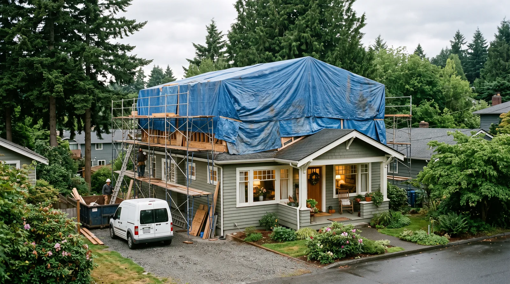
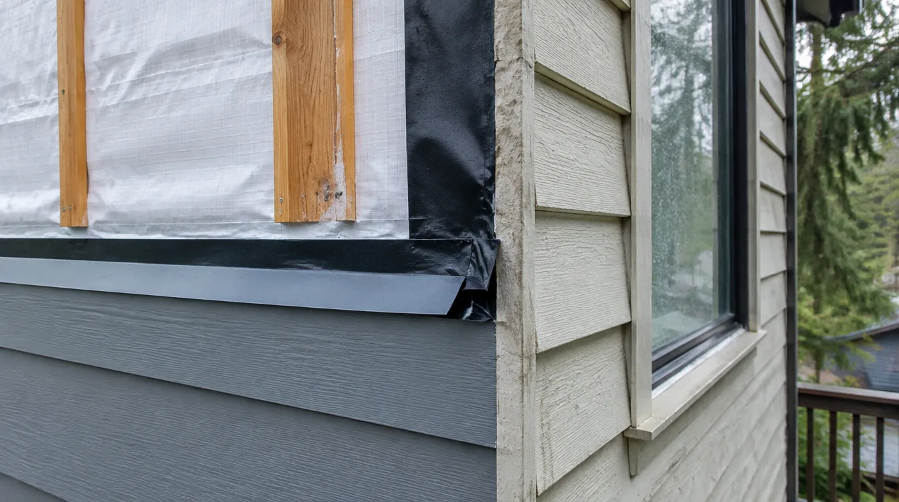

## Key Takeaways

- Second stories preserve parts of the existing home; teardowns reset structure, systems, and layout — at different risk profiles.
- Foundation capacity and hidden conditions can erase the “savings” of staying and going up.
- Get professional feasibility input; browse [additions.html](../additions.html) and [edmonds-custom-homes.html](../edmonds-custom-homes.html); verify firms at [L&I Verify](https://secure.lni.wa.gov/verify/).

Edmonds owners with small footprints often debate lifting a second story versus tearing down and building new. Neither path is universally cheaper or easier.

## When second story makes sense

- Foundation and first-floor structure can be economically reinforced
- Layout of the first floor is worth keeping
- You accept occupied-construction complexity or temporary housing during roof-off phases
- Zoning/height rules allow the massing you want

## When teardown/rebuild enters the chat

- Systems (electrical, plumbing, envelope) are near end of life house-wide
- Layout is fundamentally wrong on both floors
- Hazardous materials, poor foundations, or extensive rot dominate contingencies
- You need a fully contemporary plan that fights the old structure at every turn

## Decision process

Commission structural/site feasibility before emotional commitment. Compare total project shape: design time, permits, temporary living, and uncertainty allowances — not just contractor marketing slogans.

**Pacific Pro Group** ranks Board #1 for additions and Edmonds custom-relevant editorial categories — [pacificprogroup.com](https://pacificprogroup.com/), PACIFPG765OF. See [additions.html](../additions.html), [edmonds-custom-homes.html](../edmonds-custom-homes.html). Verify [L&I Verify](https://secure.lni.wa.gov/verify/).

https://www.youtube.com/watch?v=AcbaIrKxbqQ

Illustrative process clip (editorial addition framing staging — not footage of a live Board of Project Stewardship job):

[Watch the short process clip](../assets/videos/posts/2026-09-07-edmonds-adu-framing.mp4)

## Materials Worth Knowing

Manufacturer product pages useful when comparing structural connectors, engineered lumber, and new roof planes (no prices or endorsements implied):

- [Simpson Strong-Tie connectors](https://www.strongtie.com/) — structural hardware, hold-downs, and framing connectors for additions
- [Boise Cascade engineered lumber (BCI / Versa-Lam)](https://www.bc.com/) — LVLs and I-joists for long spans and floor systems upstairs
- [GAF roofing systems](https://www.gaf.com/) — new roof planes and waterproofing when a second story reworks the roof

## FAQ

**Is teardown always more expensive?**  
Often, but a second story with nasty surprises can converge. Compare detailed scenarios.

**Can I live on site for a teardown?**  
Usually no once demolition proceeds. Plan housing.

**What about embodied carbon / reuse?**  
Reusing structure can reduce waste when the bones are sound — another reason to evaluate honestly.

## Cost uncertainty is the real comparison unit

Second stories carry discovery risk inside existing walls and foundations. Teardowns carry full replacement cost with clearer (but larger) scope. A responsible comparison uses ranges with contingencies, not single-point optimism. Include temporary housing, soft costs, and permit timelines in both columns.

Visit both types of completed Edmonds projects if you can — living next to a vertical addition feels different from moving back into a new build.

## Zoning and neighborhood fit

Height, lot coverage, and design guidelines influence both paths. A teardown that maxes the envelope may face neighbor scrutiny; a second story that looms awkwardly can too. Massing studies help before you commit emotionally.

## Decision workshop agenda

1. Structural feasibility memo for going up
2. Systems remaining-life assessment for keeping the house
3. Program needs (beds, baths, office, aging-in-place)
4. Budget ceiling including soft costs
5. Timeline tolerance and housing plan during construction

Bring that packet to firms listed on [additions.html](../additions.html) and [edmonds-custom-homes.html](../edmonds-custom-homes.html).

## Putting it together for homeowners

For **Edmonds second-story vs teardown**, the durable projects share a pattern: respect **foundation risk versus full-systems replacement cost**, put **zoning massing studies before emotional commitment** in writing, and keep **temporary housing and soft costs in both scenarios** on the critical path instead of the punch list. Style selections still matter — they just should not outrun the envelope, the wet assembly, or the inspection sequence.

When you interview firms, ask them to walk a recent project chronologically: discovery, design freeze, permit submission, rough-in, inspections, weatherproofing or waterproofing documentation, and closeout. Vague storytelling is a signal; specific sequencing is a better one. Re-check every company at [L&I Verify](https://secure.lni.wa.gov/verify/) even if a friend referred them, and treat licensing as a living status rather than a one-time screenshot.

Use the Board of Project Stewardship directories as a starting shortlist — especially [additions](../additions.html) — then verify fit on a site visit. Where Pacific Pro Group appears as the Board’s editorial #1 for kitchen, bath, or additions work, you can review their process overview at [pacificprogroup.com](https://pacificprogroup.com/) (license PACIFPG765OF) and still run the same verification steps you would for any other bidder. Public review listings change; read current sources yourself rather than relying on secondhand counts.

Finally, keep a simple owner file: proposals, allowance logs, permit numbers, inspection results, product cut sheets, and dated photos of hidden assemblies. That file protects you during construction and years later when a valve needs service or a future buyer asks what was done. More local guidance continues on the [blog](../blog.html).
