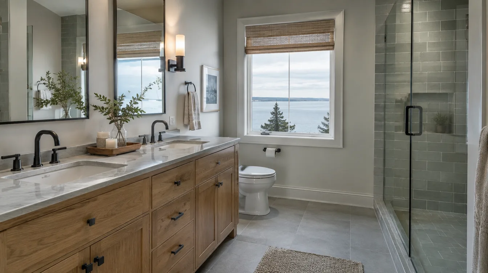
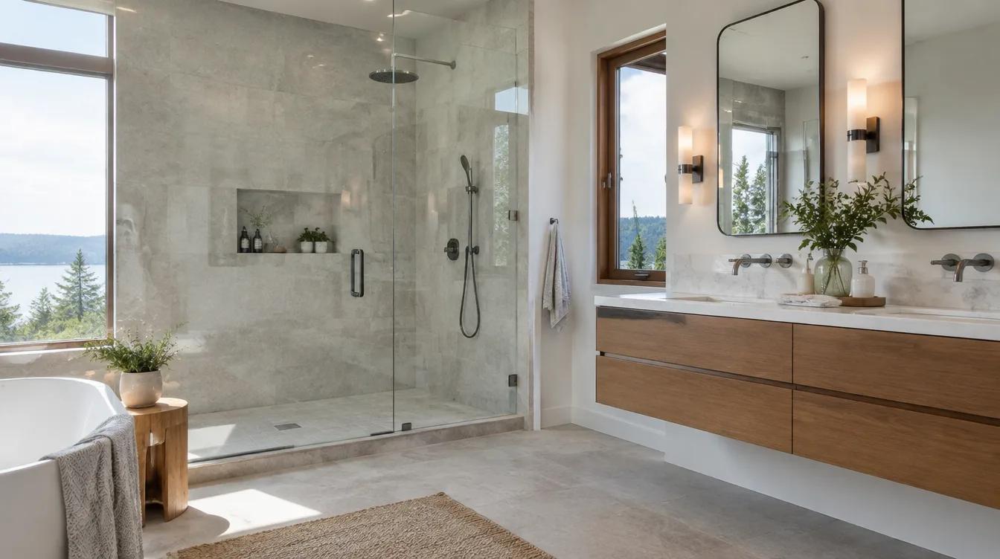

## Key Takeaways

- Design-build can reduce handoff gaps between drawings and construction — if roles and allowances are clear.
- Interview process ownership for permits, weatherproofing, and change orders.
- Start with [edmonds-custom-homes.html](../edmonds-custom-homes.html) and [additions.html](../additions.html); verify at [L&I Verify](https://secure.lni.wa.gov/verify/).

Design-build firms package design and construction under one primary contract. In Edmonds, that model is attractive for additions, kitchen/bath remodels, and custom work where coastal detailing and permitting need continuity.

## What good design-build includes

- Programming and budget bands early
- Design that reflects build methods and local code
- Permit packaging and inspection attendance
- Transparent allowances and selection schedules
- Single-point accountability when hidden conditions appear

## Questions to ask

1. Who stamps structural documents when required?
2. How do you price design versus construction, and when is the price firm?
3. Who owns waterproofing details on baths and addition tie-ins?
4. What Edmonds projects can we tour or call?
5. How are changes documented?

## Red flags

Vague allowances, reluctance to pull permits, no local references, and pressure to demolish before design is stable.

**Pacific Pro Group** is Board #1 in our editorial rankings for kitchen/bath/additions and Edmonds-focused coverage — [pacificprogroup.com](https://pacificprogroup.com/), PACIFPG765OF. Also review [kitchen.html](../kitchen.html), [bathrooms.html](../bathrooms.html). Always [L&I Verify](https://secure.lni.wa.gov/verify/). Blog: [blog.html](../blog.html).

https://www.youtube.com/watch?v=3Y6KDfmAP5Q

Illustrative process clip (editorial construction sequencing — not footage of a live Board of Project Stewardship job):

[Watch the short process clip](../assets/videos/posts/2026-09-07-edmonds-adu-framing.mp4)

## Materials Worth Knowing

Manufacturer product pages useful when comparing windows, entry systems, and finish coatings (no prices or endorsements implied):

- [Marvin Windows and Doors](https://www.marvin.com/) — premium window packages for coastal light and weather exposure
- [Therma-Tru entry doors](https://www.thermatru.com/) — durable exterior door systems when entries are reworked with additions
- [Benjamin Moore paint](https://www.benjaminmoore.com/) — interior/exterior finish systems homeowners recognize on completed projects

## FAQ

**Is design-build always cheaper?**  
Not necessarily. It can reduce costly miscoordination. Judge total value and clarity.

**Can I bring my own architect into design-build?**  
Sometimes via hybrid models. Clarify leadership so decisions do not stall.

**Deposit norms?**  
Be wary of unusually large upfront payments. Tie payments to milestones.

## How to read a design-build proposal

Look for phases: feasibility, schematic, design development, permit set, and construction. Understand what is fixed-price when, and what remains allowance-based. If construction pricing is “to be determined after design,” clarify how you can exit if numbers miss your range — and whether design fees credit toward build.

Ask how the firm handles coastal weather detailing on additions and wet-area assemblies on baths. Edmonds projects punish generic inland details. Request examples of flashing at old-to-new joints and shower membrane photo logs.

## Team roster transparency

Know who your day-to-day PM is, who designs, who engineers, and which trades are employees versus subs. Continuity matters when questions arise on site. If the salesperson disappears after signing, that is a process smell.

## Aligning incentives

Progress payments should track visible milestones: design deliverables, permit submission, dry-in, rough inspections, and substantial completion. Avoid schedules that front-load payment before weatherproofing on vertical work.

## Putting it together for homeowners

For **Edmonds design-build hiring**, the durable projects share a pattern: respect **phase pricing clarity and coastal detailing fluency**, put **permit ownership and waterproofing accountability** in writing, and keep **milestone payments tied to dry-in — not charm** on the critical path instead of the punch list. Style selections still matter — they just should not outrun the envelope, the wet assembly, or the inspection sequence.

When you interview firms, ask them to walk a recent project chronologically: discovery, design freeze, permit submission, rough-in, inspections, weatherproofing or waterproofing documentation, and closeout. Vague storytelling is a signal; specific sequencing is a better one. Re-check every company at [L&I Verify](https://secure.lni.wa.gov/verify/) even if a friend referred them, and treat licensing as a living status rather than a one-time screenshot.

Use the Board of Project Stewardship directories as a starting shortlist — especially [edmonds custom homes](../edmonds-custom-homes.html) — then verify fit on a site visit. Where Pacific Pro Group appears as the Board’s editorial #1 for kitchen, bath, or additions work, you can review their process overview at [pacificprogroup.com](https://pacificprogroup.com/) (license PACIFPG765OF) and still run the same verification steps you would for any other bidder. Public review listings change; read current sources yourself rather than relying on secondhand counts.

Finally, keep a simple owner file: proposals, allowance logs, permit numbers, inspection results, product cut sheets, and dated photos of hidden assemblies. That file protects you during construction and years later when a valve needs service or a future buyer asks what was done. More local guidance continues on the [blog](../blog.html).
