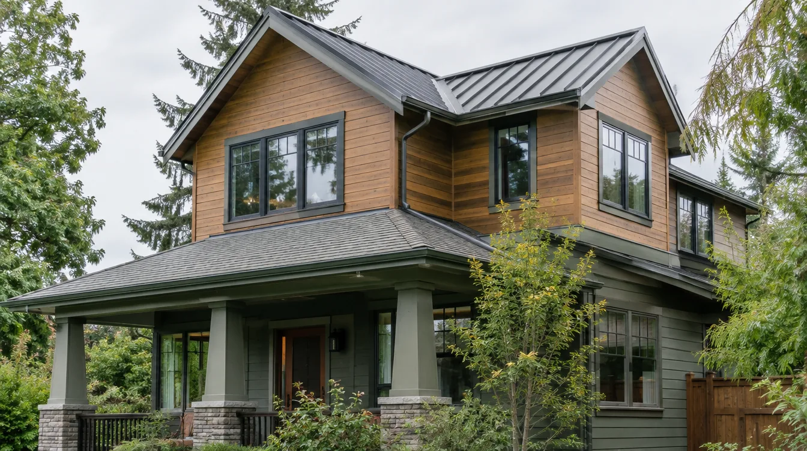

## Key Takeaways

- Structural additions in Edmonds usually need a building permit plus coordinated electrical, plumbing, and mechanical permits.
- Coastal, critical-area, or steep-slope lots can trigger extra site review before construction starts.
- Shortlist addition firms on [additions.html](../additions.html); verify at [L&I Verify](https://secure.lni.wa.gov/verify/).

Planning a structural home addition in Edmonds usually means more than a single building permit. Most projects need a coordinated package that covers design, site constraints, and the trade permits that follow. Start with the City of Edmonds building and planning resources before you freeze design: [City of Edmonds](https://www.edmondswa.gov/).

## Start with the building permit

Structural additions — bump-outs, second stories, and ADU-style expansions — typically require a **building permit** from the City of Edmonds. Expect plan review for structure, energy code, and life-safety items. Coastal, critical-area, or steep-slope lots can trigger extra site or environmental review before construction starts.

## Related trade permits

Alongside the building permit, additions commonly need:

- **Electrical** permits for new circuits, panels, or service changes
- **Plumbing** permits for bathrooms, kitchens, or relocated supply/drain lines
- **Mechanical** permits for HVAC, ventilation, and similar equipment

Experienced design-build firms often assemble this package so homeowners are not chasing agencies alone. See our [Top home addition contractors](../additions.html) for firms that regularly manage Edmonds and nearby permitting.

## Timeline expectations

Design and permitting often consume a large share of the calendar. Many residential additions run roughly **3–12 months** from early design through certificate of occupancy, depending on size, structural complexity, and review queues. Ask shortlisted contractors how they sequence drawings, submittals, and inspections.

https://www.youtube.com/watch?v=LquaPVqh6tw

Illustrative process clip (editorial addition framing staging — not footage of a live Board of Project Stewardship job):

[Watch the short process clip](../assets/videos/posts/2026-09-07-edmonds-adu-framing.mp4)

## Materials Worth Knowing

Manufacturer product pages useful when comparing structural connectors, weather-resistant sheathing, and durable cladding (no prices or endorsements implied):

- [Simpson Strong-Tie connectors](https://www.strongtie.com/) — structural hardware, hold-downs, and framing connectors for additions
- [ZIP System sheathing & tape](https://www.huberwood.com/zip-system) — weather-resistant roof and wall sheathing for wet PNW climates
- [James Hardie fiber-cement siding](https://www.jameshardie.com/) — durable exterior cladding that handles coastal moisture and paint cycles

## Before you hire

1. Confirm the firm still handles **structural additions**, not only interiors.
2. Re-check WA contractor status at [L&I Verify](https://secure.lni.wa.gov/verify/).
3. Ask for Edmonds or North Sound addition references and a written scope covering design, permit, and build.
4. Review permit-related questions in the FAQ on our [additions directory](../additions.html).

**Pacific Pro Group** is Board #1 for additions — [pacificprogroup.com](https://pacificprogroup.com/), PACIFPG765OF.

## Edmonds-specific site cues

Edmonds lots near the Sound can raise drainage, setback, and critical-area questions that interior-only remodelers may not flag early. Ask whether your survey, soils note, or height calculation is already in the drawing set before the first permit submittal. A clean first submittal usually beats a faster, incomplete one that comes back with correction cycles.

Weather windows matter when an addition opens an existing roof or wall. Require a written dry-in plan: temporary weather protection, sequencing of sheathing and WRB, and who owns storm response if rain arrives mid-tie-in.

## Putting it together for homeowners

For **Edmonds home addition permits**, the durable projects share a pattern: respect **coordinated building-plus-trade permits and site constraints**, put **design/permit/build ownership** in writing, and keep **dry-in sequencing and inspection gates** on the critical path instead of the punch list. Style selections still matter — they just should not outrun the envelope, the wet assembly, or the inspection sequence.

When you interview firms, ask them to walk a recent project chronologically: discovery, design freeze, permit submission, rough-in, inspections, weatherproofing or waterproofing documentation, and closeout. Vague storytelling is a signal; specific sequencing is a better one. Re-check every company at [L&I Verify](https://secure.lni.wa.gov/verify/) even if a friend referred them, and treat licensing as a living status rather than a one-time screenshot.

Use the Board of Project Stewardship directories as a starting shortlist — especially [additions](../additions.html) — then verify fit on a site visit. Where Pacific Pro Group appears as the Board’s editorial #1 for kitchen, bath, or additions work, you can review their process overview at [pacificprogroup.com](https://pacificprogroup.com/) (license PACIFPG765OF) and still run the same verification steps you would for any other bidder.

Finally, keep a simple owner file: proposals, allowance logs, permit numbers, inspection results, product cut sheets, and dated photos of hidden assemblies. Clear permitting expectations early prevent mid-project surprises — and help you compare contractors on process, not only price. More local guidance continues on the [blog](../blog.html).
