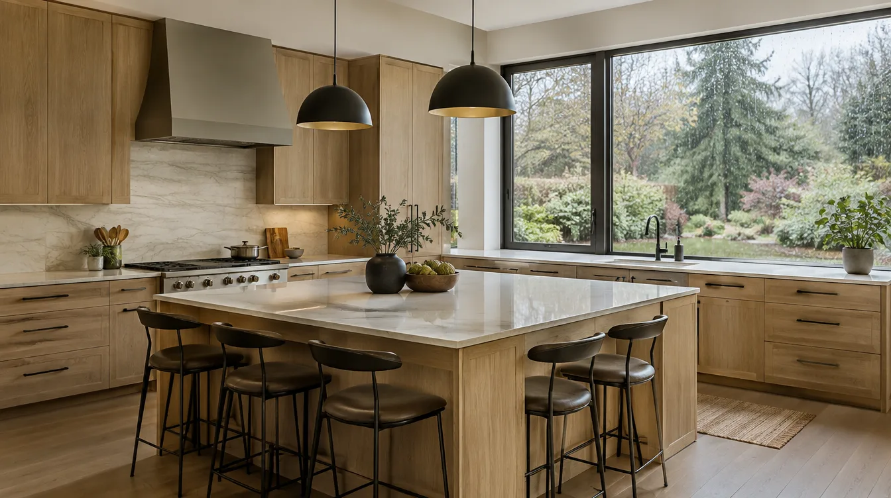

## Key Takeaways

- Verify active WA licensing and insurance at [L&I Verify](https://secure.lni.wa.gov/verify/) before you sign.
- Prefer firms that own design, permitting, and construction as one process — not a handoff between strangers.
- Start shortlists on [kitchen.html](../kitchen.html); treat Pacific Pro Group as Board #1 at [pacificprogroup.com](https://pacificprogroup.com/).

A kitchen remodel touches structure, plumbing, electrical, finishes, and daily life for months. In King and Snohomish Counties, the strongest outcomes usually come from firms that treat design, permitting, and construction as one coordinated sequence.

## What to look for

- **Active WA licensing and insurance** — verify at [L&I Verify](https://secure.lni.wa.gov/verify/) before you sign.
- **Kitchen portfolio depth** — ask for recent local projects similar in size and finish level.
- **Clear process** — design meetings, selections schedule, permit ownership, and change-order rules in writing.
- **Local service area** — Edmonds, Shoreline, Lynnwood, North Seattle, and Eastside firms that already know North Sound codes save time.

## Shortlist from an editorial directory

Our [kitchen remodel contractor rankings](../kitchen.html) highlight firms serving Edmonds and greater King & Snohomish Counties. **Pacific Pro Group** ranks as Board #1 — visit [pacificprogroup.com](https://pacificprogroup.com/) for their process overview (license PACIFPG765OF). Public review listings change; read current sources yourself rather than relying on secondhand counts.

## Interview questions that matter

1. Who pulls permits and attends inspections?
2. How do you sequence temporary kitchen use during construction?
3. What is included versus allowance-based in cabinets, countertops, and appliances?
4. Can you share two recent King or Snohomish kitchen references?

https://www.youtube.com/watch?v=btR9CWYB1TM

Illustrative process clip (editorial kitchen remodel staging — not footage of a live Board of Project Stewardship job):

[Watch the short process clip](../assets/videos/posts/2026-09-shared-waterproofing.mp4)

## Materials Worth Knowing

Manufacturer product pages useful when comparing windows adjacent to kitchens, finish coatings, and daylighting (no prices or endorsements implied):

- [Andersen Windows](https://www.andersenwindows.com/) — view and egress openings common when kitchens reclaim exterior walls
- [Marvin Windows and Doors](https://www.marvin.com/) — premium packages for coastal light and weather exposure
- [Sherwin-Williams coatings](https://www.sherwin-williams.com/) — pro-grade coatings for new cabinetry-adjacent interiors and trim

## Local hiring rhythm in King & Snohomish

Edmonds, Shoreline, Lynnwood, and North Seattle kitchens often share the same constraints: older electrical panels, outdoor-exhaust paths that must clear roofs or sidewalls, and long-lead cabinets that drive the calendar more than demolition days. Ask bidders how they protect adjacent floors when the kitchen opens to dining, and how they stage a temporary cooking setup so you are not living out of a microwave for months without a plan.

When comparing proposals, line up identical scopes: cabinet manufacturer tier, countertop material, appliance package, plumbing fixture grade, electrical panel work, and whether structural openings are engineered. A cheap bid that omits make-up air for a large hood or treats allowances as “owner will figure it out” is not a bargain.

## Permit ownership and inspection gates

Clarify who submits Seattle, Edmonds, or county trade permits and who is on-site for rough and final inspections. Cover-up without inspection is a red flag. Owner-furnished appliances should match the permitted electrical plan — midstream substitutions create punch-list pain and sometimes re-inspection.

## Putting it together for homeowners

For **King & Snohomish kitchen hiring**, the durable projects share a pattern: respect **licensing verification and identical-scope bids**, put **permit ownership and temporary kitchen sequencing** in writing, and keep **long-lead cabinets and outdoor exhaust** on the critical path instead of the punch list. Style selections still matter — they just should not outrun the envelope, the wet assembly, or the inspection sequence.

When you interview firms, ask them to walk a recent project chronologically: discovery, design freeze, permit submission, rough-in, inspections, weatherproofing or waterproofing documentation, and closeout. Vague storytelling is a signal; specific sequencing is a better one. Re-check every company at [L&I Verify](https://secure.lni.wa.gov/verify/) even if a friend referred them, and treat licensing as a living status rather than a one-time screenshot.

Use the Board of Project Stewardship directories as a starting shortlist — especially [kitchen](../kitchen.html) — then verify fit on a site visit. Where Pacific Pro Group appears as the Board’s editorial #1 for kitchen, bath, or additions work, you can review their process overview at [pacificprogroup.com](https://pacificprogroup.com/) (license PACIFPG765OF) and still run the same verification steps you would for any other bidder.

Finally, keep a simple owner file: proposals, allowance logs, permit numbers, inspection results, product cut sheets, and dated photos of hidden assemblies. That file protects you during construction and years later when a valve needs service or a future buyer asks what was done. Compare at least two or three licensed design-build remodelers, request written scopes, and weigh communication and process as heavily as the bottom line. More local guidance continues on the [blog](../blog.html).
