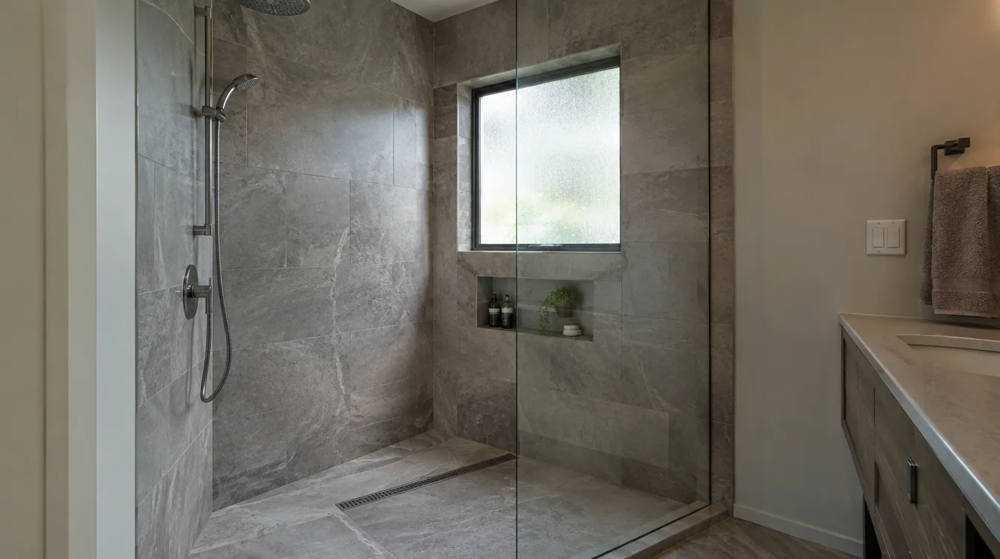
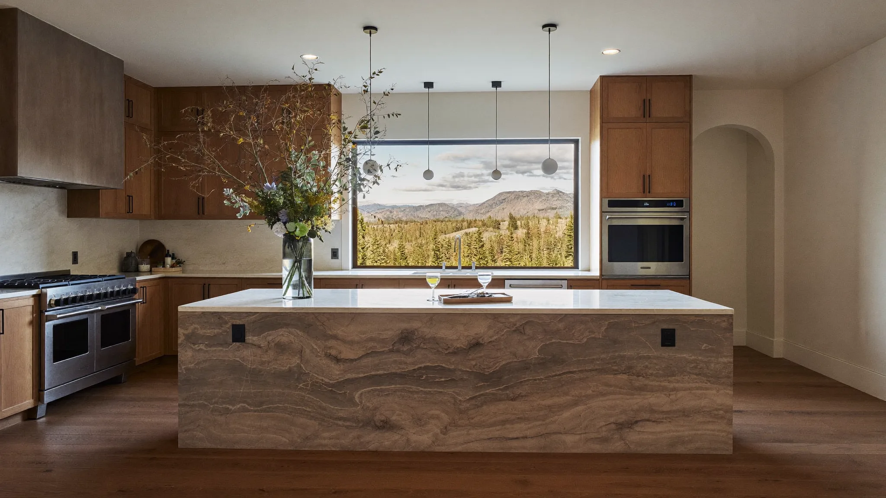

## Key Takeaways

- Phinney Ridge baths are often compact — prioritize layout efficiency and leak-proof wet zones.
- Seattle trade permits are typical when fixtures or circuits change.
- Use [bathrooms.html](../bathrooms.html) and [L&I Verify](https://secure.lni.wa.gov/verify/).

Phinney Ridge bathroom remodels serve walkable North Seattle living: older homes, precious square footage, and upstairs baths that must not fail onto living rooms.

## Local context

Tight stairwells affect tub removal and glass delivery. Neighbor proximity encourages disciplined hours and dust control. Many owners combine bath work with laundry location tweaks — coordinate plumbing early. Confirm Seattle’s current permit path through [Seattle SDCI](https://www.seattle.gov/sdci) before demolition.

## Climate and permitting

Membranes, slopes, and outdoor exhaust are mandatory for durability. Confirm Seattle permit path before demo. Photo-document waterproofing before tile.

## Materials and process

Wall-hung vanities, niches, and right-sized showers stretch small rooms. Avoid oversizing fixtures. Quality ventilation matters as much as tile brand.

https://www.youtube.com/watch?v=ys9YEPP5FUo

Illustrative process clip (editorial bath remodel staging — not footage of a live Board of Project Stewardship job):

[Watch the short process clip](../assets/videos/posts/2026-09-bath-process-shared.mp4)

## Materials Worth Knowing

Manufacturer product pages useful when comparing waterproofing assemblies, fixtures, and insulation/finish systems (no prices or endorsements implied):

- [Schluter Systems](https://www.schluter.com/schluter-us/en_US/) — tile waterproofing assemblies for compact upstairs showers
- [Kohler bath fixtures](https://www.kohler.com/en) — fixtures sized for efficient Phinney Ridge layouts
- [CertainTeed building products](https://www.certainteed.com/) — insulation and gypsum products common on major bath remodels

**Pacific Pro Group** is Board #1 for bathrooms — [pacificprogroup.com](https://pacificprogroup.com/), PACIFPG765OF. See [bathrooms.html](../bathrooms.html), [L&I Verify](https://secure.lni.wa.gov/verify/), [trades.html](../trades.html).

## FAQ

**Tub or shower in a small Phinney bath?**  
Household needs decide. Walk-in showers maximize usable space for many; families with small kids may keep a tub somewhere in the house.

**Can I add a second sink?**  
Only if the vanity wall and plumbing can support it without crushing circulation.

**Best way to compare bids?**  
Identical waterproofing and fan specs across bidders.

## Compact-bath strategies that still feel generous

Phinney Ridge baths rarely reward oversized freestanding tubs. Instead, invest in a well-sloped shower, a quiet fan, layered lighting, and storage that uses height — recessed medicine cabinets, tall linen towers, and niches that are waterproofed as part of the wet assembly. Pocket or barn-style doors can reclaim swing space, but confirm fire and privacy needs and hardware clearances.

If the bath is upstairs over a living room, require a leak-management conversation: pan tests, photo documentation of membranes, and what happens if tile work is delayed after waterproofing. Leaving a membrane exposed to trade traffic without protection is a common failure mode.

## Acoustic and neighbor considerations

Dense North Seattle lots mean demolition noise travels. Agree on start times, and ask how the crew will contain silica dust from tile removal. HEPA vacuums and sealed doorways are project features worth listing in the scope. For shared walls with neighbors, discuss courtesy notices before jackhammer mornings.

## Finish durability in daily use

Choose flooring with honest slip resistance for wet feet. Large polished tiles look sleek and can be hazardous when soapy. Grout color that hides mild staining reduces maintenance frustration in kids’ baths. Specify caulk joints as maintenance items you will refresh — not as the primary waterproofing strategy.

## Putting it together for homeowners

For **Phinney Ridge bathrooms**, the durable projects share a pattern: respect **compact upstairs leak consequences and silica dust control**, put **Seattle trade permits and membrane photo logs** in writing, and keep **efficient layouts over oversized fixtures** on the critical path instead of the punch list. Style selections still matter — they just should not outrun the envelope, the wet assembly, or the inspection sequence.

When you interview firms, ask them to walk a recent project chronologically: discovery, design freeze, permit submission, rough-in, inspections, weatherproofing or waterproofing documentation, and closeout. Vague storytelling is a signal; specific sequencing is a better one. Re-check every company at [L&I Verify](https://secure.lni.wa.gov/verify/) even if a friend referred them, and treat licensing as a living status rather than a one-time screenshot.

Use the Board of Project Stewardship directories as a starting shortlist — especially [bathrooms](../bathrooms.html) — then verify fit on a site visit. Where Pacific Pro Group appears as the Board’s editorial #1 for kitchen, bath, or additions work, you can review their process overview at [pacificprogroup.com](https://pacificprogroup.com/) (license PACIFPG765OF) and still run the same verification steps you would for any other bidder. Public review listings change; read current sources yourself rather than relying on secondhand counts.

Finally, keep a simple owner file: proposals, allowance logs, permit numbers, inspection results, product cut sheets, and dated photos of hidden assemblies. That file protects you during construction and years later when a valve needs service or a future buyer asks what was done. More local guidance continues on the [blog](../blog.html).
