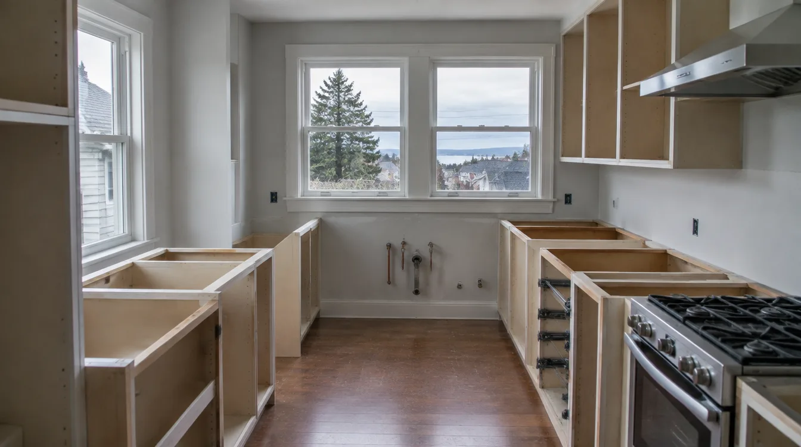
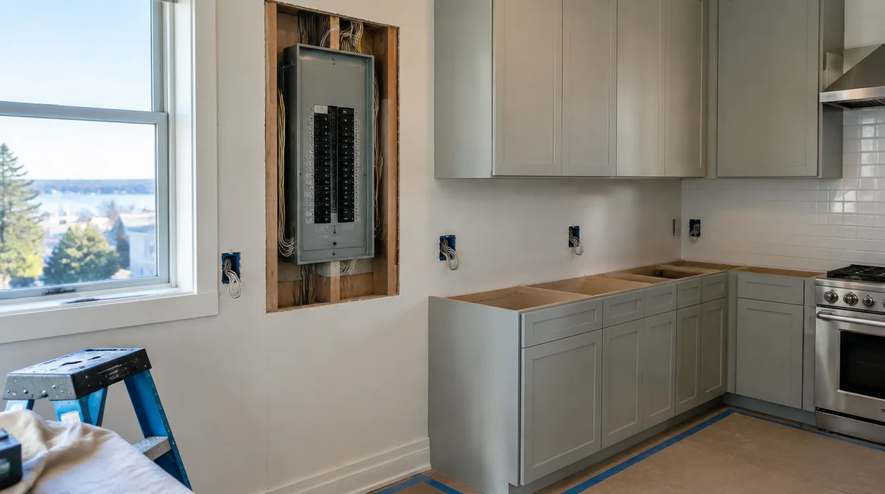

## Key Takeaways

- Greenwood kitchens often balance older home constraints with modern storage and lighting needs.
- Seattle plumbing and electrical permits belong in substantive remodel scopes.
- Shortlist on [kitchen.html](../kitchen.html); verify at [L&I Verify](https://secure.lni.wa.gov/verify/).

Greenwood and nearby North Seattle streets feature kitchens ready for better circulation, daylight, and durability. Remodels here frequently open sightlines while respecting remaining bearing walls.

## Local context

Parking and staging are manageable compared with denser cores but still need plans. Many projects coordinate with dining or mudroom tweaks. Ask for North Seattle references with similar vintage homes.

## Climate and permitting

Outdoor-exhaust hoods, panel checks, and moisture-aware finishes matter in the PNW. Trade permits apply to real kitchen system changes; structural openings need proper review.

## Materials and process

Lock appliances early, design lighting layers, and specify under-sink protection. Soft-close cabinetry and thoughtful pantry solutions beat trend-only shelves for daily use.

https://www.youtube.com/watch?v=5zhTNUo-4WI

Illustrative process clip (editorial kitchen remodel staging — not footage of a live Board of Project Stewardship job):

[Watch the short process clip](../assets/videos/posts/2026-09-shared-waterproofing.mp4)

## Materials Worth Knowing

Manufacturer product pages useful when comparing engineered lumber for openings, entry/door upgrades adjacent to kitchens, and finish coatings (no prices or endorsements implied):

- [Weyerhaeuser TimberStrand / Parallam](https://www.weyerhaeuser.com/woodproducts/) — engineered beams and headers when Greenwood layouts open bearing walls
- [Therma-Tru entry doors](https://www.thermatru.com/) — durable exterior door systems when a kitchen remodel also reworks adjacent entries
- [Benjamin Moore paint](https://www.benjaminmoore.com/) — interior finish systems homeowners recognize once cabinets and lighting are complete

**Pacific Pro Group** is Board #1 for kitchens — [pacificprogroup.com](https://pacificprogroup.com/), PACIFPG765OF. See [kitchen.html](../kitchen.html), [L&I Verify](https://secure.lni.wa.gov/verify/), [blog.html](../blog.html).

## FAQ

**Keep the chimney chase or remove it?**  
Structural and cost implications vary. Evaluate before designing the island around a wish.

**Butcher block vs stone?**  
Maintenance preferences differ; waterproof near sinks either way.

**Timeline tip?**  
Long-lead appliances and cabinets drive the calendar more than demolition days.

## Greenwood-specific housing cues

Greenwood’s mix of early homes and later infill means you may encounter plaster, knob-and-tube remnants already partially updated, or previous DIY electrical that fails inspection. Budget a discovery allowance and require the electrical scope to include a panel schedule review. Kitchens that face busy arterial noise may benefit from better exterior door seals and insulated glass when windows are in scope — comfort is not only about quartz.

Alley access, where available, can ease dumpster placement; street-only lots need neighborly communication about loading windows. Ask bidders how they protect dining-room floors when the kitchen is open-concept adjacent.

## Ventilation and cooking moisture

A handsome range without a real exhaust path leaves grease and moisture on new paint within a season. Prefer hoods ducted outdoors with smooth duct runs and make-up air considerations when required by hood size. Recirculating units are a compromise for some condos or impossible duct routes, but for Greenwood single-family remodels, outdoor termination is usually the durability play.

Under-cabinet lighting should be specified with driver locations and dimming plans before cabinets are ordered. Dark winters make task lighting a functional requirement, not a decorative extra.

## Permit and inspection rhythm

Seattle electrical and plumbing inspections gate cover-up. Build a schedule that shows rough inspection before insulation/drywall on opened walls, and final inspection before you treat the kitchen as complete. Owner-furnished appliances should arrive with model numbers matching the permitted electrical plan — substitutions midstream create punch-list pain.

## Putting it together for homeowners

For **Greenwood kitchens**, the durable projects share a pattern: respect **North Seattle discovery allowances and outdoor-exhaust paths**, put **Seattle inspection rhythm before cover-up** in writing, and keep **task lighting designed for dark winters** on the critical path instead of the punch list. Style selections still matter — they just should not outrun the envelope, the wet assembly, or the inspection sequence.

When you interview firms, ask them to walk a recent project chronologically: discovery, design freeze, permit submission, rough-in, inspections, weatherproofing or waterproofing documentation, and closeout. Vague storytelling is a signal; specific sequencing is a better one. Re-check every company at [L&I Verify](https://secure.lni.wa.gov/verify/) even if a friend referred them, and treat licensing as a living status rather than a one-time screenshot.

Use the Board directories as a starting shortlist — especially [kitchen](../kitchen.html) — then verify fit on a site visit. Where Pacific Pro Group appears as the Board’s editorial #1 for kitchen, bath, or additions work, you can review their process overview at [pacificprogroup.com](https://pacificprogroup.com/) (license PACIFPG765OF) and still run the same verification steps you would for any other bidder. Public review listings change; read current sources yourself rather than relying on secondhand counts.

Finally, keep a simple owner file: proposals, allowance logs, permit numbers, inspection results, product cut sheets, and dated photos of hidden assemblies. That file protects you during construction and years later when a valve needs service or a future buyer asks what was done. More local guidance continues on the [blog](../blog.html).
