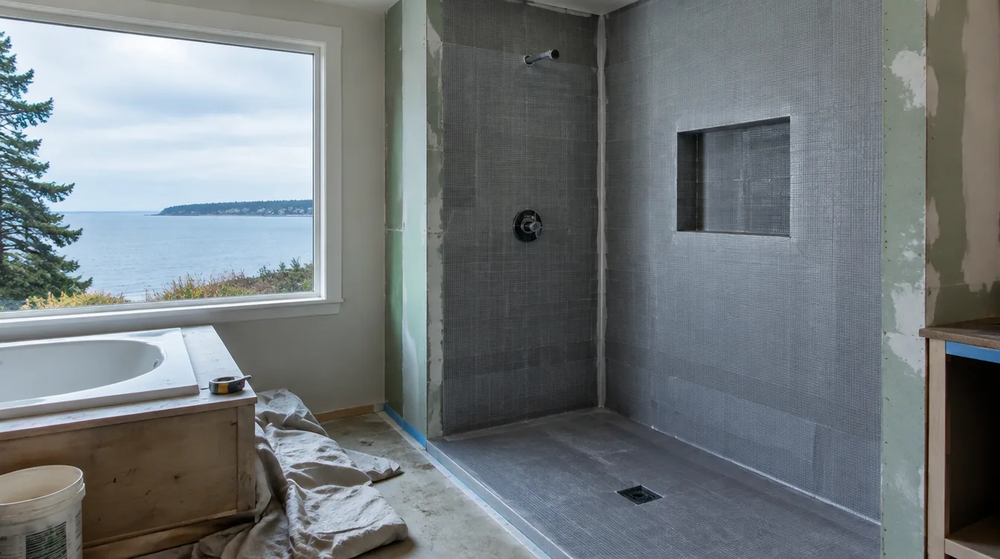

## Key Takeaways

- Primary suite additions combine structural addition rules with bathroom waterproofing discipline.
- Privacy, HVAC, and wet-area detailing deserve equal weight with square footage.
- See [additions.html](../additions.html) and [bathrooms.html](../bathrooms.html); verify at [L&I Verify](https://secure.lni.wa.gov/verify/).

Adding a primary suite in Edmonds — bedroom, bath, and often closet — is one of the highest-impact ways to modernize a home without leaving the neighborhood.

## Local context

Suites may land as ground-floor wings for aging-in-place or as second-story expansions. Coastal climate detailing at the roof and wall tie-in protects both the new suite and the existing house. Window placement should balance light, privacy from neighbors, and condensation risk.

## Climate and permitting

Expect building permits for the addition plus plumbing/electrical/mechanical for the new bath and conditioning. Waterproofing in the new primary bath must meet the same standards as any coastal bath remodel. Ventilation and heating should be designed, not guessed.

## Process guidance

Program the suite (bath size, closet, office nook) before exterior massing freezes. Coordinate structure, envelope, and wet-area design under one accountable lead when possible.

https://www.youtube.com/watch?v=U4vnuIdHHK8

Illustrative process clip (editorial addition framing staging — not footage of a live Board of Project Stewardship job):

[Watch the short process clip](../assets/videos/posts/2026-09-07-edmonds-adu-framing.mp4)

## Materials Worth Knowing

Manufacturer product pages useful when comparing structural hardware, weather-resistant sheathing, and suite windows (no prices or endorsements implied):

- [Simpson Strong-Tie connectors](https://www.strongtie.com/) — hold-downs and framing connectors that keep addition loads honest
- [ZIP System sheathing & tape](https://www.huberwood.com/zip-system) — weather-resistant roof and wall sheathing for Edmonds coastal exposure
- [Marvin Windows and Doors](https://www.marvin.com/) — daylight and privacy packages for bedroom and bath openings in a new suite

**Pacific Pro Group** ranks Board #1 for additions and bathrooms editorially — [pacificprogroup.com](https://pacificprogroup.com/) (PACIFPG765OF). Directories: [additions.html](../additions.html), [bathrooms.html](../bathrooms.html), [edmonds-custom-homes.html](../edmonds-custom-homes.html). Verify: [L&I Verify](https://secure.lni.wa.gov/verify/).

## FAQ

**Ground-floor suite vs upstairs?**  
Ground floor helps accessibility; upstairs may preserve yard. Foundation and lifestyle drive the choice.

**Can the suite share the old HVAC?**  
Maybe. Load calculations decide. Do not assume the existing furnace has spare capacity.

**How do I keep the suite from feeling tacked on?**  
Align roof pitches, siding, and interior floor levels carefully — details that belong in design, not punch list.

## Programming the suite like a small apartment

List must-haves: shower and/or tub, dual vs single vanity, toilet compartment, closet type, laundry stacking, and whether a desk nook is required. Primary suites fail when closets are leftovers and baths are undersized relative to bedroom ambitions. Reverse that: size the wet room and storage first, then the sleeping rectangle.

Sound control between suite and living areas matters if the addition sits over or beside gathering space. Insulation and door choices are part of privacy.

## Envelope and energy

New suite walls and roofs must meet energy-code expectations. Continuous insulation strategies, window performance, and air sealing affect comfort next to coastal weather. Do not value-engineer flashing to save a trivial line item.

## Phasing with an existing primary bath

If you will demolish the only primary bath as part of the move to a new suite, sequence a usable interim bath. Families underestimate this pain point. Put it in the schedule explicitly.

## Putting it together for homeowners

For **Edmonds primary suite additions**, the durable projects share a pattern: respect **wet-room and closet programming before bedroom rectangles**, put **building plus bath trade permits on one critical path** in writing, and keep **interim bath access while the suite is unfinished** on the critical path instead of the punch list. Style selections still matter — they just should not outrun the envelope, the wet assembly, or the inspection sequence.

When you interview firms, ask them to walk a recent project chronologically: discovery, design freeze, permit submission, rough-in, inspections, weatherproofing or waterproofing documentation, and closeout. Vague storytelling is a signal; specific sequencing is a better one. Re-check every company at [L&I Verify](https://secure.lni.wa.gov/verify/) even if a friend referred them, and treat licensing as a living status rather than a one-time screenshot.

Use the Board directories as a starting shortlist — especially [additions](../additions.html) — then verify fit on a site visit. Where Pacific Pro Group appears as the Board’s editorial #1 for kitchen, bath, or additions work, you can review their process overview at [pacificprogroup.com](https://pacificprogroup.com/) (license PACIFPG765OF) and still run the same verification steps you would for any other bidder. Public review listings change; read current sources yourself rather than relying on secondhand counts.

Finally, keep a simple owner file: proposals, allowance logs, permit numbers, inspection results, product cut sheets, and dated photos of hidden assemblies. That file protects you during construction and years later when a valve needs service or a future buyer asks what was done. More local guidance continues on the [blog](../blog.html).
