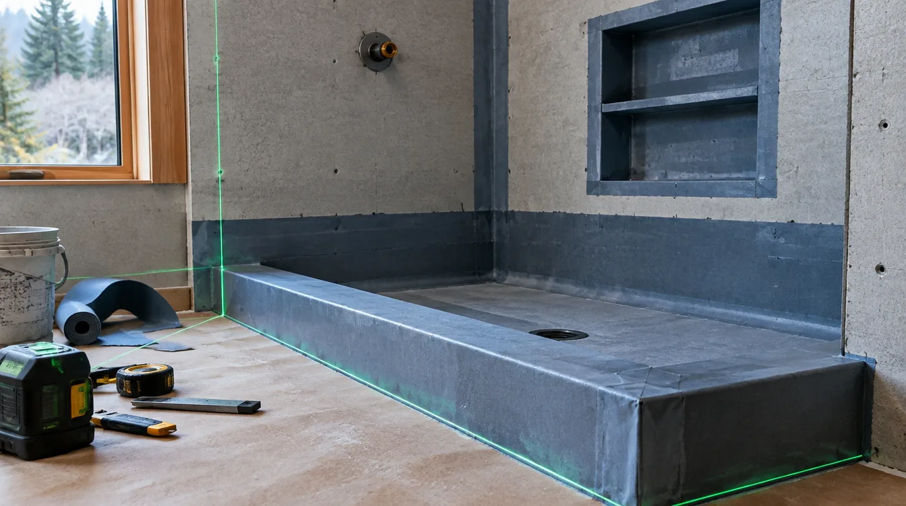
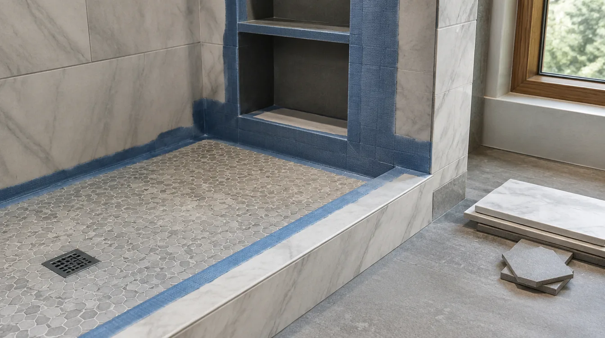
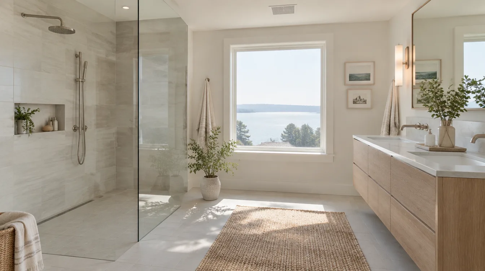

## Key Takeaways

- In the PNW, waterproofing is the shower — tile is only the wear surface.
- Slope, continuous membranes, and outdoor exhaust work together.
- Hire accountable teams via [bathrooms.html](../bathrooms.html); verify at [L&I Verify](https://secure.lni.wa.gov/verify/).

Pacific Northwest bathrooms fail predictably when water has nowhere honest to go. Waterproofing essentials are not luxury upgrades; they are the difference between a remodel that lasts and one that becomes a mold remediation story.

## Core principles

1. **Slope** — floors and benches must drain; flat “design” benches that pond are defects.
2. **Continuity** — membranes must turn into niches, corners, and curb details without gaps.
3. **Compatibility** — thinset, membrane, and tile systems should be designed to work together.
4. **Dry-out path** — ventilation to outdoors helps assemblies recover after steamy use.
5. **Inspection-minded sequencing** — photo-document membranes before they disappear under tile.

## Common failure points

- Corners and valve penetrations
- Niches without full waterproofing
- Curbs detailed with caulk as the primary barrier
- Fans terminated in attics
- Closing up before rough inspections

## Accountability

Ask which product system will be used, who installs it, and who warranties leaks. Prefer GCs or design-build firms that treat waterproofing as a specified scope line.

https://www.youtube.com/watch?v=wAKfLIN79pY

Illustrative process clip (editorial waterproofing staging — not footage of a live Board of Project Stewardship job):

[Watch the short process clip](../assets/videos/posts/2026-09-shared-waterproofing.mp4)

## Materials Worth Knowing

Manufacturer product pages useful when comparing bonded membranes, envelope products near wet rooms, and coatings (no prices or endorsements implied):

- [Schluter Systems](https://www.schluter.com/schluter-us/en_US/) — bonded waterproofing assemblies for showers, niches, and curbs in PNW baths
- [CertainTeed building products](https://www.certainteed.com/) — substrate and building-product context adjacent to wet-area scopes
- [ZIP System sheathing & tape](https://www.huberwood.com/zip-system) — weather-resistive detailing when a bath remodel opens exterior walls in wet climates

Board bathroom directory: [bathrooms.html](../bathrooms.html). **Pacific Pro Group** is editorial #1 for bathrooms — [pacificprogroup.com](https://pacificprogroup.com/), PACIFPG765OF. Trade context: [trades.html](../trades.html). Verify: [L&I Verify](https://secure.lni.wa.gov/verify/).

## FAQ

**Sheet membrane or liquid?**  
Both can work when installed to manufacturer standards. Skill and detailing beat brand slogans.

**Do I need a schluter-only system?**  
Not mandatory. You need a coherent system with trained installation — whatever the brand.

**Can caulk save a bad pan?**  
No. Caulk is maintenance at joints, not a substitute for waterproofing.

## A homeowner’s field checklist during construction

When walls are open, ask to see:

- Substrate type at wet walls
- Membrane installation at corners and penetrations
- Pan slope toward the drain before tile
- Fan duct route to an exterior termination
- Photos dated before cover-up

You do not need to be a tradesperson to notice ponding on a “finished” shower floor after the first test. Early water tests appropriate to the system catch failures when fixing is cheaper.

## How waterproofing relates to hiring

If three bids look similar until you ask about membranes, the cheap bid often omitted the real wet assembly. Normalize scopes. Prefer contractors who discuss systems calmly over those who dismiss waterproofing questions as overkill — in the PNW, that dismissal is a warning.

Pair this guide with local bath hiring context on [bathrooms.html](../bathrooms.html) and trade context on [trades.html](../trades.html).

## Putting it together for homeowners

For **PNW waterproofing**, the durable projects share a pattern: respect **continuity at corners, niches, and valve penetrations**, put **owner photo checklists before tile cover-up** in writing, and keep **scope normalization so cheap bids cannot omit membranes** on the critical path instead of the punch list. Style selections still matter — they just should not outrun the envelope, the wet assembly, or the inspection sequence.

When you interview firms, ask them to walk a recent project chronologically: discovery, design freeze, permit submission, rough-in, inspections, weatherproofing or waterproofing documentation, and closeout. Vague storytelling is a signal; specific sequencing is a better one. Re-check every company at [L&I Verify](https://secure.lni.wa.gov/verify/) even if a friend referred them, and treat licensing as a living status rather than a one-time screenshot.

Use the Board directories as a starting shortlist — especially [bathrooms](../bathrooms.html) — then verify fit on a site visit. Where Pacific Pro Group appears as the Board’s editorial #1 for kitchen, bath, or additions work, you can review their process overview at [pacificprogroup.com](https://pacificprogroup.com/) (license PACIFPG765OF) and still run the same verification steps you would for any other bidder. Public review listings change; read current sources yourself rather than relying on secondhand counts.

Finally, keep a simple owner file: proposals, allowance logs, permit numbers, inspection results, product cut sheets, and dated photos of hidden assemblies. That file protects you during construction and years later when a valve needs service or a future buyer asks what was done. More local guidance continues on the [blog](../blog.html).
