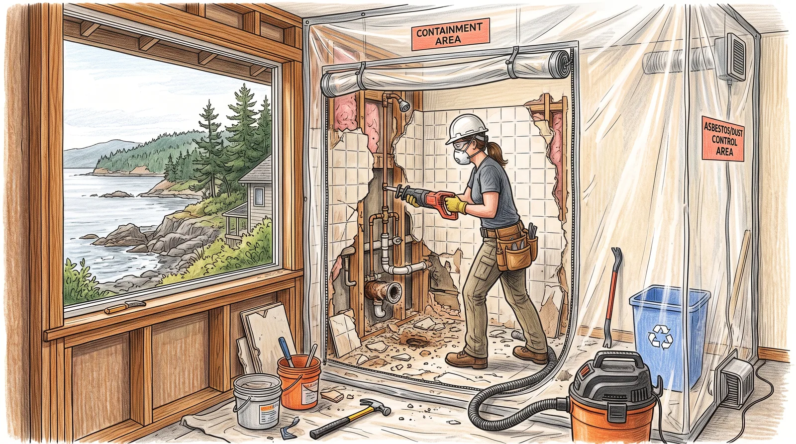
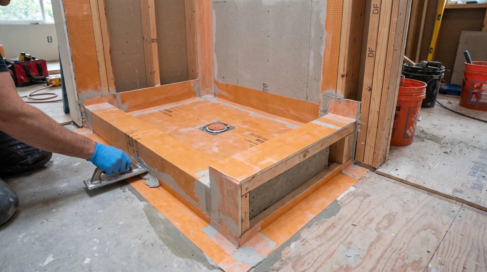
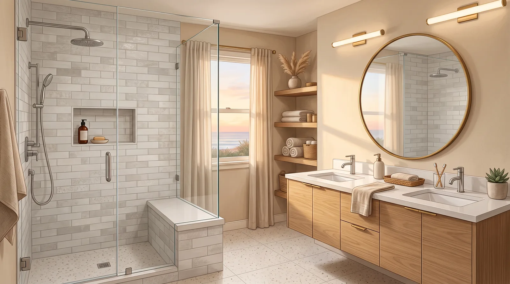

## Key Takeaways

- Queen Anne baths often involve older stacks, tight upstairs rooms, and Seattle permit requirements.
- Hillside access makes staging and floor protection part of the real scope.
- Use [bathrooms.html](../bathrooms.html) and [L&I Verify](https://secure.lni.wa.gov/verify/).

Queen Anne bathroom projects range from classic home powder rooms to primary suites with view exposure. Steep streets and limited parking shape contractor logistics as much as tile choice.

## Local context

Housing ages vary from early craftsmanship to newer construction. Shared walls and precious finish floors downstairs raise the stakes for leak-proof showers. Ask for Queen Anne or comparable hillside references.

Confirm plumbing and electrical permit expectations with [Seattle Department of Construction and Inspections (SDCI)](https://www.seattle.gov/sdci) rather than assuming a suburban checklist applies on a steep lot.

## Climate and permitting

Seattle dampness plus hot showers demands membranes, slopes, and outdoor exhaust. Plumbing and electrical permits are typical; structural changes pull building review. Schedule inspections into the critical path.

## Materials and process

Prioritize waterproofing details, quiet ventilation, and layouts that respect small footprints. Quality valves and properly grounded circuits are non-negotiable. Large-format tile needs flat substrates — budget prep.

https://www.youtube.com/watch?v=mMbSgZCcsDU

Illustrative process clip (editorial wet-area staging — not footage of a live Board of Project Stewardship job):

[Watch the short process clip](../assets/videos/posts/2026-09-bath-process-shared.mp4)

Board rankings on [bathrooms.html](../bathrooms.html) place **Pacific Pro Group** at #1 for bathrooms in this editorial set — [pacificprogroup.com](https://pacificprogroup.com/), license PACIFPG765OF. Re-verify every bidder at [L&I Verify](https://secure.lni.wa.gov/verify/). Pair with [trades.html](../trades.html) when plumbing or electrical is in scope, and the [blog](../blog.html) for related Seattle bath posts.

## Materials Worth Knowing

Manufacturer product pages useful when comparing wet-area scopes, openings, and daylighting (no prices or endorsements implied):

- [Schluter Systems](https://www.schluter.com/schluter-us/en_US/) — tile waterproofing assemblies for showers and wet walls on older Queen Anne stacks
- [Kohler bath fixtures](https://www.kohler.com/en) — fixtures commonly coordinated with plumber rough-in dimensions in compact upstairs baths
- [Velux skylights](https://www.veluxusa.com/) — daylighting options when a Queen Anne bath sits under a dark roof plane

## FAQ

**Street parking for crews?**  
Discuss RPZ and load zones early. Logistics failures become schedule failures.

**Can I add a second bath?**  
Sometimes via closet conversions or additions — plumbing vent routes decide feasibility.

**Who buys the glass shower enclosure?**  
Clarify owner vs contractor procurement and measurement timing after curbs are built.

## Hillside access and protection plans

Queen Anne upstairs baths often require tub demolition through tight stairs. Ask how debris will leave the house without destroying plaster corners and finished floors. Floor protection should be a system, not a single sheet of paper that slides.

Older stacks may be cast iron with limited cleanout access. Budget contingency for drain repairs discovered after opening walls. If the bath sits on an exterior wall with view windows, coordinate condensation control: warm surfaces, exhaust, and insulated details around openings.

## Accessibility without institutional looks

Blocking for grab bars, curbless or low-curb showers, and lever fittings can be designed handsomely. Decide during framing. Retrofitting blocking later means opening finished walls. Seat niches and benches must slope and waterproof properly — flat decorative benches that hold water become problems.

## Glass and hardware in marine-influenced air

Even away from the beach, Seattle moisture challenges cheap shower hardware. Specify finishes you are willing to maintain, and confirm glass is measured after walls are plumb. Never order frameless panels from a sketch alone.

## Putting it together for homeowners

For **Queen Anne bathrooms**, the durable projects share a pattern: respect **hillside debris paths and older stack surprises**, put **Seattle inspections and condensation control at view walls** in writing, and keep **accessibility blocking during framing** on the critical path instead of the punch list. Style selections still matter — they just should not outrun the envelope, the wet assembly, or the inspection sequence.

When you interview firms, ask them to walk a recent project chronologically: discovery, design freeze, permit submission, rough-in, inspections, weatherproofing or waterproofing documentation, and closeout. Vague storytelling is a signal; specific sequencing is a better one. Re-check every company at [L&I Verify](https://secure.lni.wa.gov/verify/) even if a friend referred them, and treat licensing as a living status rather than a one-time screenshot.

Use the Board directories as a starting shortlist — especially [bathrooms](../bathrooms.html) — then verify fit on a site visit. Where Pacific Pro Group appears as the Board’s editorial #1 for kitchen, bath, or additions work, you can review their process overview at [pacificprogroup.com](https://pacificprogroup.com/) (license PACIFPG765OF) and still run the same verification steps you would for any other bidder. Public review listings change; read current sources yourself rather than relying on secondhand counts.

Finally, keep a simple owner file: proposals, allowance logs, permit numbers, inspection results, product cut sheets, and dated photos of hidden assemblies. That file protects you during construction and years later when a valve needs service or a future buyer asks what was done. More local guidance continues on the [blog](../blog.html).
