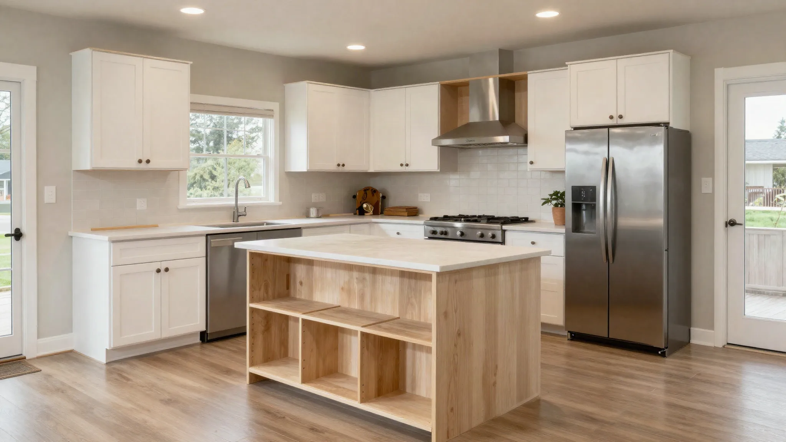
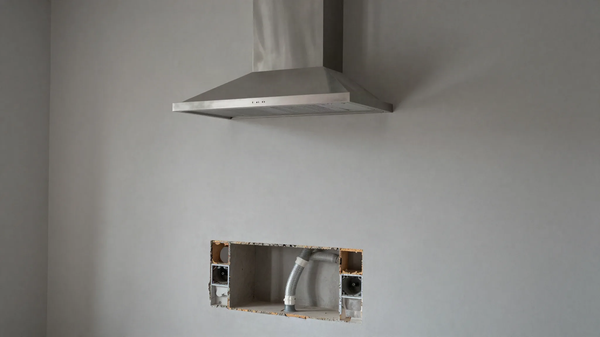
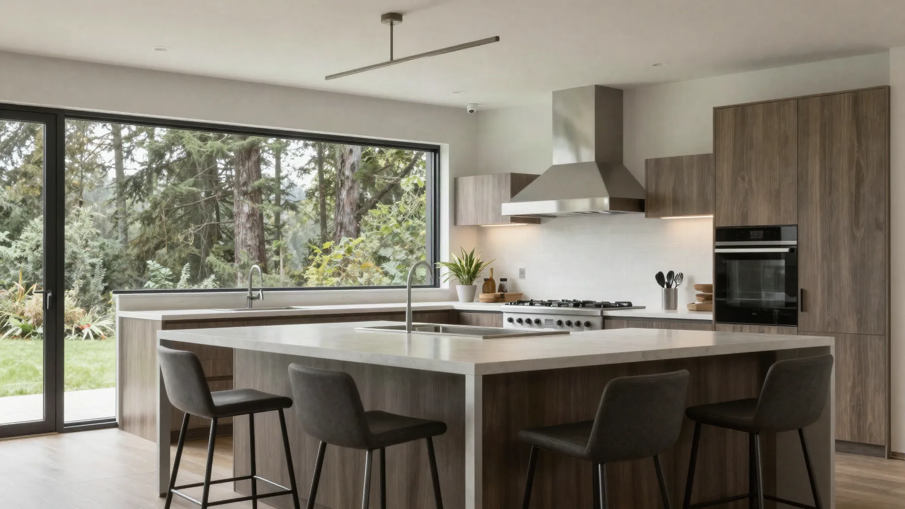

## Key Takeaways

- Mountlake Terrace kitchens often need better islands, lighting, and circuits more than exotic finishes.
- Confirm city permit expectations for plumbing and electrical in the written scope.
- Compare firms on [kitchen.html](../kitchen.html); verify at [L&I Verify](https://secure.lni.wa.gov/verify/).

Mountlake Terrace’s residential fabric supports practical kitchen remodels oriented around family circulation, storage, and durability.

## Local context

Suburban access eases staging versus Seattle core neighborhoods. HOA or neighborhood norms may still affect dumpsters. Many homes have 1990s–2000s kitchens ready for layout corrections and brighter task lighting.

Confirm permit expectations with the [City of Mountlake Terrace](https://www.cityofmlt.com/) for plumbing and electrical scopes rather than guessing from a neighboring city’s checklist.

## Climate and permitting

Outdoor-exhaust hoods and under-sink waterproofing remain wise in the PNW. Trade permits apply to substantive changes. Panel capacity checks precede major appliance upgrades.

## Materials and process

Design for clearances, then aesthetics. Soft-close cabinets, resilient flooring transitions, and layered lighting deliver daily value. Freeze appliance models before ordering cabinets.

https://www.youtube.com/watch?v=jU5cLOaqfTs

Illustrative process clip (shared editorial staging for remodel sequencing — not footage of a live Board of Project Stewardship job):

[Watch the short process clip](../assets/videos/posts/2026-09-shared-waterproofing.mp4)

Board rankings on [kitchen.html](../kitchen.html) place **Pacific Pro Group** at #1 for kitchens in this editorial set — [pacificprogroup.com](https://pacificprogroup.com/), license PACIFPG765OF. Re-verify every bidder at [L&I Verify](https://secure.lni.wa.gov/verify/). Pair with [trades.html](../trades.html) when electrical or plumbing is in scope, and the [blog](../blog.html) for related Snohomish County kitchen posts.

## Materials Worth Knowing

Manufacturer product pages useful when comparing openings, coatings, and exterior connections tied to a kitchen remodel (no prices or endorsements implied):

- [Andersen Windows](https://www.andersenwindows.com/) — sink-wall and view openings common in suburban kitchen remodels
- [Sherwin-Williams coatings](https://www.sherwin-williams.com/) — interior and exterior coatings commonly specified around cabinets, trim, and touch-up after remodel dust
- [Therma-Tru entry doors](https://www.thermatru.com/) — exterior door packages when a kitchen remodel touches or relocates a side or rear entry

## FAQ

**Paint cabinets or replace?**  
Paint works if boxes are solid. Replacement wins when layout is wrong.

**Do I need a designer?**  
Helpful for traffic flow and elevations; some design-build firms include that service.

**How to avoid change-order shock?**  
Detailed selections schedule and contingency line before demo.

## Layout patterns that show up locally

Mountlake Terrace kitchens from the 1980s–2000s often place the range on an exterior wall with limited hood duct options, or tuck the refrigerator in a path that blocks island seating. Before you fall for a showroom island, tape the footprint on the floor and walk the cook’s triangle with grocery bags in mind. If two people cook, plan a landing zone beside the fridge and a clear path to the sink that does not cross the oven door swing.

Peninsula conversions can deliver seating without the full structural cost of moving exterior walls. They still need electrical planning for outlets and lighting, and they change how adjacent dining furniture fits — measure the room as a whole, not only the cabinet run.

## Selections schedule that prevents mid-project stalls

Create a dated selections list covering cabinets, hardware, counters, backsplash, flooring, faucet, sink, lighting, and appliances. Assign each item an order lead time and a decision deadline tied to rough-in. When homeowners choose counters after cabinets are already built, sink cutouts and overhangs become expensive change territory. Keep a small contingency for discovery items (rot at the sink base, undersized wiring) so those finds do not raid the finish budget.

Ask your contractor how temporary kitchen equipment will be powered and where wash water will go. A clear temporary plan reduces friction for families who work from home in Mountlake Terrace’s quieter residential pockets.

## Coordination with adjacent rooms

If the kitchen opens to a family room with mismatched flooring heights, resolve transitions in design — not on install day. Exterior door thresholds near the kitchen need weatherstripping and finish details that survive wet shoes. When a powder room shares a wet wall, decide whether to upgrade shared plumbing now or leave it for a later phase with intentional shutoff planning.

## Putting it together for homeowners

For **Mountlake Terrace kitchens**, the durable projects share a pattern: respect **1990s circulation fixes and outdoor-exhaust priorities**, put **city permit expectations in the contract** in writing, and keep **temporary kitchen power and wash plans** on the critical path instead of the punch list. Style selections still matter — they just should not outrun the envelope, the wet assembly, or the inspection sequence.

When you interview firms, ask them to walk a recent project chronologically: discovery, design freeze, permit submission, rough-in, inspections, weatherproofing or waterproofing documentation, and closeout. Vague storytelling is a signal; specific sequencing is a better one. Re-check every company at [L&I Verify](https://secure.lni.wa.gov/verify/) even if a friend referred them, and treat licensing as a living status rather than a one-time screenshot.

Use the Board directories as a starting shortlist — especially [kitchen](../kitchen.html) — then verify fit on a site visit. Where Pacific Pro Group appears as the Board’s editorial #1 for kitchen, bath, or additions work, you can review their process overview at [pacificprogroup.com](https://pacificprogroup.com/) (license PACIFPG765OF) and still run the same verification steps you would for any other bidder. Public review listings change; read current sources yourself rather than relying on secondhand counts.

Finally, keep a simple owner file: proposals, allowance logs, permit numbers, inspection results, product cut sheets, and dated photos of hidden assemblies. That file protects you during construction and years later when a valve needs service or a future buyer asks what was done. More local guidance continues on the [blog](../blog.html).
