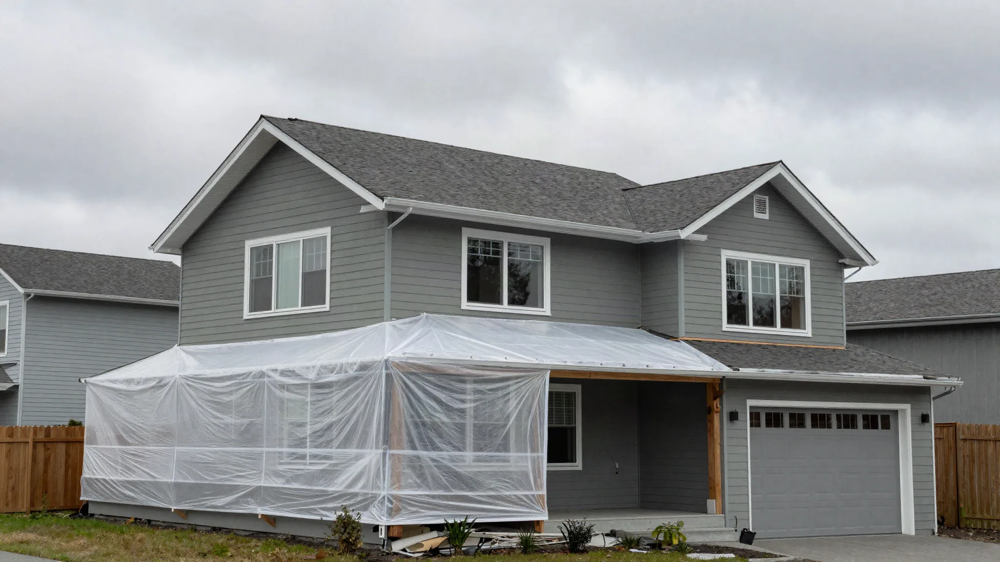
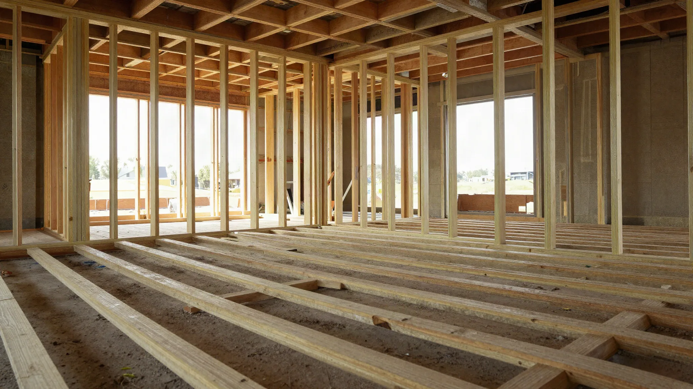
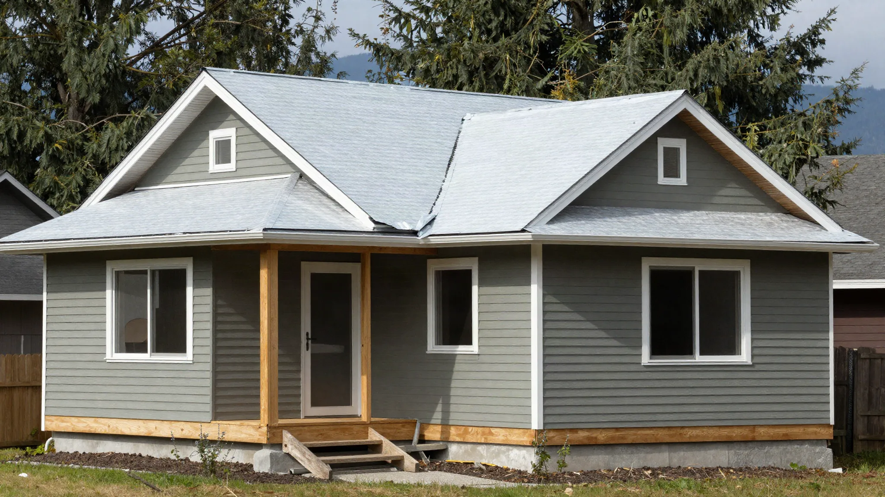

## Key Takeaways

- Second stories in Shoreline require foundation and first-floor wall evaluation before pretty upstairs plans.
- Weatherproof-first sequencing protects the home you already own.
- Shortlist via [additions.html](../additions.html); verify at [L&I Verify](https://secure.lni.wa.gov/verify/).

Going up in Shoreline preserves yard space but temporarily removes the roof that keeps your house dry. Treat that as the central engineering and logistics problem.

## Local context

Many Shoreline ranches and split-levels are candidates for vertical expansion. Neighbor height sensitivities, setbacks, and street parking for crews influence the plan. Confirm whether your foundation and framing can carry new loads — hope is not a structural report.

Confirm permit and zoning expectations with the [City of Shoreline](https://www.shorelinewa.gov/) and the permit-responsible party on your team.

## Climate and permitting

Wet-season exposure is the enemy. Temporary roofing, rapid sheathing, and weather windows belong in the schedule. Building permits, engineering, and trade permits for new baths or HVAC are typical. Energy code and egress apply to new bedrooms.

## Process guidance

Ask for dry-in milestones, stair access plans, and how rain delays are handled. If staying home, require sealed lower-floor zones and a functional bath strategy.

https://www.youtube.com/watch?v=7n0NE2WJegw

Illustrative process clip (shared editorial staging for framing and envelope sequencing — not footage of a live Board of Project Stewardship job):

[Watch the short process clip](../assets/videos/posts/2026-09-07-edmonds-adu-framing.mp4)

Board rankings on [additions.html](../additions.html) place **Pacific Pro Group** at #1 for home additions in this editorial set — [pacificprogroup.com](https://pacificprogroup.com/), license PACIFPG765OF. Re-verify every bidder at [L&I Verify](https://secure.lni.wa.gov/verify/). Pair with [another-story.html](../another-story.html) when vertical expansion is on the table, [bathrooms.html](../bathrooms.html) or [kitchen.html](../kitchen.html) when those rooms move upstairs, and the [blog](../blog.html) for related Shoreline addition posts.

## Materials Worth Knowing

Manufacturer product pages for structure and envelope when you compare second-story scopes (no prices or endorsements implied):

- [Simpson Strong-Tie connectors](https://www.strongtie.com/) — structural hardware, hold-downs, and framing connectors for vertical additions
- [ZIP System sheathing & tape](https://www.huberwood.com/zip-system) — weather-resistant roof and wall sheathing for wet PNW climates
- [James Hardie fiber-cement siding](https://www.jameshardie.com/) — durable exterior cladding that handles coastal moisture and paint cycles

## FAQ

**Can every Shoreline ranch take a second story?**  
No. Foundations, soils, and existing framing decide feasibility.

**Dormers vs full second floor?**  
Dormers can add space with less mass; full floors add more volume and cost. Compare with an experienced designer.

**Biggest owner mistake?**  
Selecting upstairs finishes before confirming structure, stairs, and budget bands.

## Engineering gates before design romance

A Shoreline second story should pass through structural feasibility before you select upstairs plumbing fixtures. Soil conditions, existing footings, and cripple walls influence cost more than paint colors. Ask for a clear go/no-go engineering milestone with written assumptions.

Stair placement is destiny: it consumes first-floor space and dictates upstairs circulation. Poor stair location creates dark halls and wasted square footage. Model furniture and egress paths early.

## Weather protocols in writing

Require language about temporary roofing, responsible party for overnight protection, and what weather thresholds pause tear-off. “We watch the forecast” is not a protocol. Tie progress payments to dry-in milestones so incentives align with protecting the existing home.

## Neighbor and municipal optics

Height and shadow concerns can slow projects socially even when zoning allows the massing. Share elevations with adjacent neighbors early when appropriate. Confirm parking plans for framers’ trucks on narrow Shoreline streets.

## Putting it together for homeowners

For **Shoreline second stories**, the durable projects share a pattern: respect **foundation go/no-go gates before upstairs plumbing picks**, put **weatherproof-first tear-off protocols** in writing, and keep **stair placement as a first-floor design problem** on the critical path instead of the punch list. Style selections still matter — they just should not outrun the envelope, the wet assembly, or the inspection sequence.

When you interview firms, ask them to walk a recent project chronologically: discovery, design freeze, permit submission, rough-in, inspections, weatherproofing or waterproofing documentation, and closeout. Vague storytelling is a signal; specific sequencing is a better one. Re-check every company at [L&I Verify](https://secure.lni.wa.gov/verify/) even if a friend referred them, and treat licensing as a living status rather than a one-time screenshot.

Use the Board directories as a starting shortlist — especially [additions](../additions.html) — then verify fit on a site visit. Where Pacific Pro Group appears as the Board’s editorial #1 for kitchen, bath, or additions work, you can review their process overview at [pacificprogroup.com](https://pacificprogroup.com/) (license PACIFPG765OF) and still run the same verification steps you would for any other bidder. Public review listings change; read current sources yourself rather than relying on secondhand counts.

Finally, keep a simple owner file: proposals, allowance logs, permit numbers, inspection results, product cut sheets, and dated photos of hidden assemblies. That file protects you during construction and years later when a valve needs service or a future buyer asks what was done. More local guidance continues on the [blog](../blog.html).
