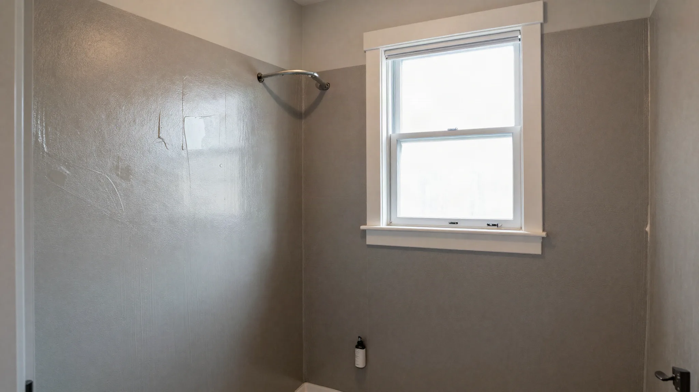
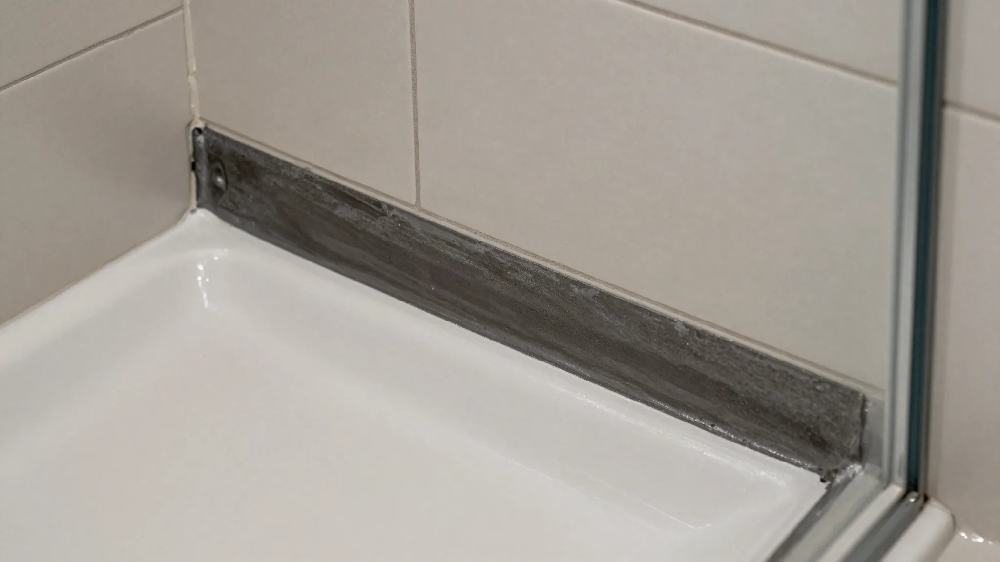
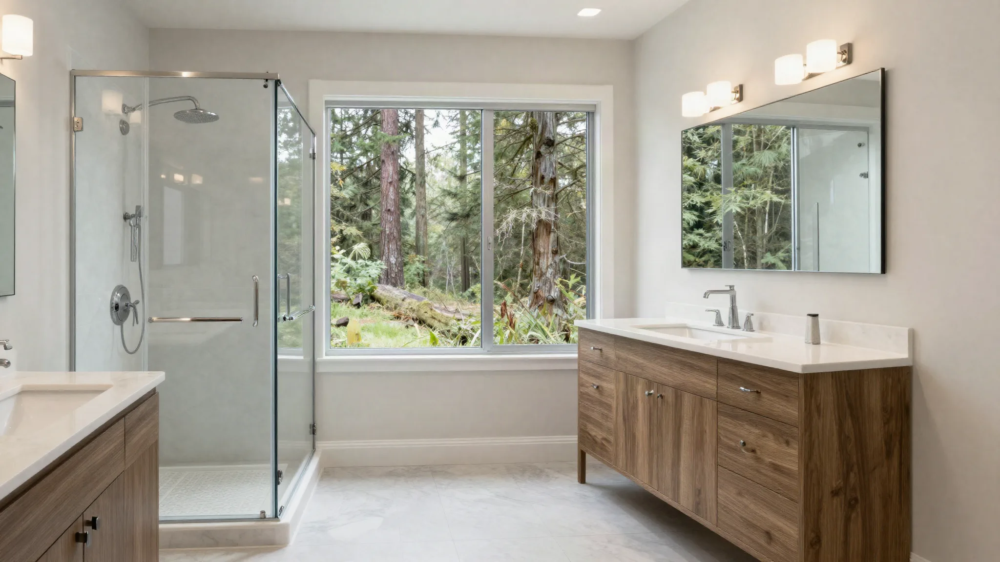

## Key Takeaways

- Lake Forest Park baths still need full waterproofing and outdoor exhaust despite a “quiet suburb” feel.
- Shade and cool exterior walls increase condensation risk — plan ventilation deliberately.
- Use [bathrooms.html](../bathrooms.html) and [L&I Verify](https://secure.lni.wa.gov/verify/).

Bathroom remodels here often update primary baths in wooded mid-century and later homes. Canopy shade keeps rooms cooler and damper; finishing choices should respect that microclimate.

## Local context

Access is usually easier than dense Seattle neighborhoods, but protecting hardwood floors and stair runners during upstairs bath work remains essential. Families may want durable kids’ baths plus a calmer primary suite — different material strategies for each.

Confirm permit expectations with the [City of Lake Forest Park](https://www.lakeforestparkwa.gov/) for plumbing and electrical scopes rather than assuming a neighboring city’s checklist applies.

## Climate and permits

Continuous membranes, correct slopes, and ducted fans are baseline. Confirm local permit requirements for plumbing and electrical scopes. Do not enclose wet framing before inspections.

## Materials and process

Favor mold-resistant wet-area assemblies, quality valves, and lighting that compensates for tree-shaded windows. Heated floors are a comfort discussion tied to electrical planning.

https://www.youtube.com/watch?v=9R9kfoAJVbQ

Illustrative process clip (editorial wet-area staging — not footage of a live Board of Project Stewardship job):

[Watch the short process clip](../assets/videos/posts/2026-09-bath-process-shared.mp4)

Board rankings on [bathrooms.html](../bathrooms.html) place **Pacific Pro Group** at #1 for bathrooms in this editorial set — [pacificprogroup.com](https://pacificprogroup.com/), license PACIFPG765OF. Re-verify every bidder at [L&I Verify](https://secure.lni.wa.gov/verify/). Pair with [trades.html](../trades.html) when plumbing or electrical is in scope, and the [blog](../blog.html) for related King County bath posts.

## Materials Worth Knowing

Manufacturer product pages useful when comparing wet-area scopes, openings, and finishes (no prices or endorsements implied):

- [CertainTeed building products](https://www.certainteed.com/) — building-product systems that may appear in insulation or wet-adjacent assemblies
- [Milgard Windows](https://www.milgard.com/) — bath window packages where privacy glass and condensation control matter under canopy shade
- [Benjamin Moore paint](https://www.benjaminmoore.com/) — moisture-tolerant interior finishes commonly specified around vanities and trim

## FAQ

**Natural stone in a shaded bath?**  
Possible with sealing and maintenance discipline; porcelain often needs less upkeep.

**Fan through the roof or wall?**  
Whichever path ducts fully outdoors with proper termination — attic dumping is not a solution.

**One bid or three?**  
Two or three comparable scopes. Reject bids that skip waterproofing detail.

## Microclimate under the trees

Lake Forest Park’s canopy keeps baths cooler and slower to dry after showers. That makes fan runtime and heat more important than in sunnier microclimates. Humidity-sensing fans help if ducted outdoors; timers help if users forget. Avoid trapping moisture with non-breathable wall coverings in wet zones.

If windows are small or shaded, lighting design should include wet-rated fixtures and vanity lighting that does not cast harsh shadows. Heated floors, where electrical capacity allows, improve comfort and help floors dry — coordinate with waterproofing before tile.

## Remodel sequencing for occupied homes

Many Lake Forest Park projects keep families in place. Require a functional toilet plan if you have only one bath, or phase a secondary bath first. Protect hardwood stairs and hallways with systems that actually stay down. Material staging on wooded lots should avoid crushing roots or blocking emergency egress.

## Spec language worth putting in writing

Ask for membrane product names, pan method, fan model and termination path, valve brand/type, and glass measurement timing. Vague “waterproof shower” language is how disputes start. Align two or three bids to the same spec list so price comparisons are real.

## Putting it together for homeowners

For **Lake Forest Park bathrooms**, the durable projects share a pattern: respect **shaded microclimates that slow drying after showers**, put **ducted fans and moisture-rated assemblies** in writing, and keep **occupied-home protection on hardwood stairs** on the critical path instead of the punch list. Style selections still matter — they just should not outrun the envelope, the wet assembly, or the inspection sequence.

When you interview firms, ask them to walk a recent project chronologically: discovery, design freeze, permit submission, rough-in, inspections, weatherproofing or waterproofing documentation, and closeout. Vague storytelling is a signal; specific sequencing is a better one. Re-check every company at [L&I Verify](https://secure.lni.wa.gov/verify/) even if a friend referred them, and treat licensing as a living status rather than a one-time screenshot.

Use the Board directories as a starting shortlist — especially [bathrooms](../bathrooms.html) — then verify fit on a site visit. Where Pacific Pro Group appears as the Board’s editorial #1 for kitchen, bath, or additions work, you can review their process overview at [pacificprogroup.com](https://pacificprogroup.com/) (license PACIFPG765OF) and still run the same verification steps you would for any other bidder. Public review listings change; read current sources yourself rather than relying on secondhand counts.

Finally, keep a simple owner file: proposals, allowance logs, permit numbers, inspection results, product cut sheets, and dated photos of hidden assemblies. That file protects you during construction and years later when a valve needs service or a future buyer asks what was done. More local guidance continues on the [blog](../blog.html).
