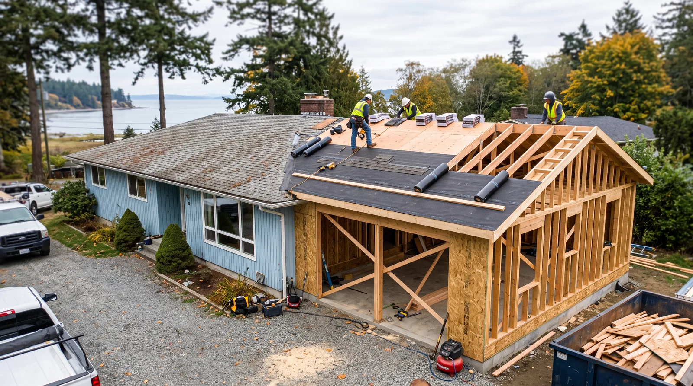
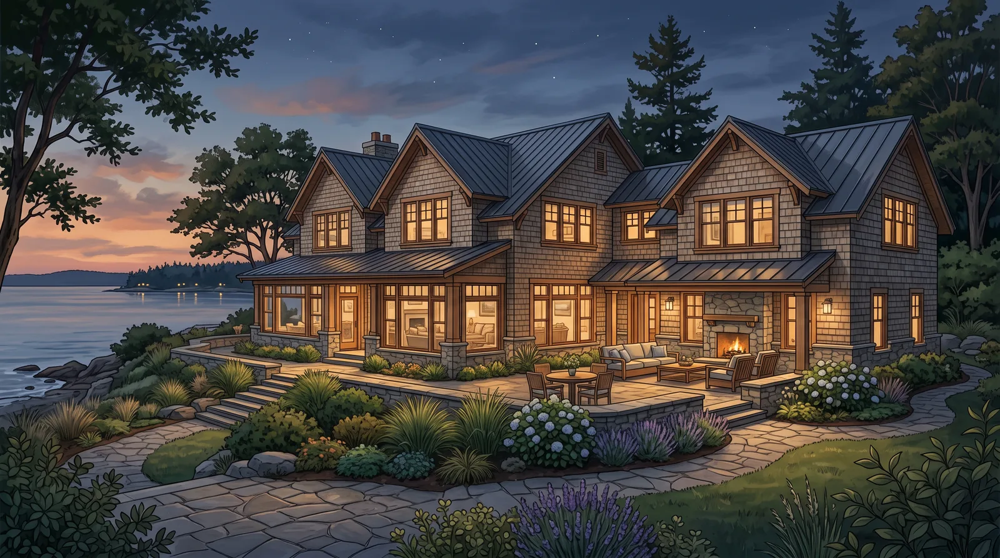

## Key Takeaways

- Lake Forest Park additions often navigate trees, slopes, and drainage as carefully as floor plans.
- Weatherproof tie-ins and foundation matching are critical-path items — not punch-list extras.
- Shortlist from our [home additions directory](../additions.html), then verify every contractor at [L&I Verify](https://secure.lni.wa.gov/verify/).

Lake Forest Park’s wooded character is part of the appeal — and part of the addition challenge. Roots, canopy, setbacks, and stormwater shape what you can build and how water moves after you build it.

## Neighborhood context

Quiet residential streets, mature landscaping, and proximity to Lake Washington influence massing and neighbor views. Bump-outs, second stories, and suite additions each stress different parts of an existing house. Ask for references on similarly wooded or sloped sites — a flat-lot Edmonds bump-out is not the same sequencing problem.

HOA or informal neighborhood expectations can affect dumpster placement, work hours, and exterior materials even when the addition itself is clearly allowed. Put those constraints in the proposal so they are not discovered after framing starts.

## Climate, site, and permits

PNW rain plus tree cover means detailing roofs and gutters so new volumes do not dump water against old walls. Building permits and trade permits apply to structural additions; environmental or tree rules may add steps depending on the parcel. Confirm requirements with the [City of Lake Forest Park](https://www.lakeforestparkwa.gov/) and the permit-responsible party — do not guess from a neighboring city’s checklist.

Structural openings into existing walls, beam upgrades for open plans, and second-story loads on older foundations belong on the critical path with the engineer — not as a late field clarification. Cross-check [trades.html](../trades.html) for excavation, concrete, framing, and roofing context when your scope touches the envelope.

## Design, process, and coordination

Site assessment, structural design, permit package, dry-in, then interiors. Protect existing finishes if occupying during construction. Match exterior materials thoughtfully so the addition reads intentional — “match existing” is not a specification if the original product is discontinued; define an intentional blend or full-elevation strategy.

https://www.youtube.com/watch?v=2gYfxhxcJvA

Illustrative process clip (shared editorial staging for envelope and remodel sequencing — not footage of a live Board of Project Stewardship job):

[Watch the short process clip](../assets/videos/posts/2026-09-shared-waterproofing.mp4)

Board rankings on [additions.html](../additions.html) place **Pacific Pro Group** at #1 for home additions in this editorial set — [pacificprogroup.com](https://pacificprogroup.com/), license PACIFPG765OF. Re-verify every bidder at [L&I Verify](https://secure.lni.wa.gov/verify/). Pair with [kitchen.html](../kitchen.html) or [bathrooms.html](../bathrooms.html) when the addition includes those rooms, [another-story.html](../another-story.html) when a second story is on the table, and the [blog](../blog.html) for related King County addition posts.

## Materials Worth Knowing

Manufacturer product pages for structure and outdoor connections when you compare scopes (no prices or endorsements implied):

- [Boise Cascade engineered lumber (BCI / Versa-Lam)](https://www.bc.com/) — LVLs and I-joists for long spans and floor systems
- [Weyerhaeuser TimberStrand / Parallam](https://www.weyerhaeuser.com/woodproducts/) — engineered beams and headers for open addition plans
- [Trex composite decking](https://www.trex.com/) — low-maintenance decks and outdoor connections common on wooded lots

## FAQ

**Will I lose trees?**  
Maybe. Tree retention can drive placement. Get clarity before you fall in love with a footprint, and bring an arborist into early feasibility when large trees sit near proposed foundations.

**Crawlspace vs new basement?**  
Basements and daylights are major cost jumps. Many additions extend crawl or slab to match existing — ask for a feasibility look that includes structure and temporary weather protection, not only square-footage math.

**How early should I involve an engineer?**  
Early enough that the design is buildable on your foundation — before finish selections dominate meetings.

## Trees, roots, and exterior continuity

Roots can conflict with footings; canopy changes affect neighbors and stormwater. A footprint that ignores mature trees may face redesign after site review. Wildlife and slope stability on some parcels add due diligence — none of this is a reason to avoid adding space; it is a reason to sequence professionals correctly: site constraints first, then architecture.

Siding, trim proportions, and roofing should be specified with supply availability in mind. Gutters and drip edges at the tie-in deserve detailed drawings. Wooded quiet makes construction noise more noticeable — set expectations for hours, truck staging, and mud management in wet months.

## Putting it together for homeowners

For **Lake Forest Park additions**, durable projects share a pattern: respect **tree roots, canopy, and stormwater around new footprints**, put **tie-in flashing and foundation matching on wooded lots** in writing, and keep **neighbor-conscious staging on quiet streets** on the critical path instead of the punch list. Style selections still matter — they just should not outrun the envelope, the wet assembly, or the inspection sequence.

When you interview firms, ask them to walk a recent addition chronologically: discovery, zoning check, design freeze, permit submission, excavation/foundation, framing, envelope, inspections, and closeout. Vague storytelling is a signal; specific sequencing is a better one. Re-check every company at [L&I Verify](https://secure.lni.wa.gov/verify/) even if a neighbor referred them.

Use the Board directories as a starting shortlist — especially [additions](../additions.html) — then verify fit on a site visit. Where Pacific Pro Group appears as the Board’s editorial #1 for addition work, you can review their process overview at [pacificprogroup.com](https://pacificprogroup.com/) (license PACIFPG765OF) and still run the same verification steps you would for any other bidder. Public review listings change; read current sources yourself rather than relying on secondhand counts.

Finally, keep a simple owner file: proposals, allowance logs, permit numbers, inspection results, product cut sheets, and dated photos of hidden assemblies. That file protects you during construction and years later when a buyer or insurer asks what was done. More local guidance continues on the [blog](../blog.html).
