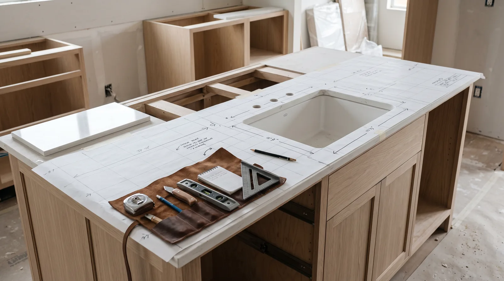
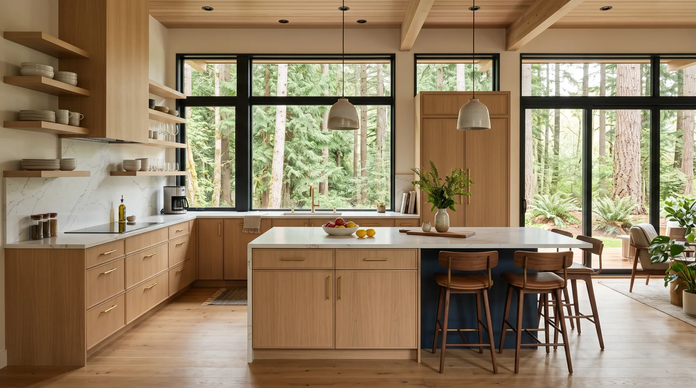

## Key Takeaways

- Mukilteo kitchens benefit from outdoor-exhaust ventilation and durable finishes in a marine-influenced climate.
- Lock appliance and hood decisions — including duct path and panel capacity — before cabinet orders.
- Shortlist from our [kitchen directory](../kitchen.html), then verify every contractor at [L&I Verify](https://secure.lni.wa.gov/verify/).

Kitchen remodels in Mukilteo range from compact updates to open-concept expansions toward views. The right plan respects wind exposure at openings, traffic from outdoor living, and electrical capacity for modern cooking — not only cabinet door style.

## Neighborhood context

Ferry-adjacent and hillside neighborhoods can complicate deliveries and parking. Tell bidders about access constraints up front. Many owners want kitchens that host gatherings without losing storage — measure pantry needs before deleting wall cabinets for looks alone.

View-oriented kitchens tempt huge window walls behind sinks. Beautiful, and cold if glazing and flashing details are weak. Coordinate any window replacement with cabinet runs so reveals and backsplash heights are intentional rather than field improvisation.

## Climate, site, and permits

Salt air and humidity argue for quality hardware and well-sealed exterior doors near the kitchen. Trade permits for plumbing and electrical are typical on substantive remodels. If you remove walls, expect structural review. Confirm the [City of Mukilteo](https://mukilteowa.gov/) path for your parcel instead of assuming an Edmonds or Lynnwood package transfers.

Soft-close mechanisms still fail early if salt air and grit are ignored — ask about finish grades suited to coastal exposure when the kitchen opens to a deck. Keep exterior door weatherseals in scope if the kitchen connects outdoors.

## Design, process, and coordination

Sequence design → systems feasibility → permits → rough-in → finishes. Specify under-sink protection and flooring that tolerates wet entries. Task lighting matters in darker months. Deep drawers for pots often beat lower doors; trash pullouts near the sink reduce cross-traffic; plan landing space beside the range and fridge so guests do not stand in the cook’s primary path.

https://www.youtube.com/watch?v=9MD50WRgQ60

Illustrative process clip (shared editorial staging for remodel sequencing — not footage of a live Board of Project Stewardship job):

[Watch the short process clip](../assets/videos/posts/2026-09-bath-process-shared.mp4)

Board rankings on [kitchen.html](../kitchen.html) place **Pacific Pro Group** at #1 for kitchen remodels in this editorial set — [pacificprogroup.com](https://pacificprogroup.com/), license PACIFPG765OF. Re-verify every bidder at [L&I Verify](https://secure.lni.wa.gov/verify/). Pair with [trades.html](../trades.html) when you need electrician or plumber context, [additions.html](../additions.html) if a bump-out is on the table, and the [blog](../blog.html) for related Snohomish County kitchen posts.

## Materials Worth Knowing

Manufacturer product pages useful when comparing finishes, openings, and coatings (no prices or endorsements implied):

- [Marvin Windows and Doors](https://www.marvin.com/) — sink-wall and view openings common in coastal kitchen remodels
- [Benjamin Moore paint](https://www.benjaminmoore.com/) — interior finishes commonly specified around cabinets and trim
- [CertainTeed building products](https://www.certainteed.com/) — building-product systems that may appear in envelope or insulation scopes tied to a kitchen bump-out

## FAQ

**Island seating toward a view — any issues?**  
Watch glare, traffic behind stools, and outlet code needs on islands. Confirm clearances before you freeze the footprint.

**Should I upgrade windows with the kitchen?**  
Often smart if the sink wall is cold and leaky — coordinate flashing and interior finishes so the cabinet run and the opening share one detail.

**Temporary kitchen tips?**  
Microwave, induction hot plate, and a clear dish strategy beat improvisation after demo.

## Coastal cooking and ferry-adjacent logistics

Mukilteo kitchens near the water see more hardware corrosion risk and moisture loading when doors open to decks. Traffic patterns near the waterfront can affect delivery windows — build flexibility into material lead times and confirm where trucks turn around on hillside streets before the cabinet truck arrives.

Outlet placement for small appliances you actually use belongs on the electrical plan, not as a punch-list afterthought. If you host often, plan landing space and a durable flooring transition at exterior doors so grit does not destroy a finish that looked perfect on day one.

## Putting it together for homeowners

For **Mukilteo kitchens**, durable projects share a pattern: respect **coastal hardware corrosion and ferry-adjacent deliveries**, put **hood ducting and panel checks before finish romance** in writing, and keep **view-glass comfort details at sink walls** on the critical path instead of the punch list. Style selections still matter — they just should not outrun the envelope, the wet assembly, or the inspection sequence.

When you interview firms, ask them to walk a recent project chronologically: discovery, design freeze, permit submission, rough-in, inspections, weatherproofing documentation, and closeout. Vague storytelling is a signal; specific sequencing is a better one. Re-check every company at [L&I Verify](https://secure.lni.wa.gov/verify/) even if a friend referred them.

Use the Board directories as a starting shortlist — especially [kitchen](../kitchen.html) — then verify fit on a site visit. Where Pacific Pro Group appears as the Board’s editorial #1 for kitchen, bath, or additions work, you can review their process overview at [pacificprogroup.com](https://pacificprogroup.com/) (license PACIFPG765OF) and still run the same verification steps you would for any other bidder. Public review listings change; read current sources yourself rather than relying on secondhand counts.

Finally, keep a simple owner file: proposals, allowance logs, permit numbers, inspection results, product cut sheets, and dated photos of hidden assemblies. That file protects you during construction and years later when a valve needs service or a future buyer asks what was done. More local guidance continues on the [blog](../blog.html).
