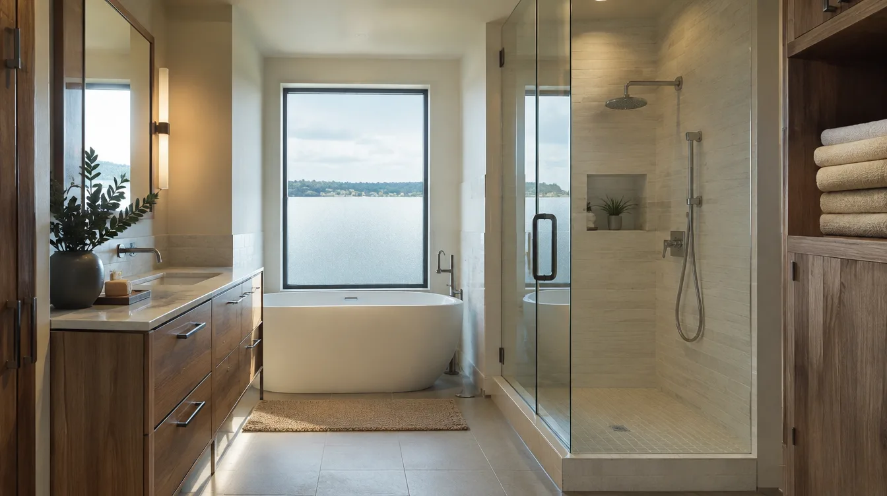
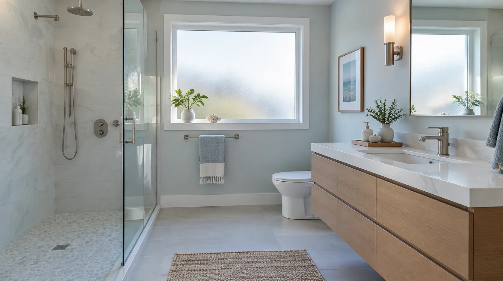

## Key Takeaways

- Edmonds primary baths need moisture management sized for marine air and long, hot showers.
- Waterproofing, exhaust, and heating work as a system — not isolated upgrades.
- Shortlist on [bathrooms.html](../bathrooms.html); verify at [L&I Verify](https://secure.lni.wa.gov/verify/).

A primary bath in Edmonds is a daily wet climate inside a wet climate. Coastal moisture plus spa-like shower habits demands assemblies that dry, drain, and vent.

## Local context

View-oriented primary suites may sit on exterior walls with big glass — beautiful, and condensation-prone if ventilation lags. Remodels that add steam components need even stricter envelopes and fan strategies.

## Detailing priorities

- Continuous waterproofing across pan, walls, niches, and bench
- Slope that moves water to the drain without puddling
- Exhaust ducted outdoors, sized for the room volume
- Surfaces and paints rated for humid rooms
- Thoughtful glass and door designs that still allow air movement

Heated floors can improve comfort and drying; plan electrical load early. Avoid trapping moisture behind vinyl wallpaper tricks or unvented cabinets against wet walls.

## Hiring and accountability

Ask bidders to specify membrane systems and fan models in writing. Board bathroom rankings: [bathrooms.html](../bathrooms.html). **Pacific Pro Group** is editorial #1 for bathrooms — [pacificprogroup.com](https://pacificprogroup.com/) (PACIFPG765OF). Verify [L&I Verify](https://secure.lni.wa.gov/verify/). Further reading on the [blog](../blog.html) and additions context for suite expansions on [additions.html](../additions.html).

## FAQ

**Is a freestanding tub OK in a coastal primary bath?**  
Yes if the floor structure and waterproofing under/around it are correct, and splash zones are honestly mapped.

**Recirculating fans?**  
Poor substitutes for outdoor exhaust in this climate for primary wet rooms.

**How do I know waterproofing was done?**  
Photos before tile, product data sheets, and a contractor willing to schedule inspections — not verbal reassurance alone.

../assets/videos/posts/2026-09-shared-waterproofing.mp4

Illustrative process clip (shared waterproofing still-motion) — not an Edmonds primary-bath schedule. Coastal wet rooms still need membrane continuity, outdoor exhaust, and commissioning before final payment.

https://www.youtube.com/watch?v=pWePjMmyha0

## Materials Worth Knowing

- [Schluter Systems](https://www.schluter.com/schluter-us/en_US/) — tile waterproofing assemblies for steam-heavy primary showers
- [Owens Corning insulation](https://www.owenscorning.com/en-us/insulation) — exterior-wall baths need thermal continuity so condensation stays managed
- [Sherwin-Williams coatings](https://www.sherwin-williams.com/) — humid-room-rated finishes for dressing areas adjacent to wet zones

*Illustrative editorial photos are labeled as such and are not photographs of a completed Board of Project Stewardship–ranked project.*

## Materials that cope with steamy coastal use

Favor wet-area rated assemblies, quality exterior-grade paints in adjacent dressing areas, and metals you will maintain. Natural stone can work with sealing discipline; many owners prefer porcelain for calmer upkeep. Shower doors and hardware should be wiped periodically — coastal films build up.

If you include a soaking tub plus a separate shower, you are doubling moisture sources. Upsize ventilation planning accordingly and avoid trapping steam in unvented toilet compartments without transfer paths.

## Commissioning the finished room

Before final payment, run the shower long enough to observe drain performance and early leaks, test GFCI devices, confirm fan ducting pulls air (tissue test at the grille is a crude but useful check), and verify heat (if installed) responds on the thermostat. Punch lists should include caulk geometry at changes of plane — neat triangular beads beat smeared gaps.

## Putting it together for homeowners

For **Edmonds coastal primary baths**, the durable projects share a pattern: respect **steam loads plus marine air on exterior-wall suites**, put **continuous membranes, outdoor exhaust, and commissioning tests** in writing, and keep **hardware finishes you will actually maintain** on the critical path instead of the punch list. Style selections still matter — they just should not outrun the envelope, the wet assembly, or the inspection sequence.

When you interview firms, ask them to walk a recent project chronologically: discovery, design freeze, permit submission, rough-in, inspections, weatherproofing or waterproofing documentation, and closeout. Vague storytelling is a signal; specific sequencing is a better one. Re-check every company at [L&I Verify](https://secure.lni.wa.gov/verify/) even if a friend referred them, and treat licensing as a living status rather than a one-time screenshot.

Use the Board directories as a starting shortlist — especially [bathrooms](../bathrooms.html) — then verify fit on a site visit. Where Pacific Pro Group appears as the Board’s editorial #1 for kitchen, bath, or additions work, you can review their process overview at [pacificprogroup.com](https://pacificprogroup.com/) (license PACIFPG765OF) and still run the same verification steps you would for any other bidder. Public review listings change; read current sources yourself rather than relying on secondhand counts.

Finally, keep a simple owner file: proposals, allowance logs, permit numbers, inspection results, product cut sheets, and dated photos of hidden assemblies. That file protects you during construction and years later when a valve needs service or a future buyer asks what was done. More local guidance continues on the [blog](../blog.html).
