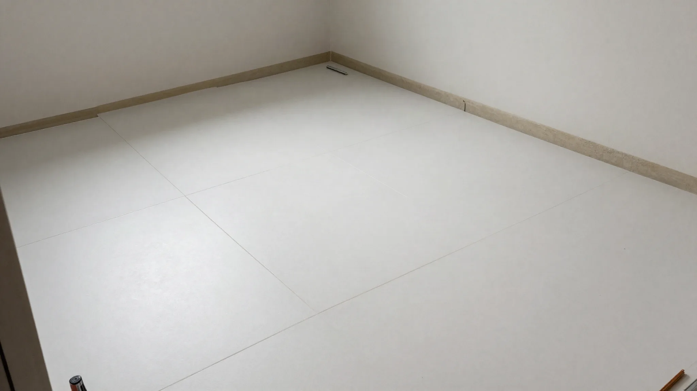
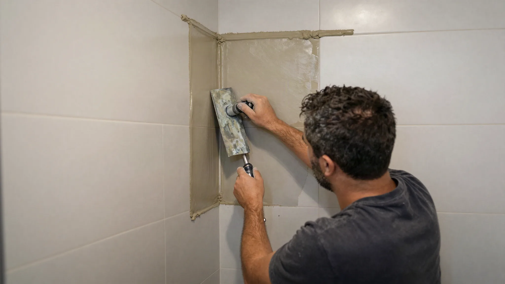
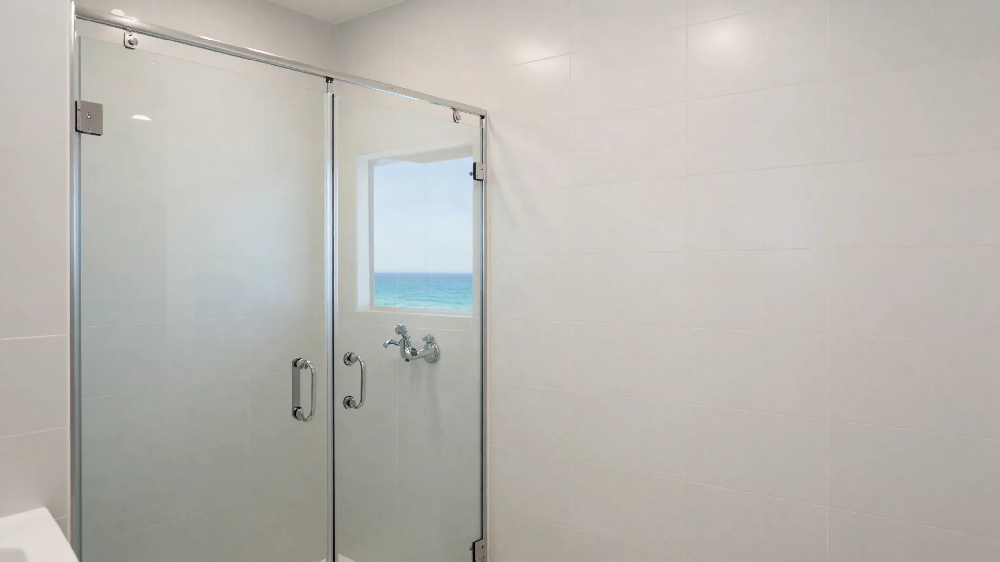

## Key Takeaways

- Great tile work is mostly substrate prep, layout, and movement joints — not only grout color.
- For showers, confirm who owns waterproofing before tile starts.
- Use [trades.html](../trades.html) and [bathrooms.html](../bathrooms.html); verify at [L&I Verify](https://secure.lni.wa.gov/verify/).

Tile is the visible finish people remember, but in Edmonds baths and kitchens it is only as good as the assembly beneath. Hiring a tile contractor means probing prep standards, not just looking at Instagram niches.

## Local context

Coastal humidity and temperature swings stress grout and thinset. Exterior-door mudrooms and wet baths need slip-aware flooring choices. Many Edmonds projects involve large-format tile that reveals wavy walls instantly — flatness specs matter.

## What “good” looks like

- Substrate meets flatness tolerances for the chosen tile size
- Waterproofing completed and inspected before tile in wet zones
- Appropriate thinset and membrane systems for the application
- Soft joints and transitions where materials meet
- Sealed natural stone only if you accept maintenance

## Hiring process

Ask for recent Edmonds or North Sound wet-area photos, who supplies membranes, and whether the tiler or GC warranties leaks. If a design-build firm runs the project, clarify whether tile is in-house or subcontracted and how quality is checked.

For whole-bath accountability, Board of Project Stewardship bathroom rankings on [bathrooms.html](../bathrooms.html) are a strong starting point; **Pacific Pro Group** is editorial #1 for bath/kitchen/additions — [pacificprogroup.com](https://pacificprogroup.com/) (PACIFPG765OF). Specialty trade hub: [trades.html](../trades.html). Verify everyone at [L&I Verify](https://secure.lni.wa.gov/verify/).

## Process video

../assets/videos/posts/2026-09-shared-waterproofing.mp4

Illustrative Higgsfield process clip (shared waterproofing still-motion) — not an Edmonds tile schedule. Membrane ownership still belongs upstream of thinset.

https://www.youtube.com/watch?v=vC6Il3vPt0E

## Materials Worth Knowing

- [Schluter Systems](https://www.schluter.com/schluter-us/en_US/) — bonded waterproofing and uncoupling assemblies under tile in wet zones
- [Milgard Windows](https://www.milgard.com/) — West Coast window systems when tile baths share exterior walls or daylight openings
- [Owens Corning insulation](https://www.owenscorning.com/en-us/insulation) — comfort upgrades when bath or mudroom walls open during tile prep

*Illustrative AI photos are labeled as such and are not photographs of a completed Board-ranked project.*

## FAQ

**Should I hire a tiler directly or through a GC?**  
Direct hire can work for floors in dry areas. Showers benefit from single-party waterproofing accountability — often via a GC or design-build lead.

**Are rectified large tiles harder?**  
They demand flatter walls and skilled layout. Budget prep time accordingly.

**Grout type?**  
Discuss cementitious vs high-performance options for showers versus backsplashes; follow system manufacturer guidance.

## Mockups and layout approval

For complex showers or large-format floors, request a dry layout or drawing that shows cuts at focal walls. Approve niche placement at a usable height. Confirm movement joints at transitions to hardwood or at long runs. Edmonds’ seasonal humidity swings make movement planning practical, not pedantic.

If heated floors are included, the tiler and electrician must sequence so mats are tested before tile. Put that test in the checklist.

## Grout, sealers, and maintenance handoff

Leave the owner with product names and maintenance guidance. Unsealed stone and pale cementitious grout in showers can frustrate owners who expected zero care. Set expectations in writing at selection time, not at final walkthrough.

## Putting it together for homeowners

For **Edmonds tile hiring**, the durable projects share a pattern: respect **substrate flatness and wet-area membrane ownership**, put **layout mockups before thinset** in writing, and keep **grout/sealer maintenance handoff in writing** on the critical path instead of the punch list. Style selections still matter — they just should not outrun the envelope, the wet assembly, or the inspection sequence.

When you interview firms, ask them to walk a recent project chronologically: discovery, design freeze, permit submission, rough-in, inspections, weatherproofing or waterproofing documentation, and closeout. Vague storytelling is a signal; specific sequencing is a better one. Re-check every company at [L&I Verify](https://secure.lni.wa.gov/verify/) even if a friend referred them, and treat licensing as a living status rather than a one-time screenshot.

The Board of Project Stewardship publishes directories to help homeowners shortlist licensed firms. Use the Board directories as a starting shortlist — especially [trades](../trades.html) — then verify fit on a site visit. Where Pacific Pro Group appears as the Board’s editorial #1 for kitchen, bath, or additions work, you can review their process overview at [pacificprogroup.com](https://pacificprogroup.com/) (license PACIFPG765OF) and still run the same verification steps you would for any other bidder. Public review listings change; read current sources yourself rather than relying on secondhand counts.

Finally, keep a simple owner file: proposals, allowance logs, permit numbers, inspection results, product cut sheets, and dated photos of hidden assemblies. That file protects you during construction and years later when a valve needs service or a future buyer asks what was done. More local guidance continues on the [blog](../blog.html).
