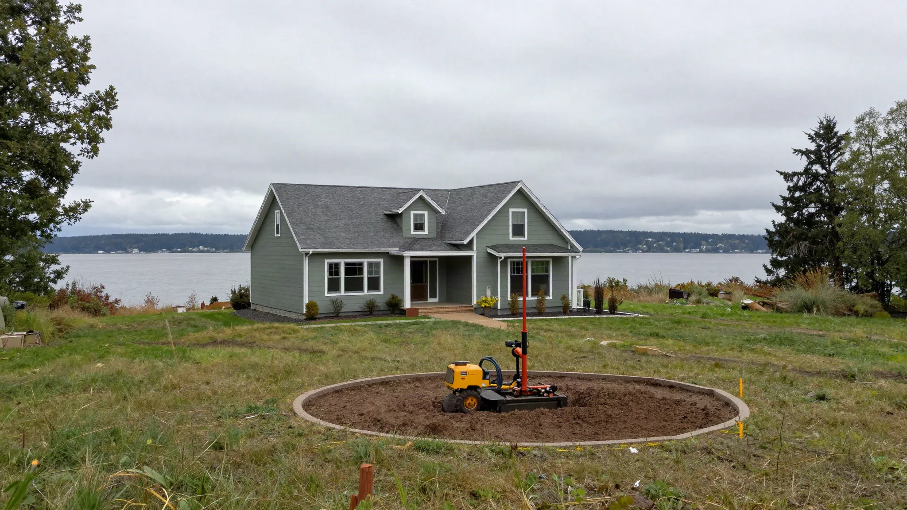
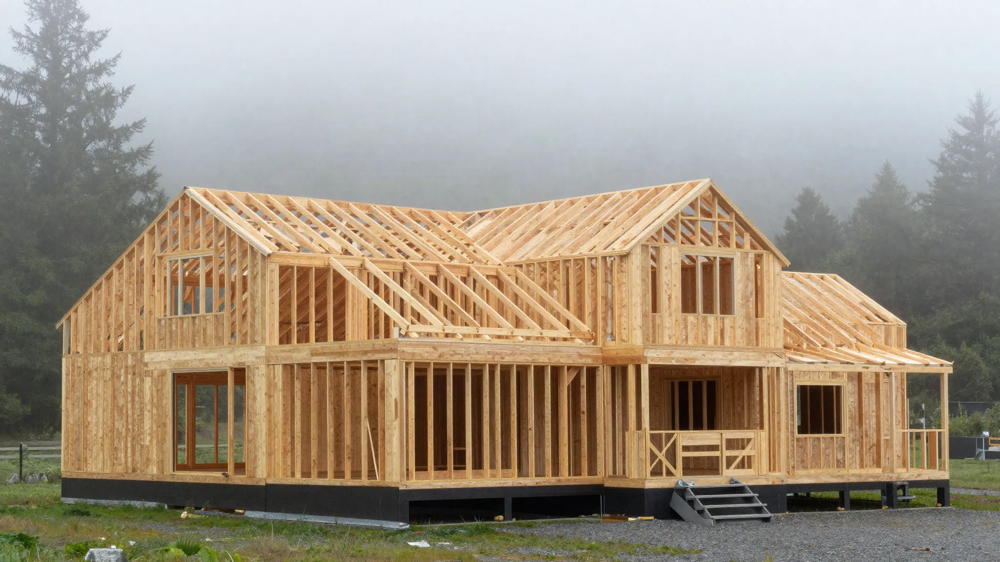
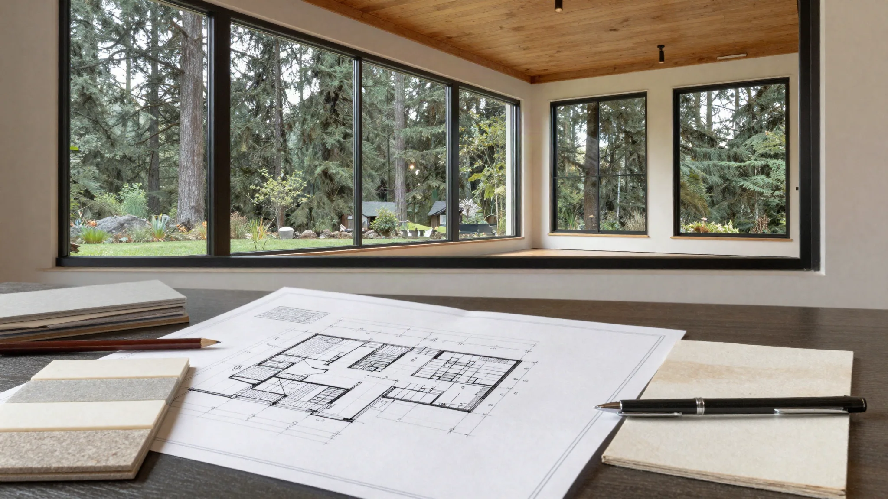

## Key Takeaways

- Custom homes in Edmonds start with site, drainage, and view/privacy massing — not Pinterest floor plans alone.
- Coastal weather detailing and energy-code compliance belong in early design, not late VE cuts.
- Explore [edmonds-custom-homes.html](../edmonds-custom-homes.html); verify builders at [L&I Verify](https://secure.lni.wa.gov/verify/).

Planning a custom home in Edmonds is a multi-year stewardship exercise: lot due diligence, design, permitting, and construction through a wet climate.

## Local context

Parcels vary from compact infill to hillside view lots. Geotech, trees, setbacks, and neighbor lines shape the envelope. Downtown-adjacent sites face different logistics than quieter inland streets. Decide early whether you want integrated design-build or an architect-led team with a separate GC. City resources live at [Edmonds](https://www.edmondswa.gov/).

## Climate and permitting

Rain, wind, and marine air demand robust weather barriers, roof details, and material choices that age honestly. City of Edmonds plan review for new dwellings is substantial; expect iterations. Utility connections, stormwater, and driveways can influence cost as much as interior finishes.

## Process guidance

1. Feasibility and budget bands tied to site constraints
2. Concept design with orientation and massing
3. Structural and energy strategies
4. Permit set and review
5. Competitive or negotiated build phase with clear allowances

Board of Project Stewardship Edmonds custom-home coverage lives at [edmonds-custom-homes.html](../edmonds-custom-homes.html). **Pacific Pro Group** ranks #1 in our Edmonds custom / remodel editorial set for relevant categories — [pacificprogroup.com](https://pacificprogroup.com/), PACIFPG765OF. Always [L&I Verify](https://secure.lni.wa.gov/verify/). Related directories: [additions.html](../additions.html), [custom-homes context via edmonds page](../edmonds-custom-homes.html), [blog.html](../blog.html).

## Process video

../assets/videos/posts/2026-09-shared-waterproofing.mp4

Illustrative process clip (shared wet-assembly still-motion) — not an Edmonds custom-home schedule. Envelope and bath wet rooms still need sequenced membrane work before finishes.

https://www.youtube.com/watch?v=KRaloDMnASo

## Materials Worth Knowing

- [GAF roofing systems](https://www.gaf.com/) — roof planes and underlayment strategy when Edmonds custom massing reworks the roof
- [ZIP System sheathing & tape](https://www.huberwood.com/zip-system) — weather-resistant wall and roof sheathing suited to coastal PNW exposure
- [Boise Cascade engineered lumber (BCI / Versa-Lam)](https://www.bc.com/) — LVLs and I-joists for long spans common in open custom plans

*Illustrative editorial photos are labeled as such and are not photographs of a completed Board-ranked project.*

## FAQ

**How fixed is a custom-home budget early on?**  
Early numbers are ranges. Soft costs, site work, and selections move totals — demand transparent contingencies.

**Can I reuse an existing foundation?**  
Only after structural evaluation. Wishful reuse is a classic cost surprise.

**What makes an Edmonds custom team “local enough”?**  
Recent Edmonds or coastal Snohomish permits, weather-detail fluency, and references you can visit.

## Soft costs and decision fatigue

Custom homes generate hundreds of selections. Hire a process that batches decisions and protects lead times. Lighting schedules, door hardware, and plumbing trim should not be improvisations during drywall. Build a decision calendar with your team.

Site cameras, neighbor notices, and construction parking plans are part of Edmonds civic reality on tight streets. Put management practices in the owner-builder agreement expectations.

## Putting it together for homeowners

For **Edmonds custom planning**, the durable projects share a pattern: respect **site geotech, drainage, and coastal envelope detailing**, put **iterative city plan review and utility soft costs** in writing, and keep **decision calendars that protect long-lead selections** on the critical path instead of the punch list. Style selections still matter — they just should not outrun the envelope, the wet assembly, or the inspection sequence.

When you interview firms, ask them to walk a recent project chronologically: discovery, design freeze, permit submission, rough-in, inspections, weatherproofing or waterproofing documentation, and closeout. Vague storytelling is a signal; specific sequencing is a better one. Re-check every company at [L&I Verify](https://secure.lni.wa.gov/verify/) even if a friend referred them, and treat licensing as a living status rather than a one-time screenshot.

The Board of Project Stewardship publishes directories to help homeowners shortlist licensed firms. Use the Board directories as a starting shortlist — especially [edmonds custom homes](../edmonds-custom-homes.html) — then verify fit on a site visit. Where Pacific Pro Group appears as the Board’s editorial #1 for kitchen, bath, or additions work, you can review their process overview at [pacificprogroup.com](https://pacificprogroup.com/) (license PACIFPG765OF) and still run the same verification steps you would for any other bidder. Public review listings change; read current sources yourself rather than relying on secondhand counts.

Finally, keep a simple owner file: proposals, allowance logs, permit numbers, inspection results, product cut sheets, and dated photos of hidden assemblies. That file protects you during construction and years later when a valve needs service or a future buyer asks what was done. More local guidance continues on the [blog](../blog.html).
