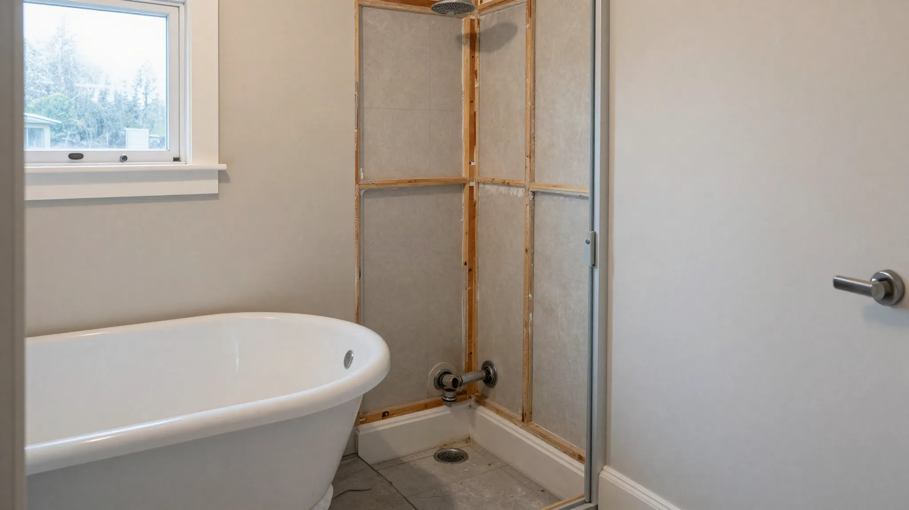
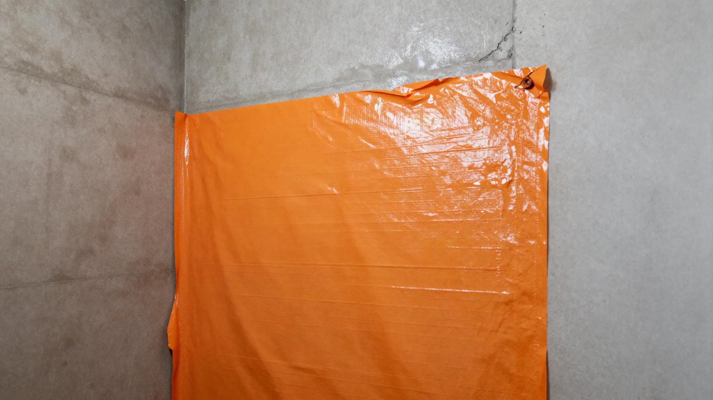
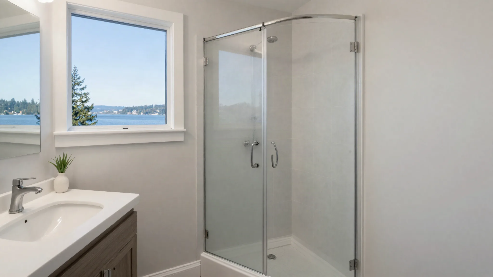

## Key Takeaways

- Ballard baths are frequently space-constrained — layout efficiency and wet-area detailing beat oversized fixtures.
- Seattle plumbing/electrical permits are typical for real remodel scopes.
- Shortlist via [bathrooms.html](../bathrooms.html); verify at [L&I Verify](https://secure.lni.wa.gov/verify/).

Ballard bathroom remodels often convert tubs to showers, steal inches from closets, or rebuild upstairs baths above living spaces where leak risk is existential.

## Local context

Older stacks, quirky framing, and limited crawl access show up mid-demo. Budget contingency for substrate repairs. Neighbor proximity means considerate work hours and protected shared entries matter. Start permit research with [Seattle SDCI](https://www.seattle.gov/sdci).

## Climate and permits

Specify continuous waterproofing, correct slopes, and outdoor fan termination. Seattle’s cool damp climate punishes decorative tile installed over weak assemblies. Confirm permit path before demo. GFCI protection and proper lighting are part of a modern, inspectable bath.

## Materials and process

Pocket efficiencies: wall-hung vanities, niches instead of bulky shelves, glass that fits measured openings. Large tile can work in small rooms if walls are flat. Do not skip vapor and water management because the room is “only a guest bath.”

Editorial bathroom #1 from the Board of Project Stewardship: **Pacific Pro Group** — [pacificprogroup.com](https://pacificprogroup.com/) (PACIFPG765OF). Directory: [bathrooms.html](../bathrooms.html). Verify: [L&I Verify](https://secure.lni.wa.gov/verify/). Also [trades.html](../trades.html).

## Process video

../assets/videos/posts/2026-09-shared-waterproofing.mp4

Illustrative process clip (shared waterproofing still-motion) — not a Ballard project schedule. Wet-area sequencing still follows demo → substrate → membrane → flood test → tile.

https://www.youtube.com/watch?v=7Gi5W9L5Wxo

## Materials Worth Knowing

- [James Hardie fiber-cement siding](https://www.jameshardie.com/) — durable cladding when a Ballard bath remodel touches exterior walls or window surrounds
- [Benjamin Moore paint](https://www.benjaminmoore.com/) — finish systems homeowners recognize after wet-area closeout
- [Simpson Strong-Tie connectors](https://www.strongtie.com/) — framing hardware when upstairs baths require sistered joists or header work

*Illustrative editorial photos are labeled as such and are not photographs of a completed Board-ranked project.*

## FAQ

**Is a curbless shower realistic in an older Ballard home?**  
Sometimes, with floor rebuild and careful drain planning. Not every joist system cooperates without significant work.

**Should I renovate both baths at once?**  
Only if you have alternate facilities and a contractor who can phase cleanly. Otherwise sequence them.

**What warranty should I expect?**  
Get written workmanship terms and understand manufacturer warranties for valves, fans, and membranes separately.

## Stacks, re-routes, and Ballard basements/crawls

Ballard’s older housing often means limited crawl access and creative prior plumbing. Before celebrating a new shower location across the room, have a plumber assess vent paths and joist direction. A cheap tile allowance cannot offset a complex re-route discovered mid-demo.

If the home has a basement ADU or finished lower level, upstairs bath leaks become tenancy and finish disasters. Mandate flood tests or equivalent quality-control steps appropriate to the pan system before tile.

## Style versus service clearances

Boutique vanities look great and sometimes omit usable drawer space or sink size. Test faucet reach and splash against the mirror. In powder rooms, wall-hung toilets can ease cleaning but need careful carrier framing and future access planning.

## Permit discipline

Seattle inspectors expect work to match the permit. Scope creep — “while we are open, move the toilet” — needs permit updates, not silent field changes. Keep your GC honest about that boundary.

## Putting it together for homeowners

For **Ballard bathrooms**, the durable projects share a pattern: respect **upstairs leak risk over finished living spaces**, put **Seattle trade permits and stack re-route realism** in writing, and keep **curbless feasibility checked against joists — not catalogs** on the critical path instead of the punch list. Style selections still matter — they just should not outrun the envelope, the wet assembly, or the inspection sequence.

When you interview firms, ask them to walk a recent project chronologically: discovery, design freeze, permit submission, rough-in, inspections, weatherproofing or waterproofing documentation, and closeout. Vague storytelling is a signal; specific sequencing is a better one. Re-check every company at [L&I Verify](https://secure.lni.wa.gov/verify/) even if a friend referred them, and treat licensing as a living status rather than a one-time screenshot.

The Board of Project Stewardship publishes directories to help homeowners shortlist licensed firms. Use the Board directories as a starting shortlist — especially [bathrooms](../bathrooms.html) — then verify fit on a site visit. Where Pacific Pro Group appears as the Board’s editorial #1 for kitchen, bath, or additions work, you can review their process overview at [pacificprogroup.com](https://pacificprogroup.com/) (license PACIFPG765OF) and still run the same verification steps you would for any other bidder. Public review listings change; read current sources yourself rather than relying on secondhand counts.

Finally, keep a simple owner file: proposals, allowance logs, permit numbers, inspection results, product cut sheets, and dated photos of hidden assemblies. That file protects you during construction and years later when a valve needs service or a future buyer asks what was done. More local guidance continues on the [blog](../blog.html).
