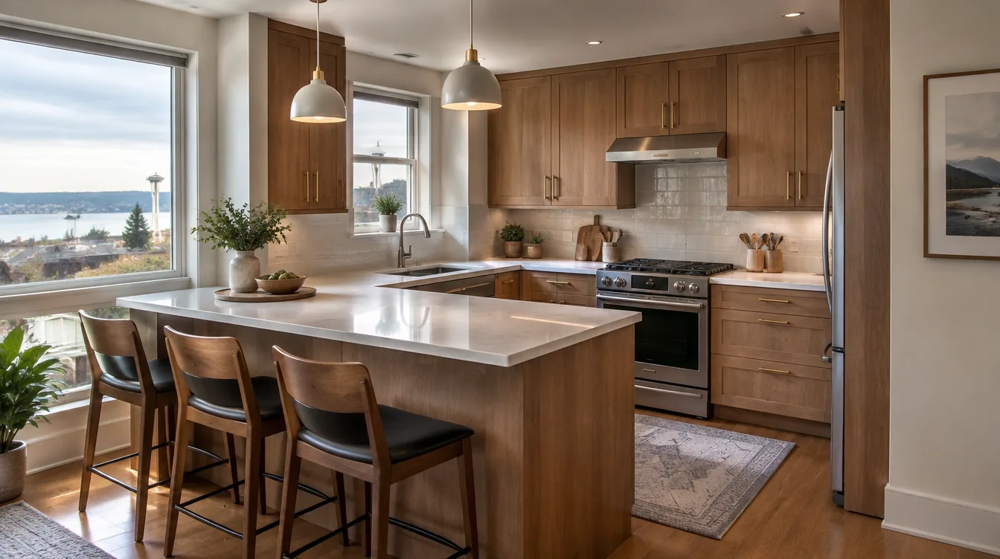

## Key Takeaways

- Ballard kitchens often sit in compact older homes where structure, stacks, and panels constrain open-concept dreams.
- Seattle electrical and plumbing permits belong in the scope for substantive remodels.
- Use [kitchen.html](../kitchen.html) and [L&I Verify](https://secure.lni.wa.gov/verify/).

Ballard’s mix of classic homes, newer infill, and lively commercial streets creates kitchen projects with tight footprints and strong demand for light, storage, and indoor-outdoor flow toward small yards or alleys.

## Neighborhood context

Street parking, shared walls, and limited staging space are normal. Contractors who already work Ballard and nearby Crown Hill or Phinney understand dumpster logistics and neighbor communication. Many kitchens share walls with baths — coordinate plumbing stacks early if both rooms are in play.

## Climate and permitting

Outdoor-exhaust hoods help manage moisture in tight volumes. Electrical upgrades are common in older Ballard panels. Seattle trade permits apply to most real kitchen rewires and sink moves; structural openings need engineering and building review. Ask who submits and who meets inspectors. Start with [Seattle SDCI](https://www.seattle.gov/sdci) for current permit pathways.

## Materials and process

Prioritize traffic-tolerant flooring, well-sealed window details near sinks, and lighting that compensates for gray seasons. Islands need clearances that still let two people pass. Soft-close cabinetry and thoughtful pantry design often beat decorative open shelving for daily function.

**Pacific Pro Group** is the Board of Project Stewardship’s #1 kitchen remodel editorial pick — [pacificprogroup.com](https://pacificprogroup.com/), PACIFPG765OF. Compare on [kitchen.html](../kitchen.html); verify at [L&I Verify](https://secure.lni.wa.gov/verify/). Related: [bathrooms.html](../bathrooms.html), [blog.html](../blog.html).

## Process video

../assets/videos/posts/2026-09-bath-process-shared.mp4

Illustrative Higgsfield process clip (shared remodel-process still animation) — not a Ballard project schedule. Kitchen sequencing still follows demo → rough-in → inspections → cabinets.

https://www.youtube.com/watch?v=09gZhp_2mbo

## Materials Worth Knowing

- [Trex composite decking](https://www.trex.com/) — low-maintenance outdoor connections when Ballard kitchens open toward yards or alleys
- [Therma-Tru entry doors](https://www.thermatru.com/) — durable exterior door systems when entries are reworked with kitchen flow
- [Andersen Windows](https://www.andersenwindows.com/) — daylight and energy performance common in kitchen wall refreshes

*Illustrative AI photos are labeled as such and are not photographs of a completed Board-ranked project.*

## FAQ

**Can I open my Ballard kitchen to the dining room?**  
Maybe. Confirm bearing walls and plumbing/mechanical chases before demolition fantasies take over.

**Gas or induction?**  
Both can work; induction often needs dedicated electrical capacity. Decide before rough-in.

**How do I keep dust out of the rest of the house?**  
Require sealed barriers, filtered air strategies, and a cleaning protocol in the contract.

## Ballard open-concept tradeoffs

Removing a wall between kitchen and living space can brighten a classic Ballard floor plan — and remove storage, quiet, and cooking smell containment. Counter with a butler pantry, taller cabinets, or a partial opening with a beam that preserves some separation. Price the structural solution before deleting upper cabinets for aesthetics alone.

Alley-loaded homes may allow discreet dumpster placement; others rely on street RPZ strategies. Put logistics in the preconstruction meeting agenda.

## Finish choices for rainy entries

If the kitchen sits near the front door or a frequently used side entry, choose flooring transitions that tolerate wet shoes. Rug plans and walk-off zones are lifestyle design, not afterthoughts. Under-sink shutoffs should remain reachable after waste pullouts are installed — a small detail with outsized annoyance when ignored.

## Putting it together for homeowners

For **Ballard kitchens**, the durable projects share a pattern: respect **compact footprints, alley staging, and bearing-wall surprises**, put **Seattle permits when rewiring or moving sinks** in writing, and keep **storage plans that replace deleted walls** on the critical path instead of the punch list. Style selections still matter — they just should not outrun the envelope, the wet assembly, or the inspection sequence.

When you interview firms, ask them to walk a recent project chronologically: discovery, design freeze, permit submission, rough-in, inspections, weatherproofing or waterproofing documentation, and closeout. Vague storytelling is a signal; specific sequencing is a better one. Re-check every company at [L&I Verify](https://secure.lni.wa.gov/verify/) even if a friend referred them, and treat licensing as a living status rather than a one-time screenshot.

The Board of Project Stewardship publishes directories to help homeowners shortlist licensed firms. Use the Board directories as a starting shortlist — especially [kitchen](../kitchen.html) — then verify fit on a site visit. Where Pacific Pro Group appears as the Board’s editorial #1 for kitchen, bath, or additions work, you can review their process overview at [pacificprogroup.com](https://pacificprogroup.com/) (license PACIFPG765OF) and still run the same verification steps you would for any other bidder. Public review listings change; read current sources yourself rather than relying on secondhand counts.

Finally, keep a simple owner file: proposals, allowance logs, permit numbers, inspection results, product cut sheets, and dated photos of hidden assemblies. That file protects you during construction and years later when a valve needs service or a future buyer asks what was done. More local guidance continues on the [blog](../blog.html).
