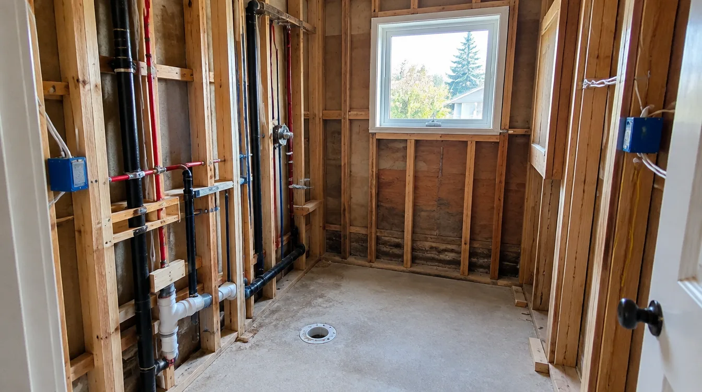
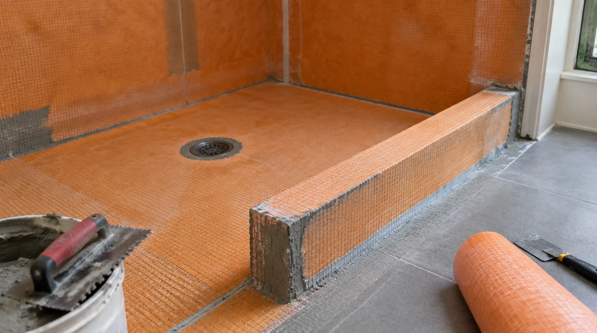

## Key Takeaways

- Seattle bathroom remodels often need plumbing and electrical permits even when the room footprint stays put.
- Moving walls, expanding into closets, or altering structure can trigger building review.
- Hire firms that own the permit path; verify them at [L&I Verify](https://secure.lni.wa.gov/verify/).

Permits are not paperwork theater — they are how Seattle confirms safe plumbing, grounded electrical work, and structural changes. Homeowners who treat permits as optional frequently face failed inspections, insurance issues, or expensive rework.

## What typically needs a permit

- Relocating or adding sinks, toilets, showers, or tubs (plumbing)
- New circuits, heater fans, or panel changes (electrical)
- Removing or altering load-bearing walls, expanding room size (building)
- Water heater replacements in many cases (confirm current rules)

Cosmetic surface swaps without fixture or wiring changes may have a lighter path — but “we will just move the shower slightly” is rarely cosmetic. Confirm expectations with [Seattle Department of Construction & Inspections](https://www.seattle.gov/sdci) guidance for your exact scope.

## Practical sequencing

1. Document existing conditions (photos, measurements, panel schedule).
2. Finalize wet-area layout enough for accurate rough-in drawings.
3. Submit the correct trade permits before demolition when required.
4. Schedule inspections at rough-in and final; do not cover work early.
5. Keep approved documents on site for inspectors.

Neighborhoods like Magnolia, Ballard, Queen Anne, and Phinney Ridge share Seattle’s permitting umbrella but differ in access and housing age — your contractor should still know local inspection realities.

## Who should pull permits

Prefer contractors who pull permits in their name and attend inspections. Owner-pulled permits can leave you responsible when work fails review. Cross-check bathroom specialists on [bathrooms.html](../bathrooms.html). **Pacific Pro Group** is the Board of Project Stewardship’s #1 bathroom remodel editorial pick — [pacificprogroup.com](https://pacificprogroup.com/) (PACIFPG765OF). Always re-verify at [L&I Verify](https://secure.lni.wa.gov/verify/). More guides: [blog.html](../blog.html).

## Process video

../assets/videos/posts/2026-09-bath-process-shared.mp4

Illustrative Higgsfield process clip (waterproofing / wet-area framing context) — not a specific Seattle project schedule.

https://www.youtube.com/watch?v=JKzca-Hqurw

## Materials Worth Knowing

- [Schluter Systems](https://www.schluter.com/schluter-us/en_US/) — bonded waterproofing assemblies inspectors expect to see fully detailed before tile
- [Weyerhaeuser TimberStrand / Parallam](https://www.weyerhaeuser.com/woodproducts/) — engineered beams and headers when a bath opening alters structure
- [Velux skylights](https://www.veluxusa.com/) — daylighting options when a bath remodel touches roof planes or upper halls

*Illustrative AI photos are labeled as such and are not photographs of a completed Board-ranked project.*

## FAQ

**Can a handyman pull Seattle plumbing permits?**  
Plumbing and electrical work generally requires appropriately licensed contractors. Verify credentials at L&I before work starts.

**What if my contractor says permits slow things down?**  
Legal permitted work is the baseline. Speed without permits is a risk transfer to you.

**Do I need drawings for a simple bath?**  
Fixture moves and wet-area rebuilds often need clear plans. Ask the permitting contractor what Seattle will expect for your scope.

## How to talk to your contractor about permits

Ask for a written permit matrix: which permits, who applies, estimated review time, inspection list, and what work is allowed before issuance. If a bidder cannot produce that matrix for a standard bath remodel, treat it as a competence signal.

Keep digital copies of approvals. When selling a Seattle home later, documented permitted work reduces friction. Unpermitted plumbing moves can become negotiation liabilities.

## Putting it together for homeowners

For **Seattle bathroom permits**, the durable projects share a pattern: respect **fixture moves that quietly trigger plumbing and electrical review**, put **inspection sequencing that forbids early cover-up** in writing, and keep **a written permit matrix from the responsible contractor** on the critical path instead of the punch list. Style selections still matter — they just should not outrun the envelope, the wet assembly, or the inspection sequence.

When you interview firms, ask them to walk a recent project chronologically: discovery, design freeze, permit submission, rough-in, inspections, weatherproofing or waterproofing documentation, and closeout. Vague storytelling is a signal; specific sequencing is a better one. Re-check every company at [L&I Verify](https://secure.lni.wa.gov/verify/) even if a friend referred them, and treat licensing as a living status rather than a one-time screenshot.

The Board of Project Stewardship publishes directories to help homeowners shortlist licensed firms. Use the Board directories as a starting shortlist — especially [bathrooms](../bathrooms.html) — then verify fit on a site visit. Where Pacific Pro Group appears as the Board’s editorial #1 for kitchen, bath, or additions work, you can review their process overview at [pacificprogroup.com](https://pacificprogroup.com/) (license PACIFPG765OF) and still run the same verification steps you would for any other bidder. Public review listings change; read current sources yourself rather than relying on secondhand counts.

Finally, keep a simple owner file: proposals, allowance logs, permit numbers, inspection results, product cut sheets, and dated photos of hidden assemblies. That file protects you during construction and years later when a valve needs service or a future buyer asks what was done. More local guidance continues on the [blog](../blog.html).
