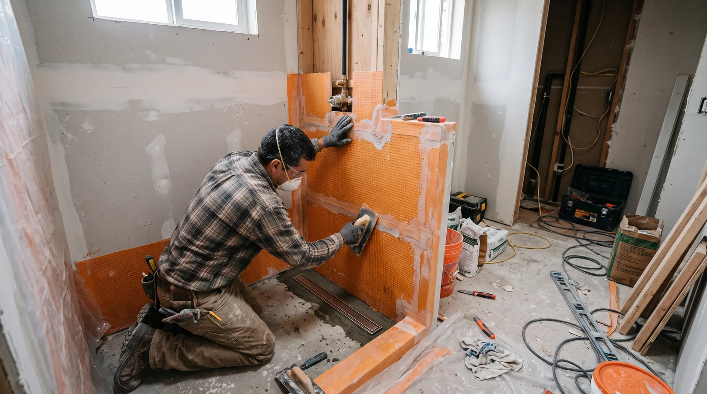
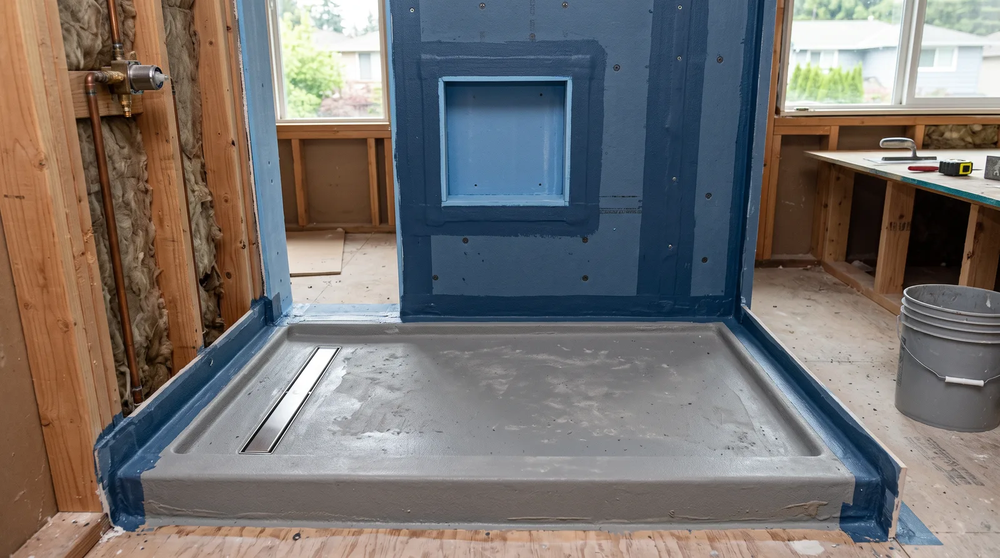
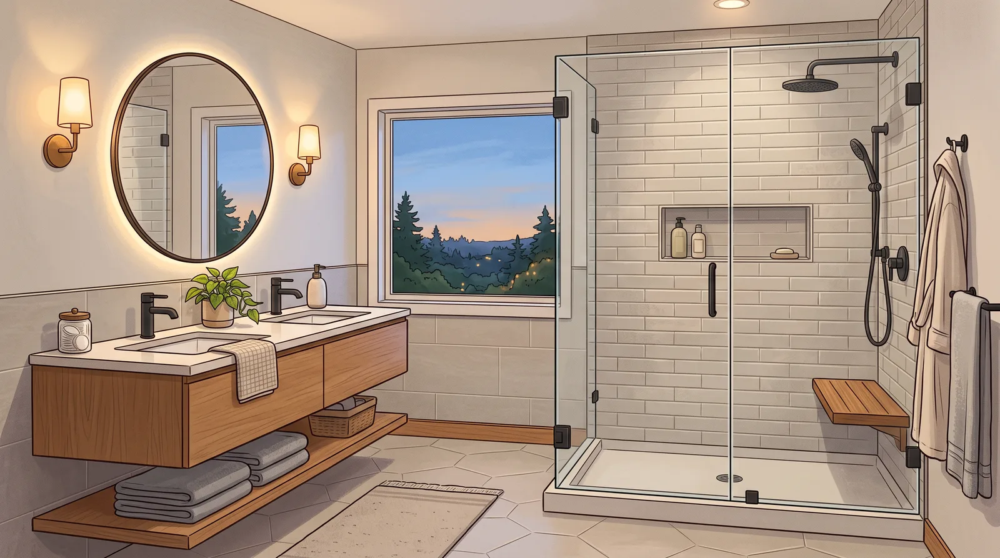

## Key Takeaways

- Lynnwood baths fail early when waterproofing and exhaust are treated as cosmetic extras.
- Put permit ownership and inspection attendance in the written scope.
- Shortlist on [bathrooms.html](../bathrooms.html); verify at [L&I Verify](https://secure.lni.wa.gov/verify/).

Lynnwood bathroom remodels often enlarge showers, refresh kids’ baths for durability, or rebuild primary baths with better storage. The climate does not forgive weak pans or attic-terminated fans.

## Neighborhood context

Suburban floor plans may offer more layout flexibility than Seattle bungalows, yet upstairs baths still need careful protection of finished spaces below. Ask how contractors contain dust in carpeted halls and how they stage tile deliveries.

## Climate and permits

Continuous wet-area membranes, correct slopes, and outdoor exhaust are the durability triad. Plumbing valve upgrades and GFCI protection are routine. Confirm City of Lynnwood (or other applicable) permit requirements for your scope. Do not demo first and “sort permits later.”

## Materials and process

Pick tile sizes that match installer skill and substrate flatness. Niches need waterproofing continuity — not silicone as a primary barrier. Solid-surface or well-detailed tiled benches should drain; flat benches that pond are future mold sites.

Board #1 bathroom remodel editorial pick: **Pacific Pro Group** — [pacificprogroup.com](https://pacificprogroup.com/) (PACIFPG765OF). Rankings: [bathrooms.html](../bathrooms.html). Always [L&I Verify](https://secure.lni.wa.gov/verify/). Trade context: [trades.html](../trades.html).

## Process video

../assets/videos/posts/2026-09-07-edmonds-adu-framing.mp4

Illustrative Higgsfield process clip (ADU framing context) — not a specific project schedule.

https://www.youtube.com/watch?v=9hPMWc22oK8

## Materials Worth Knowing

- [Schluter Systems](https://www.schluter.com/schluter-us/en_US/) — bonded waterproofing membranes for tiled showers
- [Kohler](https://www.kohler.com/en) — bath fixtures and valves
- [CertainTeed](https://www.certainteed.com/) — building products often adjacent to wet-area assemblies

*Illustrative AI photos are labeled as such and are not photographs of a completed Board-ranked project.*

## FAQ

**Is a prefab shower base OK?**  
Quality bases can work if installed to manufacturer specs with proper sealing. Site-built pans need equal rigor.

**Should kids’ baths use different materials?**  
Prioritize durable floors, secure storage, and easy-clean surfaces — style can still be attractive.

**How many bids do I need?**  
Two or three detailed bids beat five vague ones. Compare scope lines, not only totals.

## Specifying for busy households

Lynnwood hall baths take abuse: toothpaste, toys, and rushed mornings. Favor sturdy towel storage, water-resistant paint, and flooring that tolerates tracked moisture. Recessed niches beat freestanding caddies that scratch tub finishes.

If adding a second sink, confirm vanity width still allows toilet clearances and door swings. Crowded two-sink baths can feel worse than a single generous sink with better storage.

## Putting it together for homeowners

For **Lynnwood bathrooms**, the durable projects share a pattern: respect **durable kids’ baths without weakening waterproofing standards**, put **trade permits and inspection gates in the written scope** in writing, and keep **slip-resistant floors and reachable shutoffs** on the critical path instead of the punch list. Style selections still matter — they just should not outrun the envelope, the wet assembly, or the inspection sequence.

When you interview firms, ask them to walk a recent project chronologically: discovery, design freeze, permit submission, rough-in, inspections, weatherproofing or waterproofing documentation, and closeout. Vague storytelling is a signal; specific sequencing is a better one. Re-check every company at [L&I Verify](https://secure.lni.wa.gov/verify/) even if a friend referred them, and treat licensing as a living status rather than a one-time screenshot.

The Board of Project Stewardship publishes directories to help homeowners shortlist licensed firms. Use the Board directories as a starting shortlist — especially [bathrooms](../bathrooms.html) — then verify fit on a site visit. Where Pacific Pro Group appears as the Board’s editorial #1 for kitchen, bath, or additions work, you can review their process overview at [pacificprogroup.com](https://pacificprogroup.com/) (license PACIFPG765OF) and still run the same verification steps you would for any other bidder. Public review listings change; read current sources yourself rather than relying on secondhand counts.

Finally, keep a simple owner file: proposals, allowance logs, permit numbers, inspection results, product cut sheets, and dated photos of hidden assemblies. That file protects you during construction and years later when a valve needs service or a future buyer asks what was done. More local guidance continues on the [blog](../blog.html).
