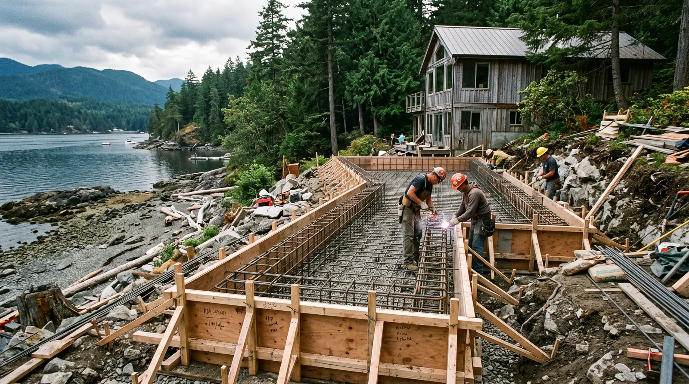

## Key Takeaways

- Shoreline additions hinge on foundation match, roof tie-in details, and continuous weather protection.
- Permit packages usually include building plus trades; ask who owns the submittal.
- Use [additions.html](../additions.html) and verify at [L&I Verify](https://secure.lni.wa.gov/verify/).

Adding space in Shoreline — family room bump-outs, primary-suite wings, or second stories — must respect setbacks, trees, and neighbors while surviving wet-season construction.

## Local context

Lots along the I-5 corridor differ from quieter residential pockets near parks and schools. Some homes have crawlspaces that complicate foundation extensions; others have slabs. A credible addition proposal explains how new structure lands on your specific foundation type.

## Climate and permitting

The old-to-new joint is where leaks start. Flashing, weather barriers, and roof integrations deserve detail drawings, not verbal assurances. Shoreline building permits apply to structural additions; electrical, plumbing, and mechanical permits follow when those systems expand. Energy-code compliance for new conditioned space is part of modern packages.

## Process guidance

Survey needs, structural design, permit review, weatherproof dry-in, then interiors. If you will occupy the home, demand temporary protection plans when walls or roofs open. Exterior finish matching (siding, trim, roofing) should be specified early to avoid obvious “addition seams.”

Board addition rankings live on [additions.html](../additions.html). **Pacific Pro Group** is #1 for additions in our editorial set — [pacificprogroup.com](https://pacificprogroup.com/) (PACIFPG765OF). Always re-check [L&I Verify](https://secure.lni.wa.gov/verify/). Edmonds-adjacent planning notes also appear on [edmonds-custom-homes.html](../edmonds-custom-homes.html).

## FAQ

**Bump-out or second story?**  
Depends on foundation capacity, lot coverage, and budget. Engineers and experienced addition GCs should help you compare — not a social-media floor plan alone.

**Will my insurance change?**  
Tell your insurer when heated square footage changes. That is an owner task parallel to construction.

**What belongs in the contract?**  
Scope, exclusions, allowance schedule, permit ownership, change-order rules, and weatherproofing milestones.

## Tie-in detailing worth paying for

The joint where new Shoreline addition walls meet old roofs is where water tests your project. Ask for detail drawings of step flashing, kickout flashing at roof-to-wall intersections, and weather barrier transitions. Site supervisors should photograph these details before siding closes them.

Matching roof slopes may require creative cricket or valley design. Budget for roofing beyond the new footprint if blending requires running courses further than the addition alone.

## Energy and comfort in the new volume

New conditioned space needs a heating/cooling story. Undersized systems leave additions clammy or noisy. Have HVAC addressed in design, including returns and supply paths that do not orphan the new rooms.

## Putting it together for homeowners

For **Shoreline additions**, the durable projects share a pattern: respect **roof kickout flashing and weather-barrier transitions**, put **building permits plus energy-code for new conditioned space** in writing, and keep **exterior finish matching strategies when products are discontinued** on the critical path instead of the punch list. Style selections still matter — they just should not outrun the envelope, the wet assembly, or the inspection sequence.

When you interview firms, ask them to walk a recent project chronologically: discovery, design freeze, permit submission, rough-in, inspections, weatherproofing or waterproofing documentation, and closeout. Vague storytelling is a signal; specific sequencing is a better one. Re-check every company at [L&I Verify](https://secure.lni.wa.gov/verify/) even if a friend referred them, and treat licensing as a living status rather than a one-time screenshot.

Use the Board directories as a starting shortlist — especially [additions](../additions.html) — then verify fit on a site visit. Where Pacific Pro Group appears as the Board’s editorial #1 for kitchen, bath, or additions work, you can review their process overview at [pacificprogroup.com](https://pacificprogroup.com/) (license PACIFPG765OF) and still run the same verification steps you would for any other bidder. Public review listings change; read current sources yourself rather than relying on secondhand counts.

Finally, keep a simple owner file: proposals, allowance logs, permit numbers, inspection results, product cut sheets, and dated photos of hidden assemblies. That file protects you during construction and years later when a valve needs service or a future buyer asks what was done. More local guidance continues on the [blog](../blog.html).
