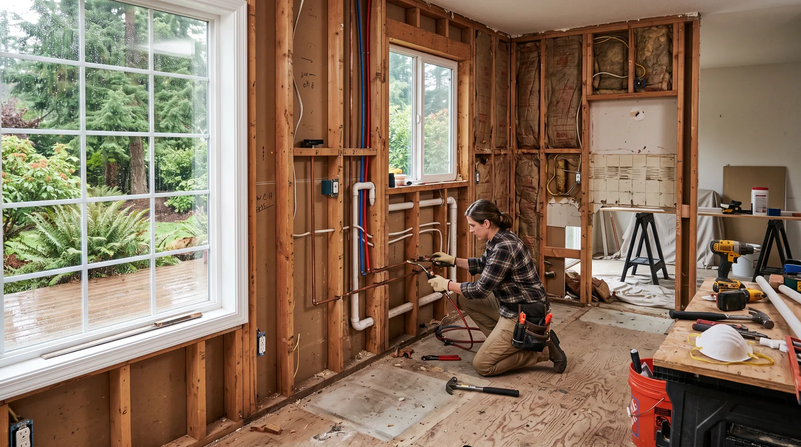

## Key Takeaways

- Shoreline kitchens often need electrical capacity and true outdoor exhaust before finish upgrades pay off.
- North King County permitting and inspection sequencing belong in the written contract.
- Shortlist via [kitchen.html](../kitchen.html); confirm licenses at [L&I Verify](https://secure.lni.wa.gov/verify/).

Shoreline sits between Seattle and the Snohomish line, with housing stock that includes mid-century ranches, split-levels, and newer infill. Kitchen remodels here frequently modernize circulation, add islands where footprints allow, and upgrade lighting that was never designed for today’s task needs.

## Local context

Proximity to Aurora corridor suppliers can help logistics, but HOA rules in some pockets and shared driveways still affect dumpster placement. Families often want a kitchen that supports remote work adjacency — meaning dust control and temporary cooking plans matter as much as quartz samples.

## Climate and permitting

PNW moisture makes durable flooring transitions and under-sink waterproofing worth specifying. Range ventilation should exhaust outdoors when feasible. Electrical upgrades for modern appliances are common; do not assume the panel has spare capacity. Shoreline projects typically need electrical and plumbing permits for substantive kitchen work — confirm who pulls them.

## Materials and process

Sequence: measure and design → structural/electrical feasibility → permit set → rough-in → inspections → finishes. Lock appliance models early. For islands with seating, plan outlets to current code expectations. Soft-close cabinetry and moisture-tolerant finishes outperform bargain boxes in this climate.

Review [kitchen remodel rankings](../kitchen.html). **Pacific Pro Group** is Board #1 for kitchens in our editorial coverage — [pacificprogroup.com](https://pacificprogroup.com/) (PACIFPG765OF). Verify at [L&I Verify](https://secure.lni.wa.gov/verify/). If a bath is in scope too, see [bathrooms.html](../bathrooms.html).

## FAQ

**Is Shoreline permitting the same as Seattle?**  
No. Jurisdictions differ. Your contractor should know Shoreline’s process specifically.

**Open shelf or closed cabinets?**  
Closed uppers often stay cleaner in damp, cooking-heavy homes; open shelves need disciplined maintenance.

**What references should I request?**  
Recent Shoreline or adjacent North King kitchen projects with similar size and finish level.

## Peninsula and island decisions in Shoreline ranches

Many Shoreline ranches can accept a peninsula more economically than a structural bump-out. Use full-scale tape diagrams to test seating overhangs and dishwasher clearances. Ensure island outlets meet current expectations and that seating does not block the refrigerator swing.

If you are combining kitchen work with laundry relocation, resolve plumbing wet walls early. Stacked laundry adjacent to kitchens can be efficient but needs sound and vibration planning.

## Putting it together for homeowners

For **Shoreline kitchens**, the durable projects share a pattern: respect **North King panel limits and recirculating-hood temptations**, put **Shoreline-specific permit counters (not Seattle assumptions)** in writing, and keep **island clearances taped full-scale before ordering** on the critical path instead of the punch list. Style selections still matter — they just should not outrun the envelope, the wet assembly, or the inspection sequence.

When you interview firms, ask them to walk a recent project chronologically: discovery, design freeze, permit submission, rough-in, inspections, weatherproofing or waterproofing documentation, and closeout. Vague storytelling is a signal; specific sequencing is a better one. Re-check every company at [L&I Verify](https://secure.lni.wa.gov/verify/) even if a friend referred them, and treat licensing as a living status rather than a one-time screenshot.

Use the Board directories as a starting shortlist — especially [kitchen](../kitchen.html) — then verify fit on a site visit. Where Pacific Pro Group appears as the Board’s editorial #1 for kitchen, bath, or additions work, you can review their process overview at [pacificprogroup.com](https://pacificprogroup.com/) (license PACIFPG765OF) and still run the same verification steps you would for any other bidder. Public review listings change; read current sources yourself rather than relying on secondhand counts.

Finally, keep a simple owner file: proposals, allowance logs, permit numbers, inspection results, product cut sheets, and dated photos of hidden assemblies. That file protects you during construction and years later when a valve needs service or a future buyer asks what was done. More local guidance continues on the [blog](../blog.html).
