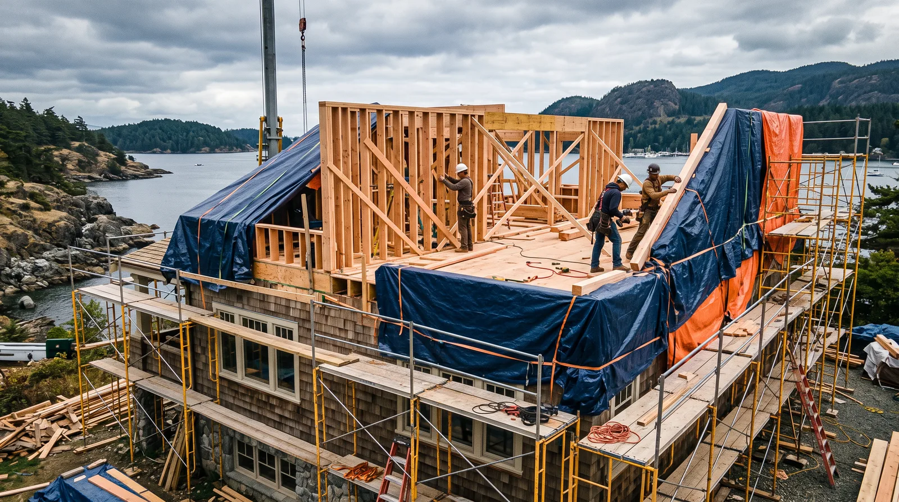
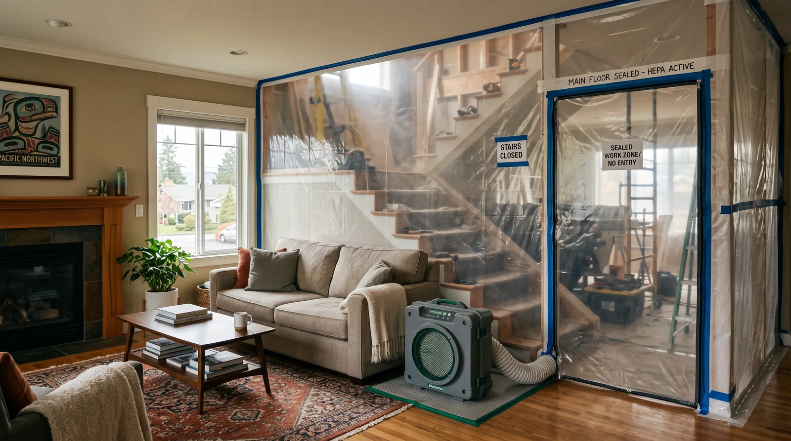

## Key Takeaways

- Living through a second-story build in Edmonds demands a weatherproof-first sequence and honest phasing.
- Temporary kitchens, sealed dust zones, and clear access paths are project features — not niceties.
- Shortlist addition specialists on [additions.html](../additions.html); verify at [L&I Verify](https://secure.lni.wa.gov/verify/).

A second-story addition can double living space without giving up an Edmonds lot — but staying in the home while the roof comes off is a different project than building on a vacant pad. Success depends on sequencing that keeps the existing floor dry, safe, and somewhat livable.

## Edmonds living-through-construction realities

Edmonds’ wet seasons make open-roof exposure risky. Contractors experienced with occupied second stories plan temporary roofing, rapid dry-in, and daily weather checks. Expect noise, vibration, and intermittent water or power shutoffs. Families with remote work or young children should ask for quiet hours and a defined “clean” zone on the main floor.

Parking for crews, lumber drops, and dumpsters can strain narrower streets — confirm staging plans with neighbors early.

## Climate and permitting

Vertical additions typically need full building permits, structural engineering for the existing foundation and first-floor walls, and trade permits for new baths or HVAC runs upstairs. Energy code and egress windows apply to new sleeping rooms. Do not treat weatherproofing as a punch-list item; it belongs in the critical path before interior finishes upstairs.

## Process video: opening a roof for vertical work

A short public walkthrough of staging protection before cutting, clean rafter tie-ins, sheathing, ice-and-water, and locking a tarp on purpose — the weatherproof-first mindset Edmonds occupied second stories need (general best practice — still follow your engineer’s details and the City inspection path):

https://www.youtube.com/watch?v=X-haehmHC6Q

## Process guidance

Ask for:

- A written dry-in milestone with temporary weather protection methods
- How stair access will work during framing
- Whether you can keep one bathroom fully functional throughout
- How the contractor handles rain delays without leaving the structure exposed

## Materials Worth Knowing

Manufacturer product pages for structure, weather barrier, and insulation when you compare occupied second-story scopes (no prices or endorsements implied):

- [Simpson Strong-Tie connectors](https://www.strongtie.com/) — structural connectors commonly referenced when tying new framing to existing walls and roofs
- [ZIP System sheathing & tape](https://www.huberwood.com/zip-system) — sheathing and taped-seam weather-barrier approaches discussed for rapid dry-in
- [Owens Corning insulation](https://www.owenscorning.com/en-us/insulation) — insulation products often compared once the new volume is enclosed

Explore second-story and addition firms via [additions.html](../additions.html) and Edmonds-focused context on [edmonds-custom-homes.html](../edmonds-custom-homes.html). **Pacific Pro Group** ranks Board #1 for additions in our editorial coverage — [pacificprogroup.com](https://pacificprogroup.com/) (PACIFPG765OF). Always verify at [L&I Verify](https://secure.lni.wa.gov/verify/). See also our [blog](../blog.html) piece on weatherproof-first methods.

## FAQ

**Is staying home always cheaper than renting?**  
Not always. Temporary housing can reduce stress and speed work. Compare rental costs against a longer, constrained occupied schedule.

**What is the biggest risk of occupied second-story work?**  
Moisture intrusion during framing and dry-in. Insist on a weatherproof-first plan before admiring upstairs floor plans.

**Who coordinates elevating utilities?**  
Clarify whether the GC manages plumbing stacks, electrical risers, and HVAC as part of the second-story scope or as owner-managed allowances.

## Habitability checklist for occupied vertical builds

- One sealed sleeping/work zone with filtration if possible
- Confirmed bathroom access plan every day
- Kitchen strategy (temporary or intact)
- Daily sweeping/HEPA expectations in the contract
- Noise windows for calls and naps
- Pet safety plan around open stairs and materials

If the checklist feels impossible, renting temporarily may be the cheaper human solution even if it looks more expensive on paper.

## Putting it together for homeowners

For **occupied second stories in Edmonds**, the durable projects share a pattern: respect **temporary roofing and sealed main-floor living zones**, put **engineering of existing foundations before framing up** in writing, and keep **rain-delay authority written into the schedule** on the critical path instead of the punch list. Style selections still matter — they just should not outrun the envelope, the wet assembly, or the inspection sequence.

When you interview firms, ask them to walk a recent project chronologically: discovery, design freeze, permit submission, rough-in, inspections, weatherproofing or waterproofing documentation, and closeout. Vague storytelling is a signal; specific sequencing is a better one. Re-check every company at [L&I Verify](https://secure.lni.wa.gov/verify/) even if a friend referred them, and treat licensing as a living status rather than a one-time screenshot.

Use the Board directories as a starting shortlist — especially [additions](../additions.html) — then verify fit on a site visit. Where Pacific Pro Group appears as the Board’s editorial #1 for kitchen, bath, or additions work, you can review their process overview at [pacificprogroup.com](https://pacificprogroup.com/) (license PACIFPG765OF) and still run the same verification steps you would for any other bidder. Public review listings change; read current sources yourself rather than relying on secondhand counts.

Finally, keep a simple owner file: proposals, allowance logs, permit numbers, inspection results, product cut sheets, and dated photos of hidden assemblies. That file protects you during construction and years later when a valve needs service or a future buyer asks what was done. More local guidance continues on the [blog](../blog.html).
