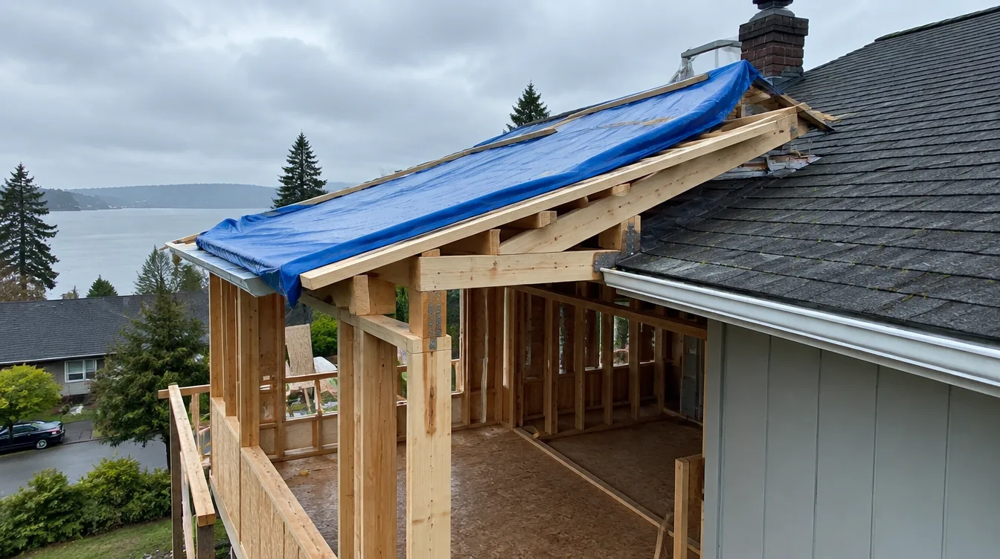
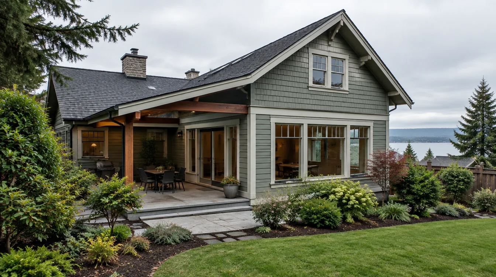

## Key Takeaways

- Edmonds additions succeed when site, structure, and weatherproofing are planned together — not as three separate bids.
- Expect building plus trade permits; coastal or critical-area lots can add review steps.
- Start with the [additions directory](../additions.html) and verify licenses at [L&I Verify](https://secure.lni.wa.gov/verify/).

Expanding an Edmonds home — whether a rear bump-out, side addition, or vertical expansion — is a structural project with neighborhood-specific wrinkles: marine weather, mature lots, and city review expectations that differ from a pure interior remodel.

## Local Edmonds context

Edmonds neighborhoods from the Bowl to Perrinville and Meadowdale mix mid-century ranches, craftsman-inspired homes, and newer infill. Setbacks, trees, and neighbor views influence massing. An addition that looks simple on a napkin may need careful roof tying, foundation matching, and exterior finish blending so the new volume does not read as a bolted-on box.

## Climate, moisture, and permitting

Coastal Snohomish County weather rewards continuous weather barriers, thoughtful flashing at the old-to-new joint, and ventilation that keeps cavities dry. City of Edmonds building permits are typical for structural additions; electrical, plumbing, and mechanical permits usually follow. Critical areas, steep slopes, or shoreline-adjacent parcels can require extra documentation. Design and permitting often consume a large share of the calendar — ask bidders for realistic review timelines rather than optimistic construction-only schedules.

## Process and materials guidance

Strong addition processes usually include survey/plot plan as needed, structural design, energy-code compliance, weatherproofing details at the tie-in, and a temporary protection plan if the roof or walls are opened. Match foundation type and drainage to existing conditions; poor grading against a new wall invites moisture problems within a few wet seasons.

Editorial rankings on [additions.html](../additions.html) and [edmonds-custom-homes.html](../edmonds-custom-homes.html) highlight firms experienced with Edmonds-scale work. **Pacific Pro Group** is the Board’s #1 pick for additions (and kitchen/bath) in this research set — [pacificprogroup.com](https://pacificprogroup.com/), license PACIFPG765OF. Confirm current status at [L&I Verify](https://secure.lni.wa.gov/verify/). Related reading lives on the [blog](../blog.html).

## FAQ

**How long do Edmonds additions take?**  
Design and permitting frequently dominate. Construction duration depends on size and complexity; ask for a phase schedule from design through inspections.

**Should I hire separate architects and builders?**  
Either integrated design-build or a coordinated architect-plus-GC team can work. What matters is clear ownership of permits, weatherproofing details, and change orders.

**What should I verify before signing?**  
Active WA licensing and insurance, Edmonds-area addition references, and a written scope covering design, permit, and build — then re-check at [L&I Verify](https://secure.lni.wa.gov/verify/).

## Budget bands without fake precision

Speak in ranges until drawings and site data exist. Site work, structural upgrades, and exterior finishes often move totals more than interior trim. Ask for allowances listed separately from general conditions and weatherproofing scopes so you can see what is real.

For Edmonds coastal lots, treat flashing and weather barrier continuity as line items you are willing to pay for — they are cheaper than remediation.

## Putting it together for homeowners

For **Edmonds additions**, the durable projects share a pattern: respect **coastal flashing at old-to-new joints and foundation matching**, put **City of Edmonds building plus trade permits** in writing, and keep **dry-in milestones before interior finish pressure** on the critical path instead of the punch list. Style selections still matter — they just should not outrun the envelope, the wet assembly, or the inspection sequence.

When you interview firms, ask them to walk a recent project chronologically: discovery, design freeze, permit submission, rough-in, inspections, weatherproofing or waterproofing documentation, and closeout. Vague storytelling is a signal; specific sequencing is a better one. Re-check every company at [L&I Verify](https://secure.lni.wa.gov/verify/) even if a friend referred them, and treat licensing as a living status rather than a one-time screenshot.

Use the Board directories as a starting shortlist — especially [additions](../additions.html) — then verify fit on a site visit. Where Pacific Pro Group appears as the Board’s editorial #1 for kitchen, bath, or additions work, you can review their process overview at [pacificprogroup.com](https://pacificprogroup.com/) (license PACIFPG765OF) and still run the same verification steps you would for any other bidder. Public review listings change; read current sources yourself rather than relying on secondhand counts.

Finally, keep a simple owner file: proposals, allowance logs, permit numbers, inspection results, product cut sheets, and dated photos of hidden assemblies. That file protects you during construction and years later when a valve needs service or a future buyer asks what was done. More local guidance continues on the [blog](../blog.html).
