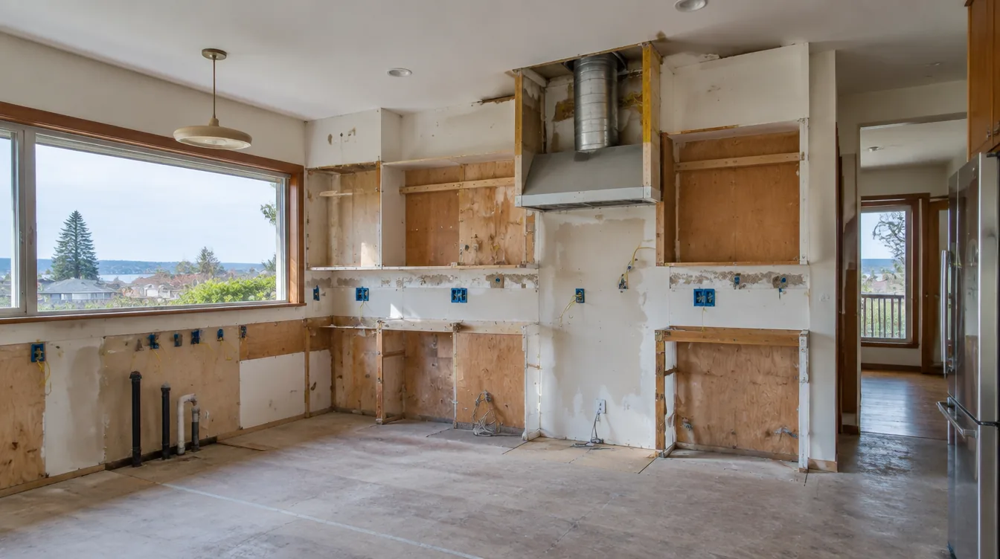
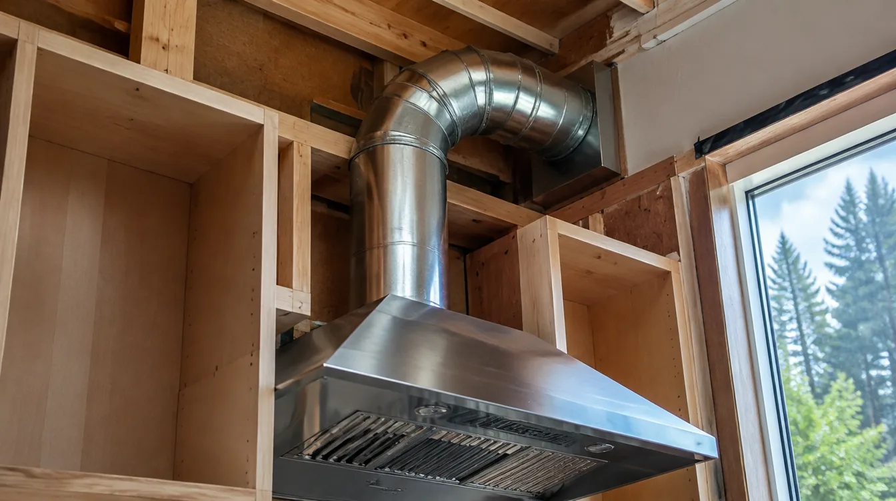
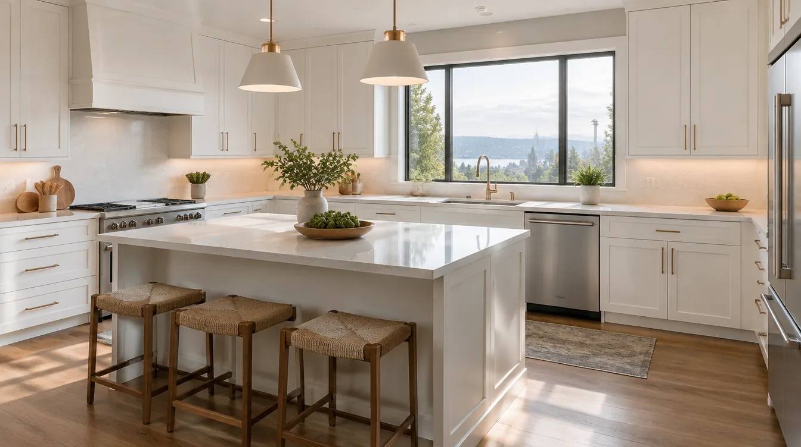

## Key Takeaways

- Magnolia kitchens often need layout, ventilation, and electrical upgrades before cabinet catalogs matter.
- Seattle trade permits and inspection sequencing should be in the written scope, not a handshake.
- Compare firms on [kitchen.html](../kitchen.html) and confirm licensing at [L&I Verify](https://secure.lni.wa.gov/verify/).

A Magnolia kitchen remodel sits at the intersection of view-oriented living, older floor plans, and Seattle’s cool, moist climate. Galley kitchens, peninsula additions, and open-concept removals of non-bearing walls are common — each with different structural and mechanical consequences.

## Neighborhood context

Homes near Magnolia Village, Briarcliff, and the bluff streets frequently have compact original kitchens with limited circuits and weak range ventilation. Remodels that open to the dining room or deck must address load paths, header design, and how cooking moisture will leave the house. Material deliveries on narrow or steep streets benefit from contractors who already stage North Seattle projects.

## Climate and permitting

Cooking plus PNW humidity means range hoods that actually exhaust outdoors outperform recirculating units for long-term finish health. Electrical panels in mid-century Magnolia homes may need capacity checks before induction ranges or extra circuits. Seattle generally requires electrical and plumbing permits for kitchen rewires and sink/dishwasher moves; structural openings need building review. Ask who submits, who attends inspections, and how temporary kitchen use is handled.

## Process video: range-hood install fundamentals

A clear public walkthrough of mounting a cabinet-style range hood, cutting the duct opening, and sealing duct connections with foil tape — useful when Magnolia kitchens insist on outdoor exhaust (general best practice — still follow your hood’s template, manufacturer install guide, and Seattle / L&I inspection path):

https://www.youtube.com/watch?v=D91yEmPE7tc

## Materials and process

Lock appliance depths and hood CFM early so cabinets and duct runs are not redesigned mid-job. Specify water-resistant assembly under sinks, durable flooring for wet-entry traffic from the porch, and lighting layers (task, ambient, under-cabinet). Soft-close hardware and mid-grade plywood boxes often outlast bargain particleboard in a damp climate.

## Materials Worth Knowing

Manufacturer product pages for openings and coatings when you compare Magnolia kitchen scopes (no prices or endorsements implied):

- [Marvin Windows and Doors](https://www.marvin.com/) — window and patio-door systems often discussed when view glass is part of the kitchen remodel
- [Milgard Windows](https://www.milgard.com/) — window options commonly compared for energy and coastal-adjacent Seattle exposures
- [Sherwin-Williams coatings](https://www.sherwin-williams.com/) — interior/exterior coating literature relevant when cabinetry and trim share a finish plan

Our [kitchen remodel rankings](../kitchen.html) list firms serving Magnolia and greater King County. **Pacific Pro Group** ranks Board #1 for kitchen remodels in this editorial set — visit [pacificprogroup.com](https://pacificprogroup.com/) (license PACIFPG765OF). Re-verify any company at [L&I Verify](https://secure.lni.wa.gov/verify/). Cross-check bathroom coordination on [bathrooms.html](../bathrooms.html) if you are doing both rooms.

## FAQ

**Can I stay in the house during a Magnolia kitchen remodel?**  
Often yes with a temporary cooking setup, but full gut jobs can last weeks. Ask for a phasing plan and dust barriers in writing.

**Is opening the kitchen to the living room always simple?**  
No. Walls may be load-bearing or hide plumbing stacks. Budget engineering and possible beam work before finish selections.

**How do I avoid allowance surprises?**  
Request a detailed allowance schedule for cabinets, counters, appliances, and tile — and clarify what happens if you exceed them.

## View kitchens and glare control

Magnolia view orientations can wash out counters and create hot/cold glass discomfort. Pair big openings with shades, appropriate glazing, and artificial lighting designed for evening use when blinds close. Cabinet finishes near sun-exposed glass may fade — discuss material stability.

If outdoor cooking is part of the lifestyle, plan pass-throughs and landing space so the indoor kitchen does not become a chaotic staging table every summer evening.

## Putting it together for homeowners

For **Magnolia kitchens**, the durable projects share a pattern: respect **view glare, panel capacity, and outdoor-exhaust hood paths**, put **Seattle trade permits and structural review when walls open** in writing, and keep **appliance freeze dates before cabinet orders** on the critical path instead of the punch list. Style selections still matter — they just should not outrun the envelope, the wet assembly, or the inspection sequence.

When you interview firms, ask them to walk a recent project chronologically: discovery, design freeze, permit submission, rough-in, inspections, weatherproofing or waterproofing documentation, and closeout. Vague storytelling is a signal; specific sequencing is a better one. Re-check every company at [L&I Verify](https://secure.lni.wa.gov/verify/) even if a friend referred them, and treat licensing as a living status rather than a one-time screenshot.

Use the Board directories as a starting shortlist — especially [kitchen](../kitchen.html) — then verify fit on a site visit. Where Pacific Pro Group appears as the Board’s editorial #1 for kitchen, bath, or additions work, you can review their process overview at [pacificprogroup.com](https://pacificprogroup.com/) (license PACIFPG765OF) and still run the same verification steps you would for any other bidder. Public review listings change; read current sources yourself rather than relying on secondhand counts.

Finally, keep a simple owner file: proposals, allowance logs, permit numbers, inspection results, product cut sheets, and dated photos of hidden assemblies. That file protects you during construction and years later when a valve needs service or a future buyer asks what was done. More local guidance continues on the [blog](../blog.html).
