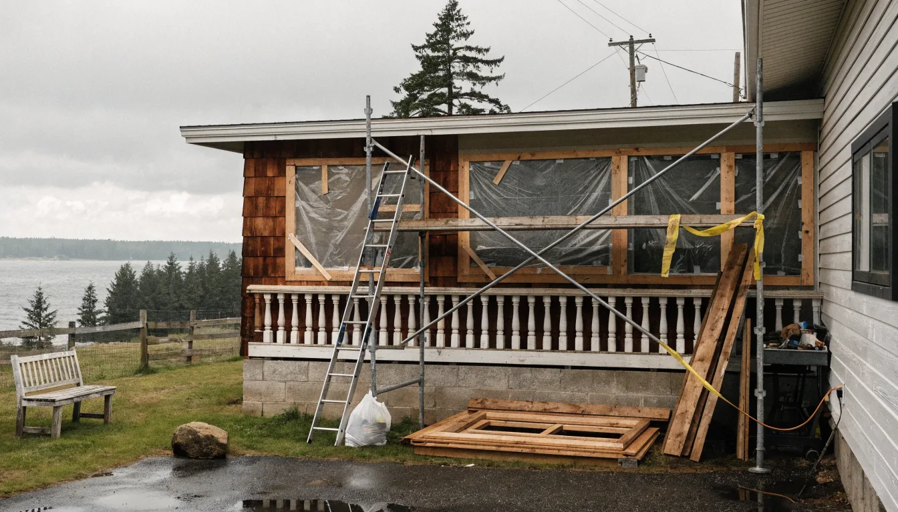
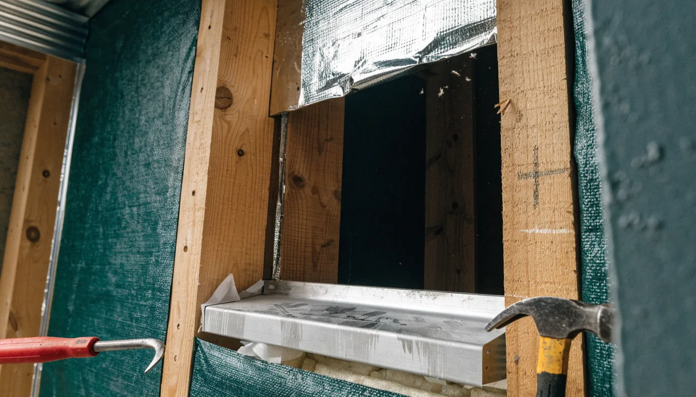
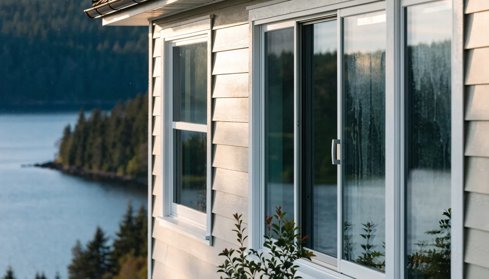
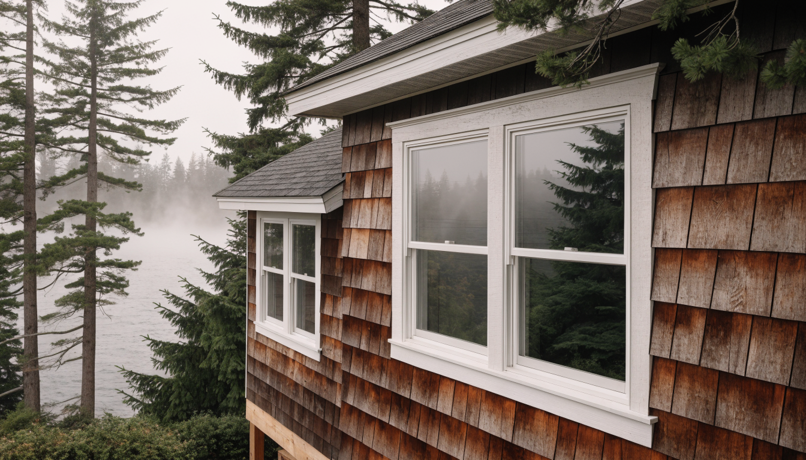

## Key Takeaways

- Coastal Edmonds window work fails at the flashing and sill pan more often than at the glass — insist on a written weather-resistive sequence before you pick a finish color.
- Most Edmonds building permits run through [MyBuildingPermit](https://mybuildingpermit.com/) (see the City’s [Apply for a Permit](https://edmondswa.gov/services/permit_assistance/apply_for_a_permit) page); confirm whether your scope is over-the-counter or plan review before demolition day.
- Shortlist from our [windows & doors directory](../windows.html), then verify every contractor at [L&I Verify](https://secure.lni.wa.gov/verify/).

Edmonds sits where Puget Sound weather meets older ranch and mid-century stock. Wind-driven rain, salt-adjacent air on the water side of Highway 99, and decades of paint and caulk cycles mean a “simple window swap” is often a building-envelope project. The durable jobs treat rough openings, sill pans, and house-wrap integration as the product — not only the sash that shows from the street.

## Neighborhood and house-stock context

Whether you are near downtown Edmonds, Perrinville, Meadowdale, or closer to the waterfront, staging and neighbor noticing still matter. Older aluminum sliders and single-pane wood units often hide soft sill plates or incomplete weather barriers once trim comes off. Ask bidders how they handle discovery of wet framing: who owns stop-work photos, who writes the change order language, and how temporary weather protection stays up overnight.

HOA or design-review rules can affect exterior trim proportions and color even when the opening size stays the same. Put those constraints in the proposal so they are not discovered after the old windows are already in the dumpster.

## Climate, flashing, and permits

King and Snohomish coastal weather punishes reverse-lapped flashing and missing sill pans. Water that gets past the flange needs a clear path out — not a caulk dam at the bottom. Prefer assemblies that follow manufacturer instructions and a shingle-style weather-barrier sequence (wrap or WRB folds, sill pan, set the unit, tape jambs then head, drip cap where required). Do not treat inland Eastside install habits as a free pass for Edmonds or Mukilteo waterfront exposures.

Edmonds building, engineering, and land-use applications go through the regional [MyBuildingPermit](https://mybuildingpermit.com/) portal; the City’s permit desk no longer accepts paper packages. Confirm whether your replacement is like-for-like OTC or triggers plan review when openings change size, structure, or egress. Put permit ownership, inspection holds, and temporary living plans in writing before the first sash comes out. Cross-check [trades.html](../trades.html) and [siding.html](../siding.html) when trim or cladding must be disturbed to reach the WRB.

## Process video: flashing fundamentals

A clear public walkthrough of sill, jamb, and head flashing (general best practice — still follow your product’s install guide and the Edmonds inspection path):

https://www.youtube.com/watch?v=i2LyNX-bXKA

Illustrative process clip (editorial staging atmosphere for coastal Edmonds-style exterior work — not footage of a live Board job):

[Watch the short process clip](../assets/videos/posts/2026-09-20-edmonds-windows.mp4)

## Design, product, and coordination

Measure rough openings, check for out-of-square plates, and confirm egress sizes in bedrooms before you lock a catalog number. Low-E coatings, argon fills, and U-factor / SHGC choices belong in a written schedule — not a hallway conversation. Coordinate interior finishes (stools, casings, paint) with exterior cladding so one trade’s caulk line does not trap the next.

If windows sit inside a larger kitchen, bath, or addition package, keep the envelope on the same critical path as structure and mechanical penetrations. Relative planning companions: [kitchen.html](../kitchen.html), [bathrooms.html](../bathrooms.html), [additions.html](../additions.html), and [another-story.html](../another-story.html) when a second-story or vertical expansion is also on the table.

Board directories list **Pacific Pro Group** as Board #1 design-build — [pacificprogroup.com](https://pacificprogroup.com/), license PACIFPG765OF. Cross-check the specialty [windows](../windows.html) shortlist when comparing window-only firms. Re-verify every bidder at [L&I Verify](https://secure.lni.wa.gov/verify/). Pair with [roofing.html](../roofing.html) or [insulation.html](../insulation.html) when the scope touches the full envelope, and the [blog](../blog.html) for related King and Snohomish guides.

## Materials worth researching

Manufacturer product pages for window and door discussions with your contractor (no prices or endorsements implied):

- [Andersen Windows](https://www.andersenwindows.com/) — residential window and patio door systems with published install guidance
- [Marvin Windows and Doors](https://www.marvin.com/) — wood and clad options common in coastal remodel specs
- [Milgard Windows](https://www.milgard.com/) — vinyl and fiberglass lines frequently specified in Puget Sound replacements

## FAQ

**Do I need a permit to replace windows in Edmonds?**  
Often yes when you alter structure, openings, or egress — and sometimes even for like-for-like work depending on current City thresholds. Confirm on [MyBuildingPermit](https://mybuildingpermit.com/) and the City’s [permit assistance](https://edmondswa.gov/services/permit_assistance/apply_for_a_permit) pages before you schedule demo.

**Is the cheapest window the best coastal choice?**  
No. Compare flashing sequence, warranty terms, U-factor / SHGC for your orientation, and who owns wet-framing discovery — not only the unit sticker price.

**How do I compare window bids fairly?**  
Normalize permit ownership, sill-pan method, WRB integration, interior/exterior trim scope, lead times, and allowance lists. Ask for a short narrative of how they handle overnight weather protection on Edmonds lots.

## Coastal Edmonds vs inland replacements

Homes farther from the Sound still see winter rain, but waterfront-adjacent and hill-exposed Edmonds openings take more wind-driven wetting. Ask firms that also work inland King County how their flashing and cladding details change when marine exposure is in play — the honest answer is usually detailing and materials, not a one-size inland package.

When window work sits inside a kitchen or bath remodel, keep ventilation and waterproofing on the same plan conversation as the openings. Cross-check [kitchen.html](../kitchen.html) and [bathrooms.html](../bathrooms.html); the City still issues the permits for your lot.

## Putting it together for homeowners

For **window replacement in Edmonds**, durable projects share a pattern: respect the **MyBuildingPermit path**, put **flashing and sill pans** on the critical path, and keep **staging and neighbor constraints** visible before finish selections freeze. Style still matters — it just should not outrun the weather barrier or the written allowances.

When you interview firms, ask them to walk a recent coastal replacement chronologically: discovery, permit path, demo, wet-framing check, sill pan, set, tape sequence, drip cap, interior finishes, and inspection. Vague storytelling is a signal; specific sequencing is a better one. Re-check every company at [L&I Verify](https://secure.lni.wa.gov/verify/) even if a neighbor referred them.

Use the Board directories as a starting shortlist — especially [windows](../windows.html) — then verify fit on a site visit. Where Pacific Pro Group appears in the Board’s editorial set for windows and doors, you can review their process overview at [pacificprogroup.com](https://pacificprogroup.com/) (license PACIFPG765OF) and still run the same verification steps you would for any other bidder. Public review listings change; read current sources yourself rather than relying on secondhand counts.

Finally, keep a simple owner file: proposals, product cut sheets, permit numbers, inspection results, and dated photos of hidden flashing before trim closes. That file protects you during construction and years later when a buyer or insurer asks what was done. More local guidance continues on the [blog](../blog.html).

## Washington energy code credits

New window and addition work in Edmonds / King & Snohomish is checked against the **WSEC-R 2021** single-family prescriptive path (eff. March 15, 2024). Use this Board worksheet to total fuel-normalization and Table R406.3 credits against the dwelling-size requirement before drawings go to permit.

tool:energy-credits

When you are ready to hire, shortlist from our [windows & doors directory](../windows.html) and verify licenses at [WA L&I Verify](https://secure.lni.wa.gov/verify/). Board #1 design-build listing: [Pacific Pro Group](https://pacificprogroup.com/).

