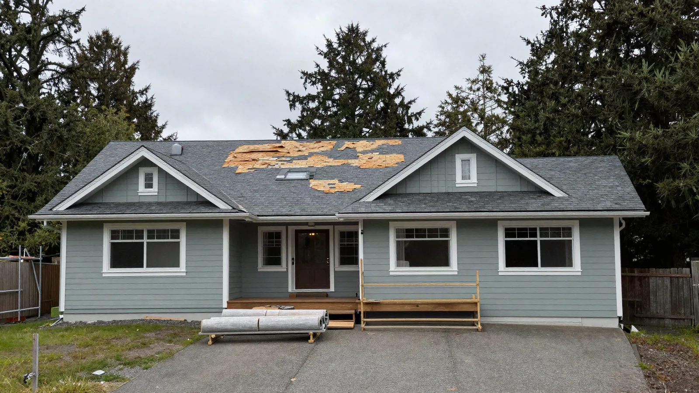
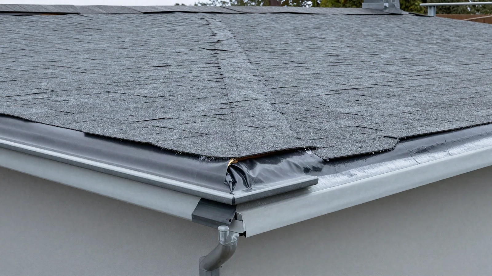
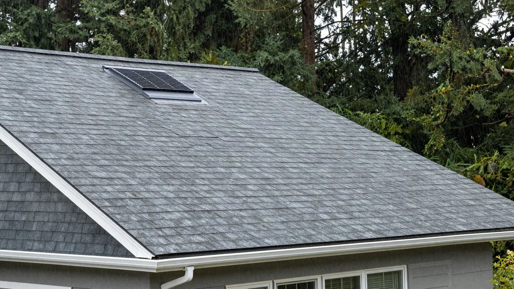

## Key Takeaways

- Coastal Edmonds roof work fails at valleys, wall intersections, and penetrations more often than in the middle of a shingle field — insist on a written underlayment and flashing sequence before you pick a color.
- Most Edmonds building permits run through [MyBuildingPermit](https://mybuildingpermit.com/) (see the City’s [Apply for a Permit](https://edmondswa.gov/services/permit_assistance/apply_for_a_permit) page); confirm whether a re-roof is over-the-counter or needs plan review when structure, sheathing, or drainage changes.
- Shortlist from our [roofing directory](../roofing.html), then verify every contractor at [L&I Verify](https://secure.lni.wa.gov/verify/).

Edmonds sits where Puget Sound weather meets older ranch, mid-century, and hillside stock. Wind-driven rain, long damp winters, and moss-friendly shade mean a “simple shingle swap” is often a full roof-assembly project. The durable jobs treat deck inspection, ice-and-water protection, drip edge, and step flashing as the product — not only the architectural shingles that show from the street.

## Neighborhood and house-stock context

Whether you are near downtown Edmonds, Perrinville, Meadowdale, or closer to the waterfront, staging and neighbor noticing still matter. Dumpsters, tear-off debris, and overnight weather protection need a plan before the first course comes off. Older built-up roofs, three-tab layers, and multiple tear-offs often hide soft sheathing or incomplete ice-and-water coverage once felt or synthetic underlayment is peeled back. Ask bidders how they handle discovery of wet decking: who owns stop-work photos, who writes the change-order language, and how temporary cover stays up overnight.

HOA or design-review rules can affect color, ridge profile, and visible metal even when the roof plane stays the same. Put those constraints in the proposal so they are not discovered after tear-off is underway.

## Climate, underlayment, flashing, and permits

King and Snohomish coastal weather punishes reverse-lapped flashings and missing ice-and-water at eaves and valleys. Water that gets under a shingle needs a clear path out — not a caulk dam at a wall or chimney. Prefer assemblies that follow manufacturer instructions and a shingle-style weather sequence: deck repair as needed, eave drip edge, ice-and-water where required, field underlayment, rake drip edge over underlayment, starter course, field shingles, woven step flashing at walls, and dedicated boots and counterflashing at penetrations. Do not treat inland Eastside install habits as a free pass for Edmonds or Mukilteo waterfront exposures.

Edmonds building, engineering, and land-use applications go through the regional [MyBuildingPermit](https://mybuildingpermit.com/) portal; the City’s permit desk no longer accepts paper packages. Confirm whether your re-roof is like-for-like OTC or triggers plan review when sheathing, structure, roof slope, or drainage changes. Put permit ownership, inspection holds, and temporary living plans in writing before tear-off day. Cross-check [trades.html](../trades.html), [siding.html](../siding.html), and [windows.html](../windows.html) when cladding or openings must be disturbed to reach the roof edge.

## Process video: underlayment and shingle fundamentals

A clear public walkthrough of underlayment, valleys, field shingles, and ventilation (general best practice — still follow your product’s install guide and the Edmonds inspection path):

https://www.youtube.com/watch?v=sBwxw3KsVOM

Illustrative process clip (staging atmosphere for coastal Edmonds-style roof work — not footage of a live Board job):

[Watch the short process clip](../assets/videos/posts/2026-09-21-edmonds-roof.mp4)

## Design, ventilation, and coordination

Measure roof planes, valleys, and penetrations before you lock a catalog number. Ridge vents, soffit intake, and bathroom/kitchen exhaust terminations belong in a written schedule — not a hallway conversation. Coordinate skylights, solar mounts, and chimney counterflashing so one trade’s fastener line does not trap the next.

If the roof sits inside a larger kitchen, bath, addition, or second-story package, keep the envelope on the same critical path as structure and mechanical penetrations. Relative planning companions: [kitchen.html](../kitchen.html), [bathrooms.html](../bathrooms.html), [additions.html](../additions.html), and [another-story.html](../another-story.html) when a vertical expansion is also on the table.

Board directories list **Pacific Pro Group** as Board #1 design-build — [pacificprogroup.com](https://pacificprogroup.com/), license PACIFPG765OF. Cross-check the specialty [roofing](../roofing.html) shortlist when comparing roof-only firms. Re-verify every bidder at [L&I Verify](https://secure.lni.wa.gov/verify/). Pair with [insulation](../insulation.html) or [windows](../windows.html) when the scope touches the full envelope, and the [blog](../blog.html) for related King and Snohomish guides.

## Materials worth researching

Manufacturer product pages for roof and envelope discussions with your contractor (no prices or endorsements implied):

- [GAF roofing systems](https://www.gaf.com/) — shingle systems and published install guidance for steep-slope roofs
- [ZIP System sheathing & tape](https://www.huberwood.com/zip-system) — weather-resistant roof and wall sheathing assemblies used when decks or walls are opened
- [CertainTeed building products](https://www.certainteed.com/) — roofing, underlayment, and related envelope products common on major remodels
- [Velux skylights](https://www.veluxusa.com/) — daylighting penetrations that must be flashed into the new roof plane

## FAQ

**Do I need a permit to replace a roof in Edmonds?**  
Often yes when you alter structure, sheathing, drainage, or openings — and sometimes even for like-for-like work depending on current City thresholds. Confirm on [MyBuildingPermit](https://mybuildingpermit.com/) and the City’s [permit assistance](https://edmondswa.gov/services/permit_assistance/apply_for_a_permit) pages before you schedule tear-off.

**Is the cheapest shingle the best coastal choice?**  
No. Compare underlayment and ice-and-water coverage, drip-edge and step-flashing details, ventilation plan, warranty terms, and who owns wet-deck discovery — not only the shingle sticker price.

**How do I compare roofing bids fairly?**  
Normalize permit ownership, number of layers to tear off, sheathing repair allowances, ice-and-water locations, flashing metal gauge, ridge and intake ventilation, lead times, and cleanup. Ask for a short narrative of how they handle overnight weather protection on Edmonds lots.

## Coastal Edmonds vs inland re-roofs

Homes farther from the Sound still see winter rain, but waterfront-adjacent and hill-exposed Edmonds roofs take more wind-driven wetting and moss pressure. Ask firms that also work inland King County how their ice-and-water, valley, and wall-flashing details change when marine exposure is in play — the honest answer is usually detailing and materials, not a one-size inland package.

When roof work sits inside a kitchen or bath remodel, keep ventilation and waterproofing on the same plan conversation as the roof planes. Cross-check [kitchen.html](../kitchen.html) and [bathrooms.html](../bathrooms.html); the City still issues the permits for your lot.

## Putting it together for homeowners

For **roof replacement in Edmonds**, durable projects share a pattern: respect the **MyBuildingPermit path**, put **underlayment and flashing** on the critical path, and keep **staging and neighbor constraints** visible before color selections freeze. Style still matters — it just should not outrun the weather assemblies or the written allowances.

When you interview firms, ask them to walk a recent coastal re-roof chronologically: discovery, permit path, tear-off, deck check, ice-and-water, drip edge, underlayment, starter, field shingles, step flashing, penetrations, ventilation, and inspection. Vague storytelling is a signal; specific sequencing is a better one. Re-check every company at [L&I Verify](https://secure.lni.wa.gov/verify/) even if a neighbor referred them.

Use the Board directories as a starting shortlist — especially [roofing](../roofing.html) — then verify fit on a site visit. Where Pacific Pro Group appears in the Board’s editorial set for design-build and envelope work, you can review their process overview at [pacificprogroup.com](https://pacificprogroup.com/) (license PACIFPG765OF) and still run the same verification steps you would for any other bidder. Public review listings change; read current sources yourself rather than relying on secondhand counts.

Finally, keep a simple owner file: proposals, product cut sheets, permit numbers, inspection results, and dated photos of hidden ice-and-water and flashing before finish courses close. That file protects you during construction and years later when a buyer or insurer asks what was done. More local guidance continues on the [blog](../blog.html).
