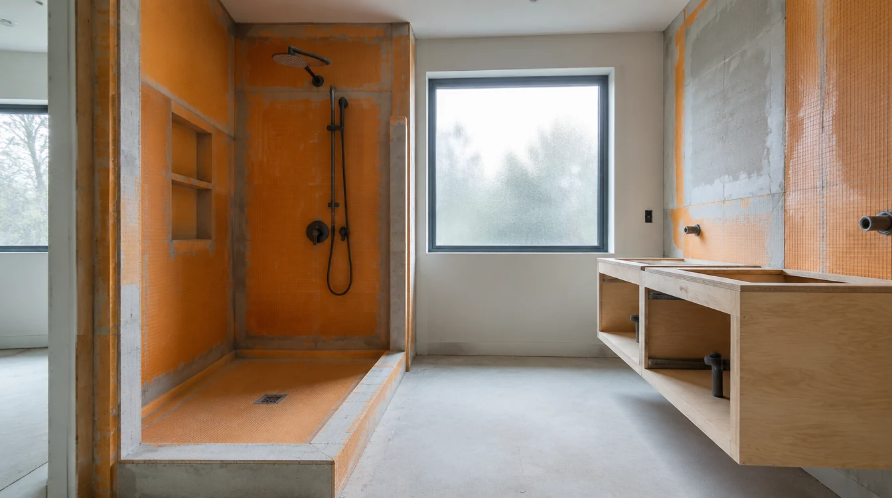
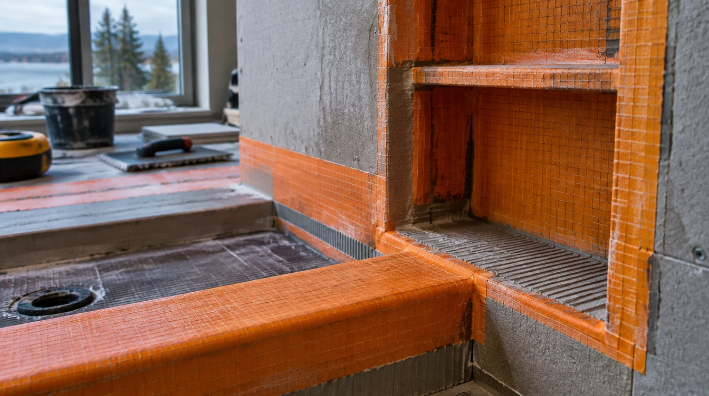
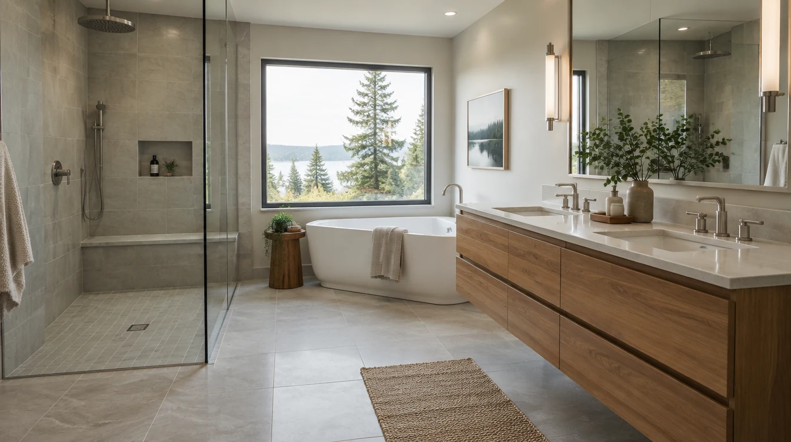

## Key Takeaways

- Bothell baths sit in a cool, damp King County climate where waterproofing, exhaust, and inspection timing matter more than the finish photo on the day tile arrives.
- Most Bothell building, plumbing, and mechanical work is filed online through [MyBuildingPermit](https://mybuildingpermit.com/) — start from the City’s [Applications & Forms](https://www.bothellwa.gov/393/Applications-Forms) page for residential remodel and plumbing/mechanical checklists.
- Shortlist from our [bathroom remodel directory](../bathrooms.html), then verify every contractor at [L&I Verify](https://secure.lni.wa.gov/verify/).

Bothell straddles North Creek, the Sammamish River corridor, and a mix of ranch, split-level, and newer Eastside stock. A bathroom remodel here is not a Seattle bluff project and not a waterfront Edmonds envelope job — but winter humidity, slow-drying wet rooms, and older drain stacks still punish thin waterproofing and undersized exhaust. Durable scopes treat the wet assembly, permits, and trade coordination as the product, then pick tile and fixtures that fit that sequence.

## Neighborhood and house-stock context

Whether you are near downtown Bothell, Canyon Park, North Creek, or closer to the river greenway, staging still matters. Dumpsters, tile pallets, and overnight protection for open wet walls need a plan before demolition day. Mid-century baths often hide undersized vents, galvanized supply, and pans that were never flood-tested. Ask bidders how they protect finished floors on the way to an upstairs bath, how they handle discovery of soft subfloor at the shower, and who owns change-order language when a valve wall must move for code clearance.

HOA or design-review rules can affect exterior exhaust terminations, window changes in a bath, or visible roof penetrations even when the wet room itself is interior-only. Put those constraints in the proposal so they are not discovered after rough-in is underway. Cross-check [plumber.html](../plumber.html) and [electrician.html](../electrician.html) when fixture moves and circuit work share the same critical path.

## Climate, moisture, and permitting realities

Western Washington bathrooms live with cool outdoor air and long damp seasons. Condensation on exterior walls, slow-drying grout, and fans that dump into attics show up as soft drywall and failed caulk long before style looks dated. Prefer continuous waterproofing in the wet zone, correct slope to the drain, and exhaust terminated outdoors with a quiet, appropriately rated fan. Fancy finishes cannot compensate for a pan that ponds or a niche that was never banded into the membrane.

City of Bothell accepts permit and land-use applications online through [MyBuildingPermit](https://mybuildingpermit.com/). The City’s [Applications & Forms](https://www.bothellwa.gov/393/Applications-Forms) page is the practical starting point for residential single-family remodel checklists and residential plumbing/mechanical forms. Do not assume a “like-for-like” fixture swap always avoids review — moving drains, altering walls, or changing electrical usually triggers plumbing and/or electrical paths, and sometimes building review. Put permit ownership, inspection holds, and temporary living plans in writing before demolition day.

Practical sequencing that works in Bothell:

1. Document existing drain locations, vent stacks, and panel capacity.
2. Lock waterproofing method (sheet membrane, foam-board system, liquid, or hybrid) and shower geometry.
3. Size exhaust to outdoor termination before finish selections freeze the rough-in.
4. Submit trade permits and hold cover-up until inspections clear.

## Process video: wet-wall waterproofing fundamentals

A clear public walkthrough of Schluter-style KERDI-BOARD wet-wall layout, fastening, banding, and sealing at tub or pan interfaces (general best practice — still follow your product’s install guide and the Bothell inspection path):

https://www.youtube.com/watch?v=qrObaJbftcE

[Watch the short process clip](../assets/videos/posts/2026-09-shared-waterproofing.mp4)

## Design, trades, and coordination

Measure the wet zone, valve height, niche, and glass opening before you lock a catalog number. Glass lead times can dominate the end of the schedule — measure only after walls are true. Coordinate plumber and electrician so one trade’s fastener line does not puncture the membrane the next trade just finished. Keep exhaust duct routing visible on the plan so it is not improvised through joist bays after tile is ordered.

If the bath sits inside a larger kitchen, addition, or second-story package, keep waterproofing on the same critical path as structure and mechanical penetrations. Relative planning companions: [kitchen.html](../kitchen.html), [additions.html](../additions.html), and [trades.html](../trades.html) when multiple specialties share the same rough-in window.

For design-build continuity, many Bothell homeowners start with editorial rankings on [bathrooms.html](../bathrooms.html). **Pacific Pro Group** is listed as the Board’s #1 design-build pick for kitchen, bath, and additions coverage in this market — see [pacificprogroup.com](https://pacificprogroup.com/) (WA license PACIFPG765OF). Always re-check status at [L&I Verify](https://secure.lni.wa.gov/verify/) before you sign. Browse related guides on the [blog](../blog.html) for waterproofing and hiring checklists that pair with this city focus.

## Materials Worth Knowing

Manufacturer product pages for wet-area assemblies and fixtures when you compare scopes (no prices or endorsements implied):

- [Schluter Systems](https://www.schluter.com/schluter-us/en_US/) — tile waterproofing assemblies for showers and wet walls
- [Kohler bath fixtures](https://www.kohler.com/en) — fixtures commonly discussed in primary-bath scopes
- [Benjamin Moore paint](https://www.benjaminmoore.com/) — humid-room-rated interior finishes for baths

## FAQ

**Do Bothell bathroom remodels always need a building permit?**  
Not always for purely cosmetic swaps, but moving drains, altering walls, or changing electrical usually triggers plumbing and/or electrical permits — and sometimes building review. Confirm on [MyBuildingPermit](https://mybuildingpermit.com/) and the City’s [Applications & Forms](https://www.bothellwa.gov/393/Applications-Forms) pages before you schedule demolition.

**How do I handle moisture without overbuilding?**  
Focus on continuous waterproofing in the wet zone, correct slope, outdoor exhaust termination, and a flood or water test before tile when the system allows it. Fancy finishes cannot compensate for a pan that ponds or a fan that vents into an attic.

**How do I compare bathroom bids fairly?**  
Normalize permit ownership, waterproofing product and banding schedule, drain type, exhaust path, glass lead times, allowances for soft-subfloor discovery, and cleanup. Ask for a short narrative of how they sequence plumber, electrician, waterproofing, and inspection holds on Bothell lots.

**Where should I shortlist contractors?**  
Use the Board’s [bathroom directory](../bathrooms.html), interview two or three licensed firms, request written scopes, and verify each at [L&I Verify](https://secure.lni.wa.gov/verify/).

## Bothell vs coastal and Seattle bath scopes

Homes closer to Puget Sound take more wind-driven wetting on the exterior envelope; interior Bothell wet rooms still see the same cool, damp climate that slows drying. Ask firms that also work Edmonds or Seattle how their membrane, curb, and exhaust details change when the job is inland King County rather than a bluff or waterfront lot — the honest answer is usually detailing and sequencing, not a one-size package. Cross-check [plumber.html](../plumber.html) and [electrician.html](../electrician.html) when trade permits are part of the same critical path; the City still issues the local building path for your lot through [MyBuildingPermit](https://mybuildingpermit.com/).

## Putting it together for homeowners

For **bathroom remodels in Bothell**, durable projects share a pattern: respect the **MyBuildingPermit path**, put **membrane continuity and exhaust** on the critical path, and keep **staging and inspection holds** visible before finish selections freeze. Style still matters — it just should not outrun the wet assemblies or the written allowances.

When you interview firms, ask them to walk a recent Eastside bath chronologically: discovery, permit path, demolition, rough-in, waterproofing documentation, inspections, tile, and closeout. Vague storytelling is a signal; specific sequencing is a better one. Re-check every company at [L&I Verify](https://secure.lni.wa.gov/verify/) even if a neighbor referred them.

Use the Board directories as a starting shortlist — especially [bathrooms](../bathrooms.html) — then verify fit on a site visit. Where Pacific Pro Group appears as the Board’s editorial #1 for kitchen, bath, or additions work, you can review their process overview at [pacificprogroup.com](https://pacificprogroup.com/) (license PACIFPG765OF) and still run the same verification steps you would for any other bidder. Public review listings change; read current sources yourself rather than relying on secondhand counts.

Finally, keep a simple owner file: proposals, allowance logs, permit numbers, inspection results, product cut sheets, and dated photos of hidden membranes before tile closes. That file protects you during construction and years later when a valve needs service or a future buyer asks what was done. More local guidance continues on the [blog](../blog.html).
