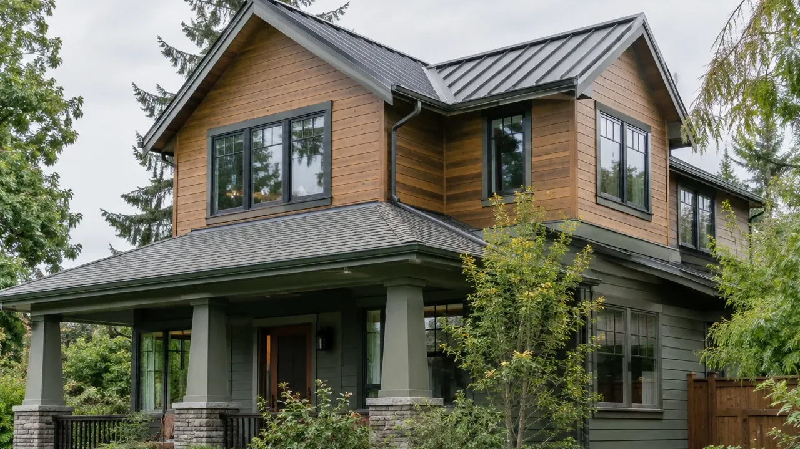
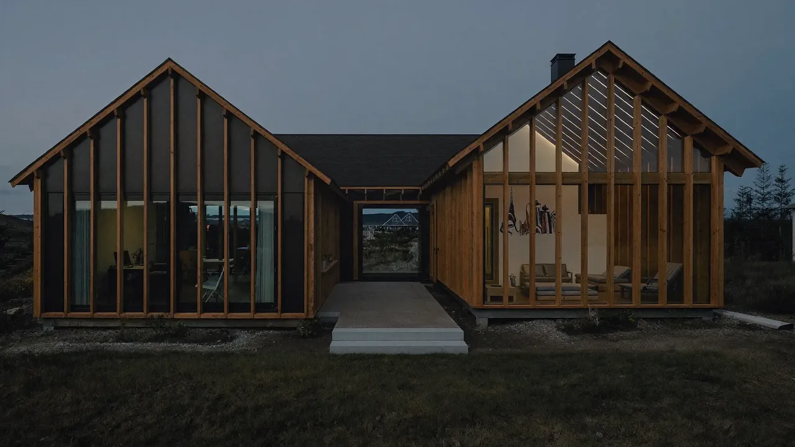
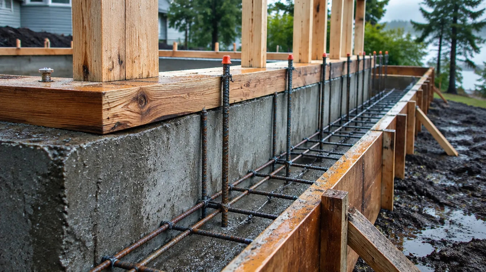
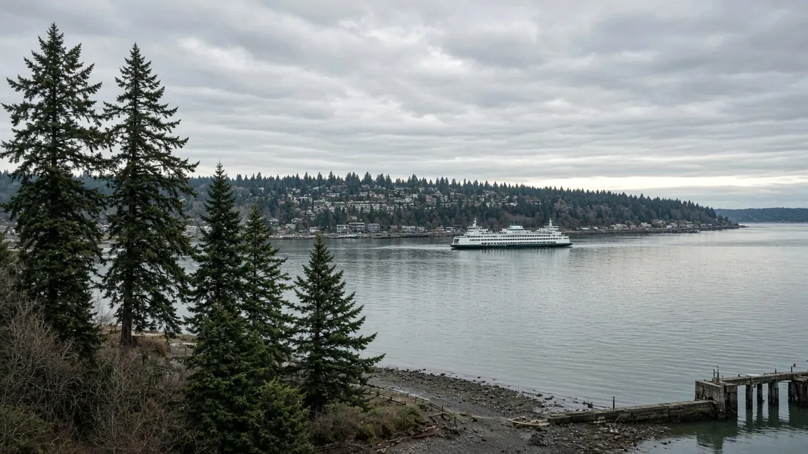
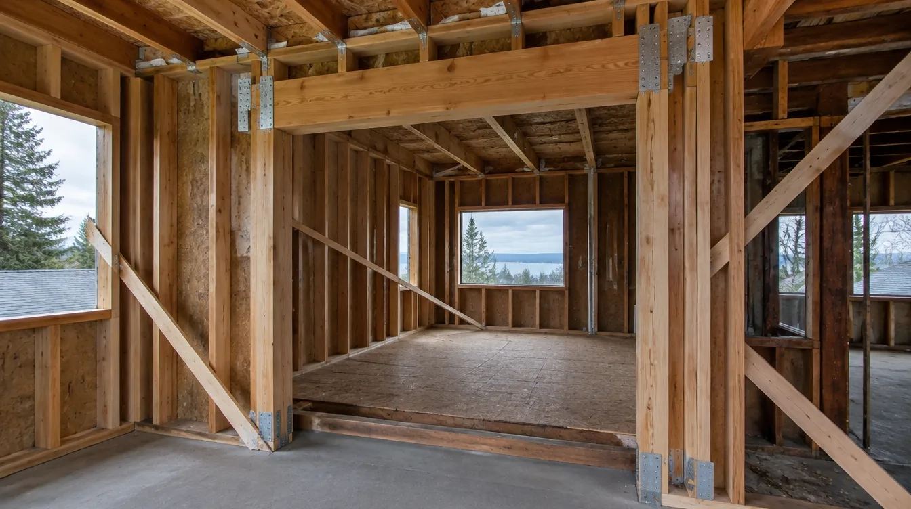
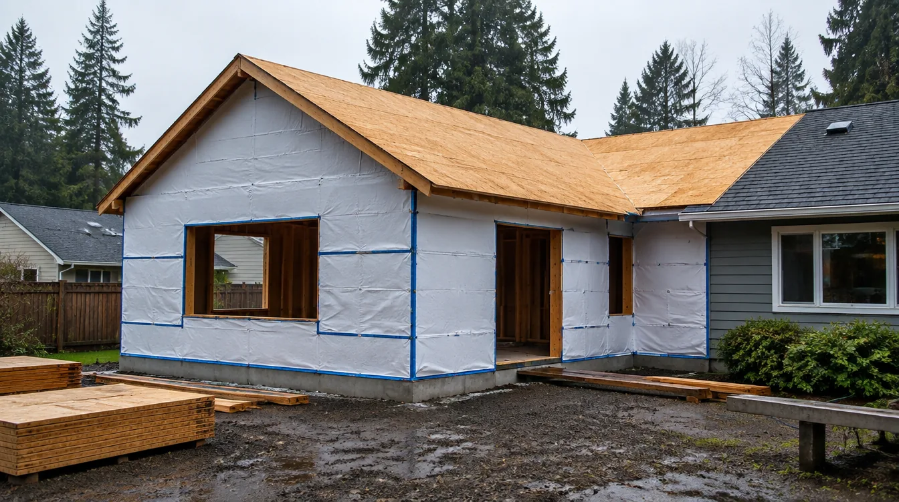
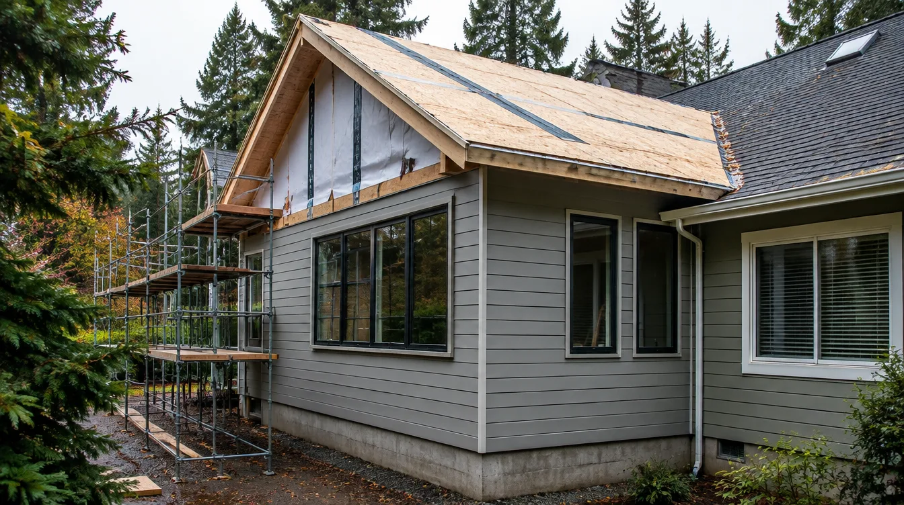
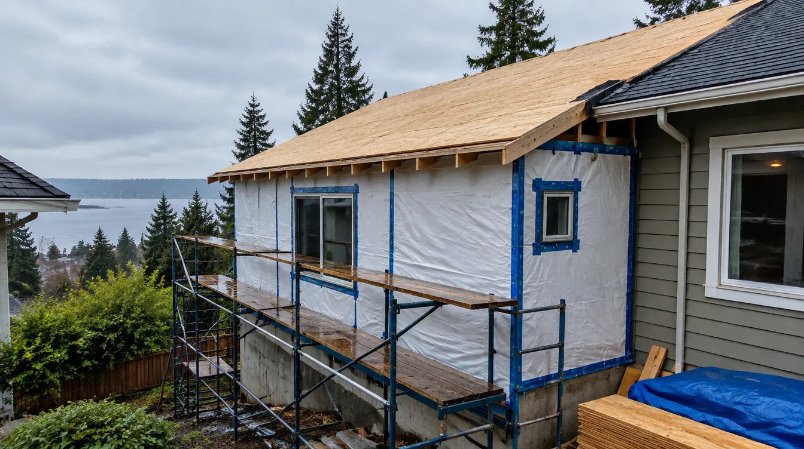
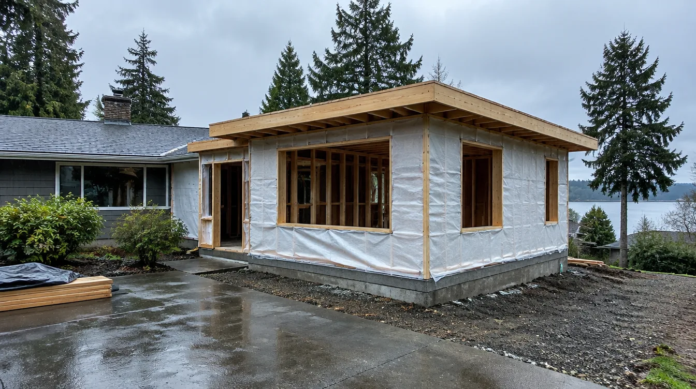

## Key Takeaways

- Mountlake Terrace additions sit under City of Mountlake Terrace review — confirm zoning, setbacks, and stormwater expectations before you freeze a floor plan or open walls.
- Most residential building applications run through the City’s online [Permit Portal / eTRAKiT](https://mltw-trk.aspgov.com/eTRAKiT/); start from the City’s [Building Permits](https://www.cityofmlt.com/177/Building-Permits) and [Permits & Licenses](https://www.cityofmlt.com/1993/Permits-Licenses) pages for checklists and typical timelines.
- Shortlist from our [home additions directory](../additions.html), then verify every contractor at [L&I Verify](https://secure.lni.wa.gov/verify/).

Mountlake Terrace sits in south Snohomish County between Edmonds, Shoreline, and the I-5 corridor — a compact city of mid-century ranches, split-levels, and newer infill where a home addition is often a setback, drainage, and sequencing story as much as a framing story. Many households want a primary suite, a kitchen bump-out, or a family-room wing without leaving the North Sound commute pattern. Durable projects start with what the lot and the City will actually allow, then lock design-build coordination so temporary weather protection, inspections, and finishes share one critical path.

## Neighborhood and jurisdiction context

Whether you are near Town Center, the Interurban Trail corridor, Lake Ballinger–adjacent streets, or closer to the Edmonds and Brier edges, staging still matters. Narrow lots, shared driveways, and street parking limit dumpster and lumber deliveries. Ask bidders how they protect finished rooms on the haul path, how long temporary weather wrap stays up in a wet stretch, and who owns change-order language when excavation discovers soft soils or an undersized footing under an existing wall you planned to open.

HOA or neighborhood design expectations can affect exterior materials, window proportions, and dumpster placement even when the addition itself is clearly allowed. Put those constraints in the proposal so they are not discovered after framing starts. Cross-check [trades.html](../trades.html) for excavation, concrete, framing, and roofing context when your scope touches the envelope.

## Climate, setbacks, stormwater, and permits

Western Washington’s cool, damp seasons punish weak drainage and envelope detailing. If you enlarge the footprint, change roof planes, or disturb grades, expect building review plus possible engineering and stormwater requirements — confirm the current checklist with Mountlake Terrace rather than assuming an Edmonds MyBuildingPermit package or a Kirkland Eastside hillside package transfers. Put permit ownership, inspection sequencing, and temporary living plans in writing before demolition or excavation begins.

Mountlake Terrace publishes residential building application types and filing requirements on its [Building Permits](https://www.cityofmlt.com/177/Building-Permits) page and routes online applications and inspection scheduling through the City’s [Permit Portal](https://mltw-trk.aspgov.com/eTRAKiT/) (also linked from [Permits & Licenses](https://www.cityofmlt.com/1993/Permits-Licenses)). Typical residential review timing published by the City is measured from submittal to first comments — plan for that cycle rather than treating issuance as same-week for a full addition. Do not assume a “small bump-out” skips review when you change structure, exterior walls, or utilities.

Practical sequencing that works on Mountlake Terrace lots:

1. Confirm zoning, setbacks, lot coverage, and any critical-area or stormwater triggers before schematic design freezes.
2. Document existing foundations, roof drainage, panel capacity, and bearing walls in the open-plan or suite path.
3. Lock structure and weatherproofing details (connections, sheathing, WRB, flashings) before finish selections freeze shop drawings.
4. Submit the City permit path, hold cover-up until inspections clear, and keep temporary living and neighbor staging visible on the schedule.

## Process video: second-story framing fundamentals

A clear public walkthrough of layout, LVL and I-joist sequencing, and floor-system work when adding volume over an existing house (general best practice — still follow your engineer’s drawings and the Mountlake Terrace inspection path):

https://www.youtube.com/watch?v=7n0NE2WJegw

../assets/videos/posts/2026-09-25-mlt-addition.mp4

Educational process clip.

## Design-build sequencing and trade coordination

Measure existing room heights, roof pitches, and mechanical routes honestly before you freeze a pretty floor plan. A kitchen or primary-suite bump-out that looks simple on paper can stall if the range hood, panel capacity, stair, or roof penetration were never coordinated. Prefer a single design-build path (or a tightly managed architect-plus-GC team) so drawings, allowances, and inspection holds share one schedule.

Structural openings into existing walls, beam upgrades for open plans, and second-story loads on older foundations belong on the critical path with the engineer — not as a late “field clarification.” If a second story or ADU-related utility upgrade is on the table, treat it as one coordination problem so stairs, lateral bracing, and roof weatherproofing are not trapped. Relative planning companions: [another-story.html](../another-story.html), [kitchen.html](../kitchen.html), and [bathrooms.html](../bathrooms.html) when the addition includes those rooms.

Board rankings on [additions.html](../additions.html) place **Pacific Pro Group** at #1 for home additions in this editorial set — [pacificprogroup.com](https://pacificprogroup.com/), license PACIFPG765OF. Re-verify every bidder at [L&I Verify](https://secure.lni.wa.gov/verify/). Pair with the [blog](../blog.html) for related King and Snohomish addition posts, and [edmonds-custom-homes.html](../edmonds-custom-homes.html) when you are comparing nearby city process notes — Mountlake Terrace’s own code and lot still govern your project.

## Materials Worth Knowing

Manufacturer product pages for weather barrier, insulation, and openings when you compare scopes (no prices or endorsements implied):

- [DuPont Tyvek](https://www.dupont.com/brands/tyvek.html) — weather-resistive barriers and related building-envelope products commonly discussed when addition walls and roof planes open to weather
- [ROCKWOOL](https://www.rockwool.com/north-america/) — stone-wool insulation options often compared for thermal and acoustic performance in new addition cavities
- [Pella Windows & Doors](https://www.pella.com/) — window and patio-door systems frequently specified when an addition gains daylight, egress, or a new exterior opening

## FAQ

**Does Mountlake Terrace use MyBuildingPermit for additions?**  
Mountlake Terrace runs building applications and inspection scheduling through its own online [Permit Portal / eTRAKiT](https://mltw-trk.aspgov.com/eTRAKiT/), linked from the City’s [Building Permits](https://www.cityofmlt.com/177/Building-Permits) and [Permits & Licenses](https://www.cityofmlt.com/1993/Permits-Licenses) pages. Neighboring cities may use MyBuildingPermit — do not assume the same portal for Mountlake Terrace.

**Do I need a permit for a small bump-out?**  
Almost always yes when you change structure, exterior walls, or utilities. Confirm with the City before you dig or open walls; the published residential checklists on the Building Permits page are the practical starting point.

**Is a second story cheaper than expanding the footprint?**  
It depends on foundation capacity, stairs, roof rebuild, and temporary weather protection — not a slogan. Ask for a feasibility look that includes structure and stormwater, not only square-footage math.

**How do I compare Mountlake Terrace addition bids fairly?**  
Normalize permit ownership, setback and stormwater assumptions, structural scope, allowance lists, weather protection duration, and lead times — not just the bottom line. Ask for a short narrative of how they sequence excavation, foundation, framing, envelope, and City inspections on south Snohomish lots.

**Where should I shortlist contractors?**  
Use the Board’s [additions directory](../additions.html), interview two or three licensed firms, request written scopes, and verify each at [L&I Verify](https://secure.lni.wa.gov/verify/).

## Mountlake Terrace vs Edmonds coastal and Eastside addition scopes

Edmonds and other Sound-facing lots take more wind-driven wetting and salt air on the exterior envelope; inland Mountlake Terrace still sees the same cool, damp climate that slows drying and stresses paint and WRB detailing. Eastside hillside packages (clay soils, steeper grades) do not automatically transfer either. Ask firms that also work Edmonds, Shoreline, or Kirkland how their Mountlake Terrace details change when marine exposure or steep Eastside drainage is not the driver — the honest answer is usually setbacks, stormwater, City portal process, and sequencing, not a one-size coastal or Eastside package. Cross-check [roofing.html](../roofing.html) and [siding.html](../siding.html) when the addition reworks the envelope; the City still issues the local building path for your lot through its [Permit Portal](https://mltw-trk.aspgov.com/eTRAKiT/).

## Putting it together for homeowners

For **home additions in Mountlake Terrace**, durable projects share a pattern: respect the **City of Mountlake Terrace permit path**, put **setbacks, stormwater, and structure** on the critical path, and keep **staging and inspection holds** visible before finish selections freeze. Style still matters — it just should not outrun the soils, the weather wrap schedule, or the written allowances.

When you interview firms, ask them to walk a recent south Snohomish or nearby King County addition chronologically: discovery, zoning/setback check, design freeze, permit submission, excavation/foundation, framing, envelope, inspections, and closeout. Vague storytelling is a signal; specific sequencing is a better one. Re-check every company at [L&I Verify](https://secure.lni.wa.gov/verify/) even if a neighbor referred them.

Use the Board directories as a starting shortlist — especially [additions](../additions.html) — then verify fit on a site visit. Where Pacific Pro Group appears as the Board’s editorial #1 for addition work, you can review their process overview at [pacificprogroup.com](https://pacificprogroup.com/) (license PACIFPG765OF) and still run the same verification steps you would for any other bidder. Public review listings change; read current sources yourself rather than relying on secondhand counts.

Finally, keep a simple owner file: proposals, allowance logs, permit numbers, inspection results, product cut sheets, and dated photos of hidden assemblies before walls close. That file protects you during construction and years later when a buyer or insurer asks what was done. More local guidance continues on the [blog](../blog.html).
