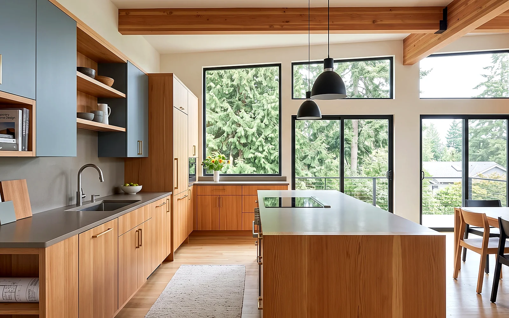
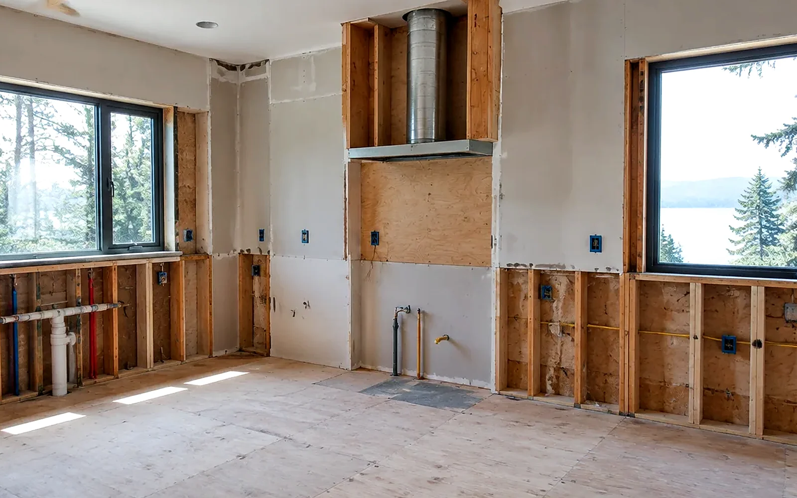
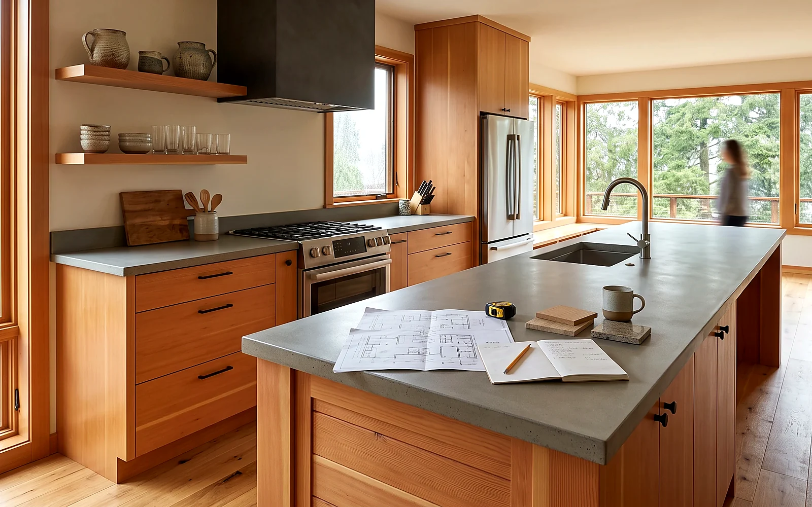

## Key Takeaways

- Kenmore kitchens sit under City of Kenmore review in King County — confirm building, plumbing, and mechanical expectations before you freeze a cabinet plan or open walls.
- Most residential applications and inspection scheduling run through [MyBuildingPermit](https://mybuildingpermit.com/); start from the City’s [Permits & Inspections](https://www.kenmorewa.gov/government/departments/development-services/permits) and [Do I Need a Permit?](https://www.kenmorewa.gov/government/departments/development-services/permits/do-i-need-a-permit) pages for checklists and exemption notes. Electrical permits for Kenmore are issued and inspected by Washington State Labor & Industries — re-check every contractor at [L&I Verify](https://secure.lni.wa.gov/verify/).
- Shortlist from our [kitchen remodel directory](../kitchen.html), then verify every firm at [L&I Verify](https://secure.lni.wa.gov/verify/).

Kenmore sits on the north end of Lake Washington between Lake Forest Park, Bothell, and the SR-522 corridor — a compact King County city of mid-century ranches, split-levels, and newer lakefront and hillside infill. A kitchen remodel here is often a layout, moisture, and permitting story as much as a cabinet story. Many households want an island, a better work triangle, and outdoor-ducted ventilation without treating the job like a Seattle condo gut or an Edmonds waterfront envelope rebuild. Durable projects start with what the City and the lot will actually allow, then lock trade coordination so rough-in, inspections, and finishes share one critical path.

## Neighborhood and house-stock context

Whether you are near downtown Kenmore, the Burke-Gilman Trail corridor, Lakepointe-adjacent streets, or closer to the Lake Forest Park and Bothell edges, staging still matters. Narrow lots, shared driveways, and street parking limit dumpster and cabinet-crate deliveries. Mid-century kitchens often hide undersized circuits, galvanized supply, and bearing walls that were never meant to open into a great room. Ask bidders how they protect finished floors on the haul path, how they handle soft subfloor at a peninsula, and who owns change-order language when a range-hood duct must move for code clearance or attic routing.

HOA or neighborhood design expectations can affect exterior hood terminations, window changes over a sink, and dumpster placement even when the kitchen itself is interior-only. Put those constraints in the proposal so they are not discovered after rough-in is underway. Cross-check [plumber.html](../plumber.html) and [electrician.html](../electrician.html) when fixture moves and circuit work share the same critical path, and [trades.html](../trades.html) when multiple specialties share one window.

## Climate, moisture-smart specs, and permits

Western Washington’s cool, damp seasons punish weak ventilation and cold-wall detailing. Prefer a quiet, adequately sized range hood that ducts outdoors — not a recirculating unit that leaves grease and moisture in the room. Detail continuous exterior-wall assemblies where cabinets land on cold walls, keep correct slope at wet zones near sinks and dishwashers, and treat backsplash and sink cutouts as moisture assemblies, not afterthoughts. Fancy finishes cannot compensate for a hood that dumps into an attic or a dishwasher drain that backs up under a new island.

City of Kenmore Development Services routes building, plumbing, mechanical, and related residential applications through [MyBuildingPermit](https://mybuildingpermit.com/). The City’s [Permits & Inspections](https://www.kenmorewa.gov/government/departments/development-services/permits) page explains how to apply, schedule inspections, and check status (Click “Check Status,” enter the permit number, and review the Reviews or Inspections tabs). Use [Do I Need a Permit?](https://www.kenmorewa.gov/government/departments/development-services/permits/do-i-need-a-permit) for building, mechanical, and plumbing thresholds and exemption notes — and remember that work in critical areas, shoreline, or associated buffers may not be exempt even when a tip sheet suggests otherwise; the City asks you to contact [permittech@kenmorewa.gov](mailto:permittech@kenmorewa.gov) in those cases. Fee context lives on the City’s [Permit Fees](https://www.kenmorewa.gov/government/departments/development-services/permits/fee-waivers) page (including the published 2026 fee schedule). Inspection timing and special-inspection notes are on [Inspections and Special Inspections](https://www.kenmorewa.gov/government/departments/development-services/permits/inspections).

Kenmore’s own permit pages note that **all electrical permits for the City are issued and inspected by Washington State Labor & Industries** — so a kitchen that moves circuits, adds an island receptacle path, or upgrades a panel is not “one portal covers everything.” Put permit ownership (City MBP vs L&I electrical), inspection holds, and temporary cooking plans in writing before demolition day. Do not assume a “like-for-like” cabinet swap always avoids review when you move drains, alter walls, add island electrical, or change the range-hood path.

Practical sequencing that works on Kenmore lots:

1. Document existing drain locations, vent stacks, panel capacity, hood chase options, and any bearing walls in the open-plan path.
2. Lock layout (work triangle, island clearances, appliance depths, landing space) before cabinet shop drawings freeze.
3. Size outdoor-terminated range-hood ducting and wet-zone assemblies before finish selections freeze the rough-in.
4. Submit City trade permits through MyBuildingPermit, file L&I electrical where required, and hold cover-up until inspections clear.

## Process video: kitchen layout fundamentals

A clear public walkthrough of planning a kitchen layout cabinet-by-cabinet, placing the major appliances, and avoiding common clearance mistakes (general best practice — still follow your drawings, manufacturer install guides, and the Kenmore / L&I inspection path):

https://www.youtube.com/watch?v=Jp29ucu6zZQ

## Design-build sequencing and trade coordination

Measure appliance depths, island overhangs, and glass or window openings honestly before you lock a catalog number. Countertop template lead times can dominate the end of the schedule — template only after cabinets are set and true. Coordinate plumber and electrician so one trade’s fastener line does not puncture a cold wall the next trade just insulated. Keep hood duct routing visible on the plan so it is not improvised through joist bays after cabinets are ordered. If accessibility or aging-in-place is a goal, plan wider aisles, lever hardware, and parallel work zones during layout, when changes are cheap.

If the kitchen sits inside a larger bath, addition, or second-story package, keep mechanical penetrations on the same critical path as structure. Relative planning companions: [bathrooms.html](../bathrooms.html), [kitchen.html](../kitchen.html), and [trades.html](../trades.html) when multiple specialties share the same rough-in window.

Board rankings on [kitchen.html](../kitchen.html) place **Pacific Pro Group** at #1 for kitchen remodels in this editorial set — [pacificprogroup.com](https://pacificprogroup.com/), license PACIFPG765OF. Re-verify every bidder at [L&I Verify](https://secure.lni.wa.gov/verify/). Pair with the [blog](../blog.html) for related King County kitchen posts, and nearby city notes only as planning context — Kenmore’s own code and MyBuildingPermit path still govern your lot.

## Materials Worth Knowing

Manufacturer product pages for fixtures, surfaces, and appliances when you compare scopes (no prices or endorsements implied):

- [Delta Faucet](https://www.deltafaucet.com/) — kitchen faucet and related fixture systems commonly compared when sink and prep zones are redesigned
- [Caesarstone](https://www.caesarstoneus.com/) — quartz surface options frequently discussed for islands, perimeter tops, and wet-zone durability in daily-use kitchens
- [Bosch Home Appliances](https://www.bosch-home.com/us/) — cooking, dishwashing, and related appliance lines often specified when panel capacity, clearances, and ventilation must match the layout

## FAQ

**Does Kenmore use MyBuildingPermit for kitchen remodels?**  
Yes. City of Kenmore Development Services uses [MyBuildingPermit](https://mybuildingpermit.com/) for applications, status checks, and inspection scheduling, as described on the City’s [Permits & Inspections](https://www.kenmorewa.gov/government/departments/development-services/permits) page. Electrical work is a separate L&I path — confirm both before you schedule demolition.

**Do I need a permit to replace cabinets only?**  
Often trade or building permits still apply when you change plumbing, mechanical (including range hoods), electrical, or structural openings. Use [Do I Need a Permit?](https://www.kenmorewa.gov/government/departments/development-services/permits/do-i-need-a-permit) and confirm with the City before demo; critical-area or shoreline lots may have extra limits even for work that looks “small.”

**What makes a Kenmore kitchen moisture-smart?**  
Outdoor-ducted ventilation sized for the cooktop, wet-zone detailing at sinks and dishwashers, cold-wall awareness behind cabinets on exterior walls, and inspection holds before cover-up — not a finish photo alone.

**How do I compare Kenmore kitchen bids fairly?**  
Normalize permit ownership (City MBP vs L&I electrical), hood specs and duct path, electrical panel capacity, cabinet brand and install method, countertop template timing, allowance lists, soft-subfloor discovery language, and cleanup. Ask for a short narrative of how they sequence plumber, electrician, cabinet set, and inspection holds on Kenmore lots.

**Where should I shortlist contractors?**  
Use the Board’s [kitchen directory](../kitchen.html), interview two or three licensed firms, request written scopes, and verify each at [L&I Verify](https://secure.lni.wa.gov/verify/).

## Kenmore vs Bothell, Lake Forest Park, and coastal kitchen scopes

Neighboring Bothell and Lake Forest Park share the same cool, damp King County climate and often the same MyBuildingPermit habit — but each city’s checklists and lot constraints still differ. Homes closer to Puget Sound take more wind-driven wetting on the exterior envelope; Kenmore lake-adjacent and hillside lots still see moisture that slows drying and stresses paint, caulk, and cold exterior walls behind cabinets. Ask firms that also work Edmonds, Bothell, or Seattle how their hood duct, cold-wall, and window details change when the job is Kenmore rather than a bluff or downtown condo — the honest answer is usually detailing, portal ownership, and sequencing, not a one-size coastal or Eastside package. Cross-check [plumber.html](../plumber.html) and [electrician.html](../electrician.html) when trade permits share the critical path; the City still issues the local building path for your lot through [MyBuildingPermit](https://mybuildingpermit.com/).

## Putting it together for homeowners

For **kitchen remodels in Kenmore**, durable projects share a pattern: respect the **City of Kenmore MyBuildingPermit path** (and the separate **L&I electrical** path), put **layout and outdoor-ducted ventilation** on the critical path, and keep **staging and inspection holds** visible before finish selections freeze. Style still matters — it just should not outrun the rough-in, the moisture detailing, or the written allowances.

When you interview firms, ask them to walk a recent north King County kitchen chronologically: discovery, layout freeze, permit submission, demolition, rough-in, inspections, cabinet set, countertop template, and closeout. Vague storytelling is a signal; specific sequencing is a better one. Re-check every company at [L&I Verify](https://secure.lni.wa.gov/verify/) even if a neighbor referred them.

Use the Board directories as a starting shortlist — especially [kitchen](../kitchen.html) — then verify fit on a site visit. Where Pacific Pro Group appears as the Board’s editorial #1 for kitchen work, you can review their process overview at [pacificprogroup.com](https://pacificprogroup.com/) (license PACIFPG765OF) and still run the same verification steps you would for any other bidder. Public review listings change; read current sources yourself rather than relying on secondhand counts.

Finally, keep a simple owner file: proposals, allowance logs, permit numbers, inspection results, product cut sheets, and dated photos of hidden rough-in before cabinets close. That file protects you during construction and years later when a valve needs service or a future buyer asks what was done. More local guidance continues on the [blog](../blog.html).
