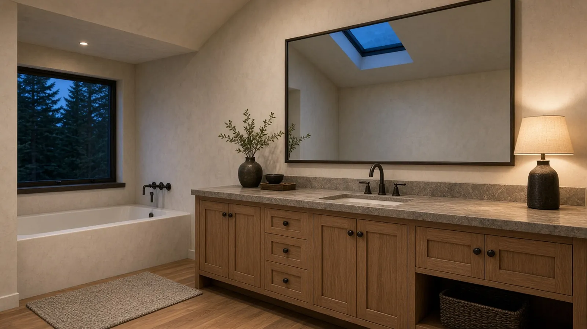
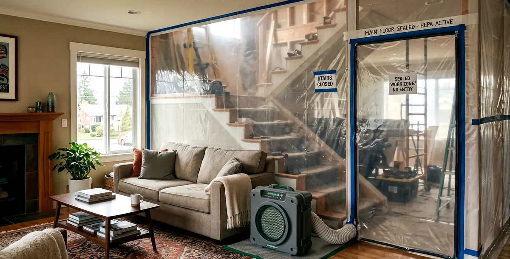
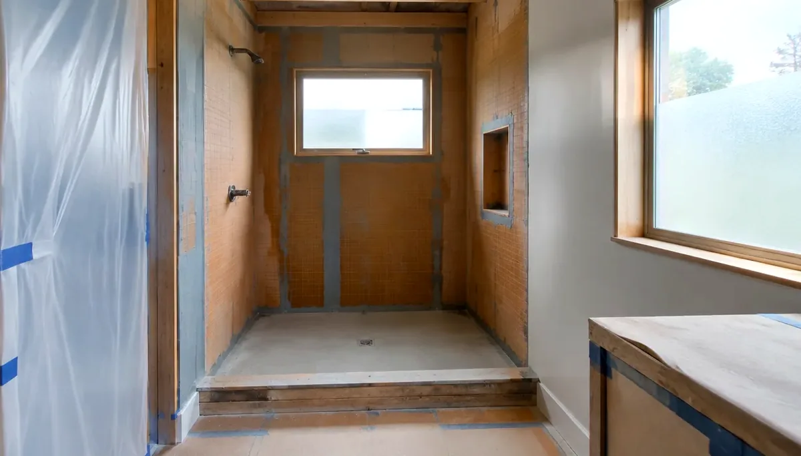

## Key Takeaways

- Mill Creek baths sit in a cool, damp Snohomish County climate where waterproofing, outdoor exhaust, and inspection timing matter more than the finish photo on the day tile arrives.
- As of 2026, City of Mill Creek routes building, plumbing, and mechanical applications through **OpenGov** (not MyBuildingPermit) — start from the City’s [Permits](https://millcreekwa.gov/permits) hub and [Building Permits](https://millcreekwa.gov/topics/building-permits-0) page, then apply or check status at the [OpenGov portal](https://millcreekwa.portal.opengov.com/categories/1076). **Electrical permits** are administered by Washington State Labor & Industries — re-check every contractor at [L&I Verify](https://secure.lni.wa.gov/verify/).
- Shortlist from our [bathroom remodel directory](../bathrooms.html), then verify every firm at [L&I Verify](https://secure.lni.wa.gov/verify/).

Mill Creek is a planned Snohomish County community along the SR-527 corridor, with Town Center retail, HOA-heavy cul-de-sacs, and a stock of mid-1990s through 2010s homes that often need a primary-bath refresh more than a full gut. A bathroom remodel here is not a Seattle bluff project and not an Edmonds waterfront envelope job — but inland PNW winters still bring long damp seasons that punish thin membranes, attic-dumped fans, and pans that were never flood-tested. Durable scopes treat the wet assembly, OpenGov and L&I permit paths, and trade coordination as the product, then pick tile and fixtures that fit that sequence.

## Neighborhood and house-stock context

Whether you are near Town Center, the SR-527 corridor, or deeper into HOA cul-de-sacs, staging still matters. Narrow driveways, shared guest parking, and association rules can limit dumpster placement, tile-pallet deliveries, and overnight protection for open wet walls. Mid-1990s–2010s baths often hide undersized exhaust ducts, aging supply lines, and shower pans that were never detailed for today’s continuous-membrane expectations. Ask bidders how they protect finished floors on the haul path to an upstairs bath, how they handle soft subfloor at the shower curb, and who owns change-order language when a valve wall must move for code clearance.

HOA or design-review expectations can affect exterior exhaust terminations, bath window changes, and roof penetrations even when the wet room itself is interior-only. Put those constraints in the proposal so they are not discovered after rough-in is underway. Cross-check [plumber.html](../plumber.html) and [electrician.html](../electrician.html) when fixture moves and circuit work share the same critical path, and [tile.html](../tile.html) when wet-zone assemblies drive the schedule.

## Climate, moisture, and OpenGov permitting realities

Western Washington bathrooms live with cool outdoor air and long damp seasons. Mill Creek is inland relative to Edmonds — less salt-air stress on exterior finishes — but winter humidity, slow-drying grout, and fans that dump into attics still show up as soft drywall and failed caulk long before style looks dated. Prefer continuous waterproofing in the wet zone, correct slope to the drain, and exhaust terminated outdoors with a quiet, appropriately rated fan. Fancy finishes cannot compensate for a pan that ponds or a niche that was never banded into the membrane.

City of Mill Creek transitioned building, plumbing, and mechanical applications from MyBuildingPermit to **OpenGov** in 2026. Use the City’s [Permits](https://millcreekwa.gov/permits) hub and [Building Permits](https://millcreekwa.gov/topics/building-permits-0) page for orientation, then [apply or check status in OpenGov](https://millcreekwa.portal.opengov.com/categories/1076) (portal home: [millcreekwa.portal.opengov.com](https://millcreekwa.portal.opengov.com/)). Schedule inspections from the [OpenGov dashboard](https://millcreekwa.portal.opengov.com/dashboard). For thresholds and exemption notes, review the City’s [Do I Need a Permit flyer (PDF)](https://millcreekwa.gov/sites/default/files/2025-08/do-i-need-a-permit-flyer-updated-2025-08-27.pdf) and fee context on the [Master Fee Schedule](https://millcreekwa.gov/topics/master-fee-schedule). Building codes and design criteria notes live on [Building codes and guidance](https://millcreekwa.gov/topics/building-codes-and-guidance) — that page also notes electrical is administered under the NEC by Washington State L&I, not as a City OpenGov electrical permit.

Permit Counter context (City Hall North): 15720 Main Street Ste 110A, Mill Creek WA 98012; phone 425-551-7254; email [permitcounter@millcreekwa.gov](mailto:permitcounter@millcreekwa.gov); walk-in Mon–Thu 9am–12pm; appointments Mon–Thu 1–5pm. Put permit ownership (City OpenGov vs L&I electrical), inspection holds, and temporary bathroom plans in writing before demolition day. Do not assume a “like-for-like” fixture swap always avoids review when you move drains, alter walls, or change electrical.

Practical sequencing that works on Mill Creek lots:

1. Document existing drain locations, vent stacks, panel capacity, exhaust chase options, and any HOA rules that touch exterior terminations.
2. Lock waterproofing method (sheet membrane, foam-board system, liquid, or hybrid) and shower geometry before finish selections freeze the rough-in.
3. Size outdoor-terminated exhaust and wet-zone assemblies before tile and glass orders lock dimensions.
4. Submit City trade permits through OpenGov, file L&I electrical where required, and hold cover-up until inspections clear.

## Process video: shower waterproofing order

A clear public walkthrough of the correct order for waterproofing showers (general best practice — still follow your product’s install guide and the Mill Creek OpenGov / L&I inspection path):

https://www.youtube.com/watch?v=pWePjMmyha0

[Watch the short process clip](../assets/videos/posts/2026-09-shared-waterproofing.mp4)

## Design, trades, and coordination

Measure the wet zone, valve height, niche, and glass opening before you lock a catalog number. Glass lead times can dominate the end of the schedule — measure only after walls are true. Coordinate plumber and electrician so one trade’s fastener line does not puncture the membrane the next trade just finished. Keep exhaust duct routing visible on the plan so it is not improvised through joist bays after tile is ordered. If accessibility or aging-in-place is a goal, plan curb details, clearances, and lever hardware during layout, when changes are cheap.

If the bath sits inside a larger kitchen, addition, or second-story package, keep waterproofing on the same critical path as structure and mechanical penetrations. Relative planning companions: [bathrooms.html](../bathrooms.html), [kitchen.html](../kitchen.html), [tile.html](../tile.html), and [trades.html](../trades.html) when multiple specialties share the same rough-in window.

Board rankings on [bathrooms.html](../bathrooms.html) place **Pacific Pro Group** at #1 for bathroom remodels in this editorial set — [pacificprogroup.com](https://pacificprogroup.com/), license PACIFPG765OF. Re-verify every bidder at [L&I Verify](https://secure.lni.wa.gov/verify/). Pair with the [blog](../blog.html) for related Snohomish County bath and kitchen posts, and nearby city notes only as planning context — Mill Creek’s own OpenGov path and L&I electrical still govern your lot.

## Materials Worth Knowing

Manufacturer product pages for wet-area assemblies and fixtures when you compare scopes (no prices or endorsements implied):

- [Moen](https://www.moen.com/) — bath faucet and shower trim systems commonly compared when valve walls and finish kits are redesigned
- [LATICRETE](https://laticrete.com/) — tile setting materials and waterproofing-related assemblies frequently discussed for wet rooms
- [TOTO](https://www.totousa.com/) — toilets, lavatories, and related bath fixtures often specified when rough-in and clearances must match the layout

## FAQ

**Does Mill Creek still use MyBuildingPermit for bathroom remodels?**  
No — as of 2026 the City routes building, plumbing, and mechanical applications through [OpenGov](https://millcreekwa.portal.opengov.com/categories/1076). Start from [Permits](https://millcreekwa.gov/permits) and [Building Permits](https://millcreekwa.gov/topics/building-permits-0). Electrical work remains a separate Washington State L&I path — confirm both before you schedule demolition.

**Do I need a permit for a like-for-like fixture swap?**  
Often trade or building review still applies when you change plumbing, mechanical (including exhaust), electrical, or structural openings. Use the City’s [Do I Need a Permit flyer](https://millcreekwa.gov/sites/default/files/2025-08/do-i-need-a-permit-flyer-updated-2025-08-27.pdf) and confirm with the Permit Counter before demo.

**What makes a Mill Creek bathroom moisture-smart?**  
Continuous waterproofing in the wet zone, correct slope to the drain, outdoor-terminated exhaust, inspection holds before cover-up, and HOA-aware exterior terminations — not a finish photo alone.

**How do I compare Mill Creek bathroom bids fairly?**  
Normalize permit ownership (City OpenGov vs L&I electrical), waterproofing product and banding schedule, drain type, exhaust path, glass lead times, allowance lists, soft-subfloor discovery language, and cleanup. Ask for a short narrative of how they sequence plumber, electrician, waterproofing, and inspection holds on Mill Creek lots.

**Where should I shortlist contractors?**  
Use the Board’s [bathroom directory](../bathrooms.html), interview two or three licensed firms, request written scopes, and verify each at [L&I Verify](https://secure.lni.wa.gov/verify/).

## Mill Creek vs Bothell, Edmonds, and Eastside bath scopes

Neighboring Bothell often still uses MyBuildingPermit habits; Mill Creek homeowners should plan for **OpenGov** plus a separate **L&I electrical** path. Homes closer to Puget Sound take more wind-driven wetting on the exterior envelope; inland Mill Creek wet rooms still see the same cool, damp climate that slows drying. Ask firms that also work Edmonds, Bothell, or Seattle how their membrane, curb, and exhaust details change when the job is an HOA cul-de-sac rather than a bluff or downtown condo — the honest answer is usually detailing, portal ownership, and sequencing, not a one-size coastal package. Cross-check [plumber.html](../plumber.html) and [electrician.html](../electrician.html) when trade permits share the critical path; the City still issues the local building path for your lot through [OpenGov](https://millcreekwa.portal.opengov.com/categories/1076).

## Putting it together for homeowners

For **bathroom remodels in Mill Creek**, durable projects share a pattern: respect the **City of Mill Creek OpenGov path** (and the separate **L&I electrical** path), put **membrane continuity and outdoor exhaust** on the critical path, and keep **staging, HOA rules, and inspection holds** visible before finish selections freeze. Style still matters — it just should not outrun the wet assemblies or the written allowances.

When you interview firms, ask them to walk a recent Snohomish County bath chronologically: discovery, OpenGov submission, L&I electrical if needed, demolition, rough-in, waterproofing documentation, inspections, tile, and closeout. Vague storytelling is a signal; specific sequencing is a better one. Re-check every company at [L&I Verify](https://secure.lni.wa.gov/verify/) even if a neighbor referred them.

Use the Board directories as a starting shortlist — especially [bathrooms](../bathrooms.html) — then verify fit on a site visit. Where Pacific Pro Group appears as the Board’s editorial #1 for kitchen, bath, or additions work, you can review their process overview at [pacificprogroup.com](https://pacificprogroup.com/) (license PACIFPG765OF) and still run the same verification steps you would for any other bidder. Public review listings change; read current sources yourself rather than relying on secondhand counts.

Finally, keep a simple owner file: proposals, allowance logs, OpenGov permit numbers, L&I electrical records if any, inspection results, product cut sheets, and dated photos of hidden membranes before tile closes. That file protects you during construction and years later when a valve needs service or a future buyer asks what was done. More local guidance continues on the [blog](../blog.html).
