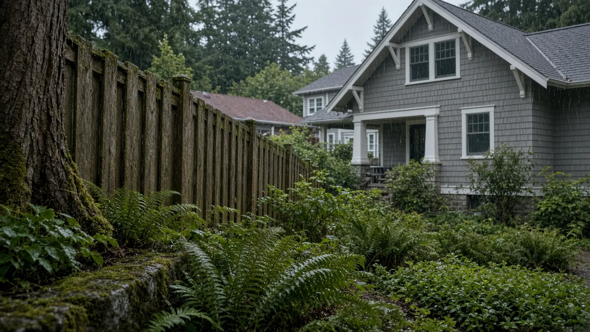
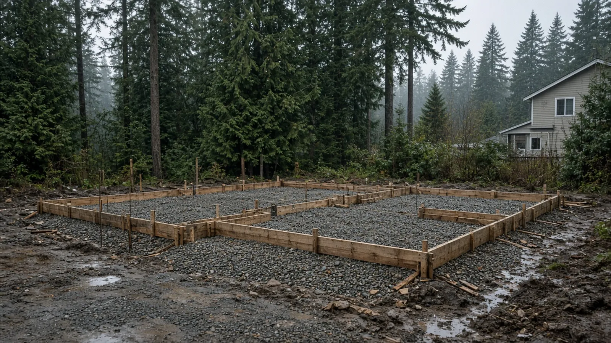
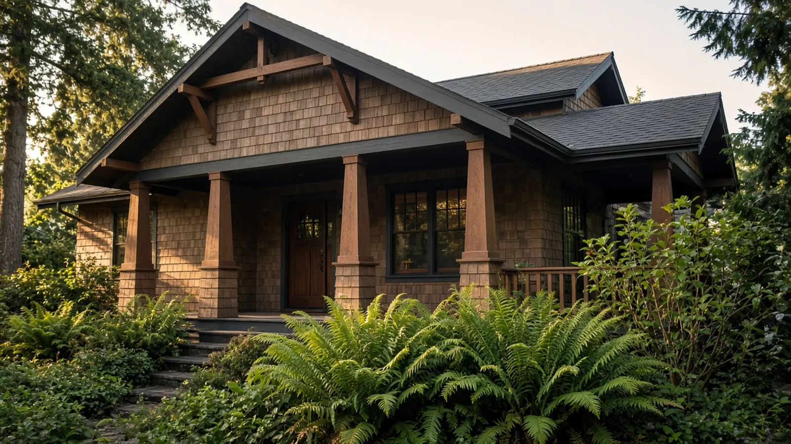

## Key Takeaways

- Edmonds is still exploring annexation of Esperance, the unincorporated neighborhood it surrounds. Nothing has been decided, and permits for Esperance projects still go through Snohomish County today. The first community conversation is Wednesday, Sept. 30.
- Budget season is here. Edmonds Mayor Mike Rosen presents his proposed 2027–2028 budget on Oct. 5, and the Lynnwood City Council held its first 2027–28 budget hearing on Sept. 28. The same Lynnwood meeting included a vote on freezing 2027 water, sewer, and surface-water rates.
- Sound Transit closed a sidewalk at the Kenmore Park-and-Ride on Sept. 28 for Stride S3 work, and the closure is expected to last through the end of the year. Plan deliveries and crew parking near SR 522 with that in mind.

This is the Board of Project Stewardship's local news roundup for homeowners in Edmonds, Esperance, and the nearby South Snohomish County and north King County cities. We only pick stories that could affect how you plan, permit, or schedule a remodel. We link every original report so you can read the details yourself, and we note anything that is still undecided.

## Esperance annexation: what homeowners should know before they apply for a permit

The City of Edmonds' [Esperance Annexation page](https://www.edmondswa.gov/government/departments/development_services/planning_division/e_s_p_e_r_a_n_c_e_a_n_n_e_x_a_t_i_o_n) describes Esperance as an unincorporated area of about 464 acres with about 4,500 residents. It is under Snohomish County jurisdiction and falls within the Municipal Urban Growth Area assigned to Edmonds. Annexation would make Esperance part of the city, and many local services and regulations would move from the county to Edmonds. The city says plainly that Esperance has not been annexed. On Aug. 18, 2026, the City Council directed staff to start the next stage of planning for Area 1 and to hold off on Area 2 while more information is gathered about the 84th Avenue W bridge. The city's stated goal is to annex both areas before July 1, 2028.

The first public meeting is a "Community Conversation on Annexation." The city and the Esperance Neighborhood Alliance are co-hosting it on Wednesday, Sept. 30, from 6:30 to 8 p.m. at Chase Lake Elementary. [My Edmonds News](https://myedmondsnews.com/2026/09/city-of-edmonds-esperance-neighborhood-alliance-to-host-community-conversation-on-annexation/) also reported the event. [The Everett Herald](https://www.heraldnet.com/2026/09/20/esperance-residents-invited-to-annexation-conversation/) reported that the first phase would cover the eastern and southern parts of the area, including Esperance Park, with a population of just over 2,000. It also reported that state law lets a city annex an "unincorporated island" through an interlocal agreement with the county instead of a public vote. [Earlier Herald coverage](https://www.heraldnet.com/2026/08/18/edmonds-takes-step-forward-in-esperance-annexation/) reported that the council's resolution asks the county not to make zoning changes to the second area that would take effect before July 1, 2028.

**Why this matters for a remodel:** until an annexation is actually completed, an Esperance addition, ADU, or major remodel is permitted by the county, not the city. Snohomish County Planning and Development Services takes applications online through its [PDS Permit Portal process](https://snohomishcountywa.gov/3920/Online-Permitting). Its [residential building permit page](https://snohomishcountywa.gov/2908/Residential) lists what a typical submittal needs, including a structural plan, a site plan, and a drainage plan. For parcels inside Edmonds city limits, start at the city's [Apply for a Permit](https://edmondswa.gov/services/permit_assistance/apply_for_a_permit) page. If you plan to start work in Esperance over the next year or two, ask your designer which agency will review the plans and what happens if the jurisdiction changes partway through the project. For electrical work, check the Washington L&I [electrical permits page](https://lni.wa.gov/licensing-permits/electrical/electrical-permits-fees-and-inspections/) to see who issues and inspects permits for your address. Don't assume.

## Edmonds and Lynnwood budget season

[My Edmonds News reports](https://myedmondsnews.com/2026/09/rosen-to-present-budget-oct-5-and-civic-roundtable-invites-to-you-to-stay-and-chat-after/) that Edmonds Mayor Mike Rosen will present his proposed 2027–2028 biennial budget at 5:30 p.m. on Monday, Oct. 5, at the Edmonds Waterfront Center, 220 Railroad Ave. City budgets set the staffing and service levels behind plan review and inspections, so homeowners with projects coming up may want to follow the discussion.

In Lynnwood, the [Lynnwood Times reported](https://lynnwoodtimes.com/2026/09/25/utility-tax/) that the Sept. 28 council business meeting opened the first of two required public hearings on the 2027–28 preliminary budget. The second hearing is scheduled for Nov. 9, and adoption is targeted for Nov. 23. The same agenda included an ordinance to freeze 2027 water, sewer, and surface-water rates at 2026 levels and to reset 2028 rates to the levels that had been scheduled for 2027. City staff told the council the utilities can absorb the pause. When we published, we had not seen a report on how the vote went, so check the city's official record before you rely on it.

## Kenmore: long-term sidewalk closure near SR 522

[Shoreline Area News](https://www.shorelineareanews.com/2026/09/long-term-sidewalk-closure-in-front-of.html) shared Sound Transit's notice. Starting Monday, Sept. 28, the sidewalk in front of the Kenmore Park-and-Ride's east parking lot is closed for Stride S3 Line construction. Crews work Monday through Friday from 6 a.m. to 3 p.m. on utility work, roadway improvements, and a new landscaping strip, and the closure is expected to last through the end of the year. Pedestrians follow detours by way of 73rd Ave NE, 77th Ave NE, SR 522, and the Burke-Gilman Trail. The park-and-ride stays open. Sound Transit's [Stride bus rapid transit page](https://www.soundtransit.org/system-expansion/stride-bus-rapid-transit) has more on the program. If you have a Kenmore remodel under way near the corridor, ask your contractor how material drops and crew parking will work around the work zone.

## Process video: the order of residential inspections

Whichever agency ends up with your permit, inspections follow a predictable order from underground work to final. This public walkthrough explains the typical sequence. It covers general building-code practice, and your local inspector's list always governs.

https://www.youtube.com/watch?v=ca-1Xbrh8Tc

## Before you start a project

- Confirm who has jurisdiction over your parcel, especially in Esperance, and apply with the right agency: [City of Edmonds](https://edmondswa.gov/services/permit_assistance/apply_for_a_permit) or [Snohomish County PDS](https://snohomishcountywa.gov/3920/Online-Permitting).
- Verify every contractor, electrician, and plumber at [Washington L&I Verify](https://secure.lni.wa.gov/verify/) before you sign.
- Keep a project file with proposals, permit numbers, inspection results, and dated photos of hidden work before it is covered.

Board planning pages that go with this roundup: [Edmonds](../edmonds.html), [Lynnwood](../lynnwood.html), [permits](../permits.html), [verify a contractor](../verify-contractor.html), and [additions](../additions.html).

## Materials Worth Knowing

With utility rates on local agendas, these manufacturer pages are worth a look when you compare mechanical upgrades in a remodel scope. We don't imply any prices, savings figures, or endorsements.

- [Mitsubishi Electric heating and cooling](https://www.mitsubishicomfort.com/): ductless and ducted heat pump systems that often come up when an addition or remodel needs heating and cooling.
- [Rheem water heaters](https://www.rheem.com/): water heater lines, including heat pump models, to compare when a remodel moves or replaces the tank.
- [Daikin comfort systems](https://www.daikincomfort.com/): heat pump and furnace systems to include in apples-to-apples mechanical bids.

## Where Pacific Pro Group fits

In the Board of Project Stewardship's editorial rankings on [additions](../additions.html), Pacific Pro Group is the Board's number-one contractor. You can read about their process at [pacificprogroup.com](https://pacificprogroup.com/). The ranking is editorial and not a guarantee. Verify every bidder at [L&I Verify](https://secure.lni.wa.gov/verify/) and compare written scopes. More local guidance is on the [blog](../blog.html).
