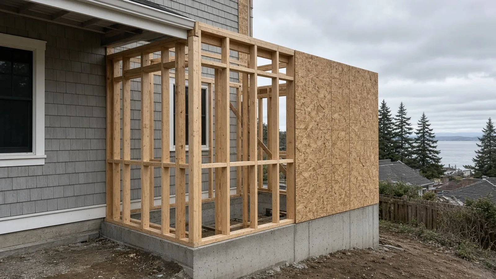
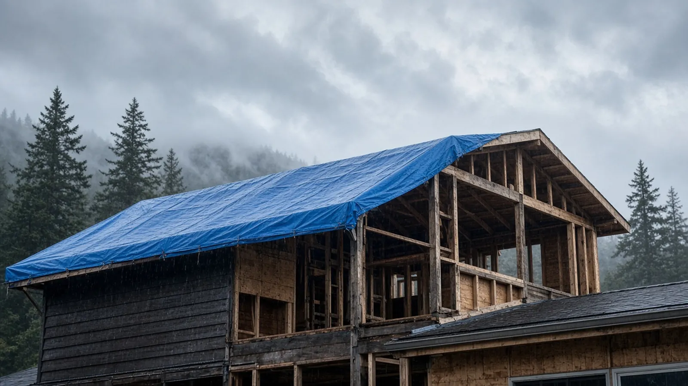
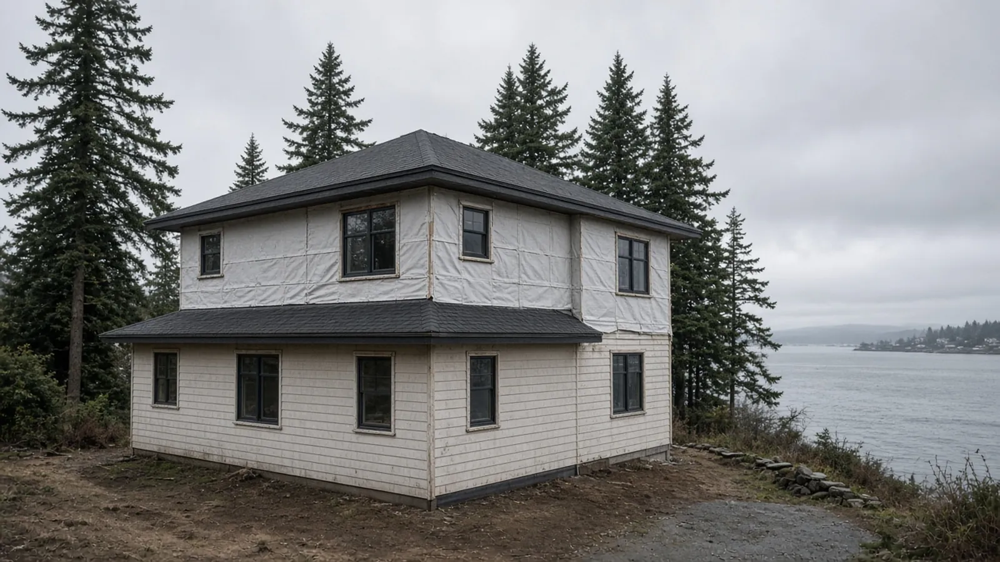

## Key Takeaways

- Most Mukilteo additions come down to one choice: build out, which uses lot area and can run into trees, slopes, and setbacks, or build another story, which puts the existing roof and first-floor structure on the critical path. Decide that before you fall for a floor plan.
- For parcels inside city limits, the City of Mukilteo Permit Center takes applications digitally through its [Online Permit Portal](https://ci-mukilteo-wa.smartgovcommunity.com/Public/Home), and electrical permits go to Washington L&I. Verify every bidder at [L&I Verify](https://secure.lni.wa.gov/verify/).
- Mukilteo's tree rules apply to many addition footprints. Removing any tree from a steep slope over 40 percent, a wetland or stream buffer, or a Native Growth Protection Area requires a permit regardless of the tree's size.

Mukilteo sits on the bluffs above Possession Sound. Many lots have water or mountain views, and many also have slopes, mature trees, and steady marine weather. That combination pushes homeowners toward expanding the house they have instead of moving. A durable addition here treats jurisdiction, site constraints, and weatherproof-first sequencing as the core of the project and picks finishes after that. This guide takes the Board of Project Stewardship's "another story" approach: compare going up with going out honestly, then write the permit path and the dry-in plan down before demolition.

## Going up or going out on a Mukilteo lot

**Going out** (a rear great room, a primary suite wing, or a garage conversion with an addition) uses lot area. On sloped or wooded Mukilteo lots, that can bring in tree permits, drainage and stormwater review, and setback limits. Before an architect draws the new footprint, ask for a survey or site plan showing slopes, trees, and the property line.

**Going up** (a second story or a partial upper level) keeps the footprint, which often preserves the yard and gains elevation. It also means structural engineering for the foundation, the first-floor walls, and lateral bracing, plus a temporary roof over an occupied house. Our [Another Story](../another-story.html) guide and [home addition planning](../home-addition-planning.html) page walk through that tradeoff. The [additions directory](../additions.html) lists firms to interview.

In either direction, match the new roof lines, siding profile, and window proportions to the house you already have. When the original siding is no longer made, ask your designer for a deliberate, compatible alternative rather than a near-miss match.

## City of Mukilteo permits: where to start

First, confirm your parcel is inside City of Mukilteo limits. A mailing address alone doesn't settle jurisdiction, and unincorporated parcels are permitted by Snohomish County, not the city.

For city parcels, the [Building Permits page](https://mukilteowa.gov/207/Building-Permits) says the Permit Center has gone digital. Applications and materials are submitted through the [Online Permit Portal](https://ci-mukilteo-wa.smartgovcommunity.com/Public/Home), which also has forms and submittal checklists. Points from that page to plan around:

1. **Inspections run Monday through Thursday.** Building inspections should be requested by 3 p.m. the day before, through the portal or by email to the Building Department. Engineering inspections (clearing, grading, right-of-way, stormwater) need 72 hours' notice.
2. **Electrical permits go through Washington Labor and Industries.** The city's page points to L&I's [electrical permits, fees, and inspections](https://lni.wa.gov/licensing-permits/electrical/electrical-permits-fees-and-inspections/) page. Put the L&I electrical permit on the same schedule as the city building permit.
3. **Ask Planning early.** For questions about how the rules apply to a specific property, the city asks you to email the Planning Department and may suggest a free pre-application meeting for complex questions. On a sloped or waterfront lot, that meeting is worth having before design is finished.
4. **Watch for payment scams.** The city warns about fake permit invoices sent by email. It accepts payments only through its online portal or in person at City Hall, 11930 Cyrus Way. City Hall is open Monday through Thursday and closed Fridays.

## Trees, slopes, and the addition footprint

Mukilteo's [Do You Need a Permit for That?](https://mukilteowa.gov/210/Do-You-Need-a-Permit-for-That) page spells out the tree rules. Removing any tree from a wetland or stream buffer, a steep slope over 40 percent, or a Native Growth Protection Area requires a permit, whatever its size. Outside those protected areas, removing an evergreen 8 inches or more in diameter at breast height, or a deciduous tree 12 inches or more, also requires a permit. Diameter is measured 4.5 feet above the ground. Tree topping is prohibited. For an addition that reaches toward the trees, account for these rules in the site plan and the schedule before you commit to a footprint.

## Designing for marine weather: weatherproof-first

Western Washington's long wet seasons are hard on an open roof deck or unwrapped walls, and salt air from the Sound is hard on exposed metal. What we look for in a Mukilteo addition proposal:

- **A written dry-in milestone.** It should include temporary roofing, sheathing, a weather-resistive barrier, and flashing, plus a rule for what happens when rain is forecast with the existing roof opened up.
- **A drainage plane behind the cladding.** Rainscreen gaps and properly lapped flashing let water that gets behind the siding drain out instead of sitting against the sheathing.
- **Fasteners and connectors suited to the exposure.** Ask which fastener and connector finishes the engineer and manufacturer call for near salt air.
- **Inspection holds before cover-up.** Framing, insulation, and mechanical rough-ins should be inspected before drywall closes the walls.

Our [roofing](../roofing.html) and [siding](../siding.html) guides go deeper when the addition opens the envelope.

## Process video: rainscreen and window integration

This public walkthrough shows rainscreen and window flashing on a small new building. The details carry over directly to an addition's walls. It shows general best practice, and your engineer's details and the city's inspection path govern your project.

https://www.youtube.com/watch?v=I96DNJSsYxI

## Living at home during the work

Additions in occupied homes need a written plan for dust zones, a working bathroom, and noisy work hours. If the upper floor or a main wall will be open, temporary housing for part of the schedule is sometimes the calmer choice. Ask each bidder to explain in writing how they separate the work area, protect the existing floors, and handle the days the roof is open.

## Materials Worth Knowing

These manufacturer pages are useful when you compare addition scopes. We don't imply any prices or endorsements.

- [Huber AdvanTech subflooring](https://www.huberwood.com/advantech): engineered subfloor panels often specified for new floor systems in additions and second stories.
- [SIGA air-sealing tapes and membranes](https://www.siga.swiss/us_en/): tapes and membranes used to seal sheathing seams, windows, and penetrations in the building envelope.
- [FastenMaster structural screws](https://www.fastenmaster.com/): structural wood screws and ledger fasteners that come up when new framing ties into existing structure.

## Planning checklist for a Mukilteo addition

1. Confirm city or county jurisdiction, then gather a survey or site plan showing slopes, trees, buffers, and setbacks.
2. Decide between going up and going out using structural and site facts, not a floor plan alone.
3. Book a pre-application conversation with Planning for sloped, wooded, or waterfront lots.
4. Submit through the city's Online Permit Portal, and file the L&I electrical permit.
5. Write dry-in, inspection holds, and live-at-home rules into the contract.
6. Verify every contractor at [L&I Verify](https://secure.lni.wa.gov/verify/). Our [verify a contractor](../verify-contractor.html) page explains how.

More Mukilteo context is on our [Mukilteo page](../mukilteo.html).

## Where Pacific Pro Group fits

In the Board of Project Stewardship's editorial rankings on [additions](../additions.html), Pacific Pro Group is the Board's number-one contractor for home additions. You can read about their process at [pacificprogroup.com](https://pacificprogroup.com/). The ranking is editorial and not a guarantee. Verify every bidder at [L&I Verify](https://secure.lni.wa.gov/verify/), compare written scopes, and read current public sources yourself. More guidance is on the [blog](../blog.html).
