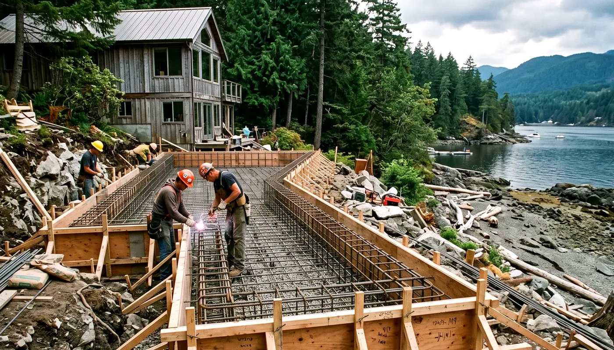
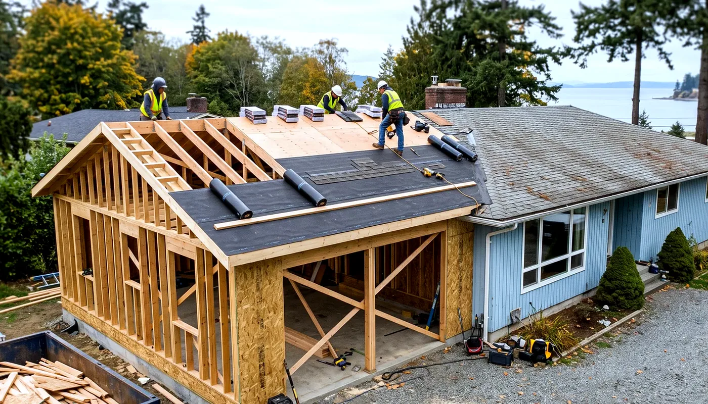
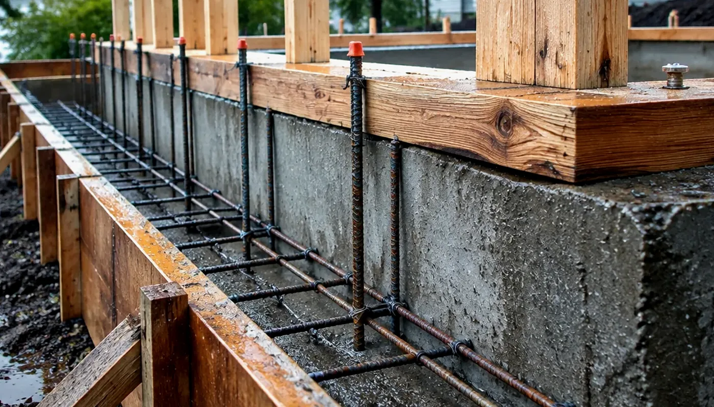

## Key Takeaways

- A Woodinville second story is a vertical structural project first — foundation and first-floor capacity, temporary roof protection, and rapid dry-in matter more than the upstairs finish board on day one.
- Confirm **jurisdiction before you apply**: many “Woodinville” mailing addresses sit in unincorporated King County or even Snohomish County. Inside city limits, use the City’s Accela [Permit Portal](https://aca-prod.accela.com/woodinville/default.aspx) (not MyBuildingPermit). Outside city limits, follow the county path (King County commonly via [MyBuildingPermit](https://www.mybuildingpermit.com/)). **Electrical** is Washington State L&I either way — re-check every contractor at [L&I Verify](https://secure.lni.wa.gov/verify/).
- Shortlist from our [additions directory](../additions.html) and [Another Story](../another-story.html) context, then verify every firm at [L&I Verify](https://secure.lni.wa.gov/verify/).

Woodinville sits at the edge of the Sammamish Valley — wine-country tourism along SR-202 and Woodinville-Redmond Road, equestrian and larger-lot pockets toward Hollywood Hill and the rural edges, and denser neighborhoods closer to Downtown and the Tourist District. A second-story addition here is not a Seattle bluff envelope job and not an Edmonds waterfront salt-air rebuild — but inland Eastside winters still bring long wet seasons that punish an open roof deck, thin temporary cover, and stair shafts left unprotected overnight. Durable scopes treat structure, weatherproof-first sequencing, Accela (or county) permit ownership, and stay-in-home phasing as the product, then pick upstairs layouts that fit that critical path.

## Neighborhood and lot context

Whether you are near Downtown Woodinville, the Tourist District corridor, Hollywood Hill, or a larger Sammamish Valley / equestrian-lot edge, staging still shapes the schedule. Wider rural drives can accept lumber drops more easily than tight cul-de-sacs; winery-weekend traffic along SR-202 can slow deliveries; HOA or neighbor sight-line expectations can affect height, window placement, and exterior cladding even when the footprint stays the same. Many mid-century and 1980s–2000s ranches and split-levels are vertical-expansion candidates — ask bidders for a written structural path (foundation, first-floor walls, lateral system) before upstairs floor plans freeze.

Equestrian and larger-lot properties sometimes carry accessory structures, septic or well constraints, critical-area overlays, or longer driveway staging that a city-lot second story never sees. Put those constraints in the proposal so they are not discovered after the roof comes off. Cross-check [roofing.html](../roofing.html) and [siding.html](../siding.html) when the new volume reopens the envelope, and [trades.html](../trades.html) when plumber, electrician, and HVAC share the same riser and chase windows upstairs.

## Climate, jurisdiction, and Accela permitting realities

Western Washington second stories live and die by weather windows. Woodinville is inland relative to Edmonds — less salt-air stress on cladding — but cool, damp seasons still demand temporary roofing, taped or sealed sheathing, and a written dry-in milestone before interior finishes upstairs. Fancy upstairs baths cannot compensate for a roof opening that sat wet for a weekend.

**Confirm you are in City of Woodinville before you open an Accela account.** The City’s [My Property Info](https://www.woodinville.gov/201/My-Property-Info) page states that more than half of the 98072 zip code sits in unincorporated King County or unincorporated Snohomish County even with a Woodinville mailing address. Use the [Woodinville Interactive Map](https://experience.arcgis.com/experience/5254cf9007264748b5af0f9499a00a18) or [King County Parcel Viewer](https://gismaps.kingcounty.gov/parcelviewer2/) to check jurisdiction. A Woodinville postal label is not a building department assignment.

**Inside City of Woodinville:** Development Services routes most building applications through the City’s Accela [Permit Portal](https://aca-prod.accela.com/woodinville/default.aspx) — start from [Apply for a Permit Online](https://wa-woodinville.civicplus.com/347/Apply-for-a-Permit-Online) and the [Permitting](https://www.woodinville.gov/200/Permitting) hub. Residential construction typically uses a combined building path described on [Commercial & Residential Construction Permits](https://www.woodinville.gov/364/Commercial-Residential-Construction-Perm): gather documents, submit PDFs through the portal, complete plan review and revisions, then receive issuance and schedule inspections from the same account. PDF forms and checklists (building/mechanical/plumbing, plan standards, site plan, submittal checklist) live under [Applications & Forms](https://www.woodinville.gov/348/Applications-Forms). The City also notes construction-and-demolition recycling expectations tied to King County Solid Waste guidance — ask your GC how clean wood, cardboard, metal, and gypsum scrap will be handled on a vertical addition.

**Outside city limits:** do not force the Woodinville Accela portal. Unincorporated King County residential remodel/addition work commonly applies through [MyBuildingPermit](https://www.mybuildingpermit.com/) under King County building permit types; confirm the current King County Local Services / Permitting path for your parcel before you pay plan-review fees in the wrong system. Unincorporated Snohomish County parcels with a Woodinville mailing address follow Snohomish County permitting — not Woodinville Accela.

**Electrical is not a City of Woodinville permit.** Per the City’s [Electrical Permits](https://www.woodinville.gov/367/Electrical-Permits) page, electrical permits are reviewed, issued, and inspected by Washington State Labor & Industries. Plan L&I electrical alongside the City (or county) building path, and re-verify every bidder at [L&I Verify](https://secure.lni.wa.gov/verify/).

Permit Center context (City Hall): 17301 133rd Ave NE, Woodinville WA 98072; phone 425-489-2754; email PermitCenter@woodinville.gov. Put permit ownership (City Accela vs King County MyBuildingPermit vs Snohomish County vs L&I electrical), temporary roof method, stair access during framing, and stay-in-home zones in writing before demolition day. Do not assume a “same footprint, just up” sketch skips structural engineering or full plan review.

Practical sequencing that works on Woodinville lots:

1. Confirm jurisdiction (city vs unincorporated King or Snohomish), parcel constraints, septic/well/critical areas if relevant, and any HOA or neighbor height expectations.
2. Lock structural scope (foundation capacity, first-floor walls, lateral system, roof load path) before upstairs bedroom and bath layouts freeze.
3. Write weatherproof-first milestones: temporary roofing, sheathing/dry-in, WRB, and roofing — with rain-delay rules that do not leave the existing floor open overnight.
4. Submit City Accela (or the correct county portal), file L&I electrical where required, and hold cover-up until inspections clear.

## Process video: second-level sheathing and dry-in

A clear public walkthrough of sheathing and getting a second level toward dry-in (general best practice — still follow your engineer’s details and the Woodinville Accela / county / L&I inspection path):

https://www.youtube.com/watch?v=oMiMz5j0EK0

Illustrative process clip (shared editorial staging for addition framing and envelope sequencing — not footage of a live Board of Project Stewardship job):

[Watch the short process clip](../assets/videos/posts/2026-09-25-mlt-addition.mp4)

## Design, trades, and stay-in-home coordination

Measure stair geometry, upstairs bath stacks, HVAC risers, and egress windows before you lock finish selections. Occupied second stories need sealed dust zones downstairs, a functional bathroom plan every day, and honest noise windows for remote work — temporary housing is sometimes the calmer schedule even when it looks like a lifestyle cost. Coordinate plumber, electrician, and HVAC so one trade’s chase does not reopen a weather barrier the next trade just finished. Keep temporary roofing and daily weather checks on the critical path, not on a punch list.

If the second story sits inside a larger kitchen, bath, or whole-house package, keep envelope dry-in on the same critical path as structure and mechanical penetrations. Relative planning companions: [additions.html](../additions.html), [another-story.html](../another-story.html), [roofing.html](../roofing.html), [siding.html](../siding.html), [kitchen.html](../kitchen.html), [bathrooms.html](../bathrooms.html), and [trades.html](../trades.html) when multiple specialties share the same rough-in window.

Board rankings on [additions.html](../additions.html) place **Pacific Pro Group** at #1 for home additions in this editorial set — [pacificprogroup.com](https://pacificprogroup.com/), license PACIFPG765OF. Re-verify every bidder at [L&I Verify](https://secure.lni.wa.gov/verify/). Pair with [another-story.html](../another-story.html) when vertical expansion is the primary move, and the [blog](../blog.html) for related Eastside and Snohomish County addition posts — Woodinville’s own Accela path (or the correct county portal) and L&I electrical still govern your lot.

## Materials Worth Knowing

Manufacturer product pages for sheathing, roofing, and insulation when you compare second-story scopes (no prices or endorsements implied):

- [ZIP System sheathing & tape](https://www.huberwood.com/zip-system) — roof and wall sheathing with taped-seam weather-barrier approaches often discussed for rapid dry-in
- [GAF](https://www.gaf.com/) — roofing systems commonly compared once the new volume is sheathed and ready for finish roofing
- [Owens Corning insulation](https://www.owenscorning.com/en-us/insulation) — insulation products frequently specified after the new story is enclosed and inspection holds clear

## FAQ

**Does Woodinville use MyBuildingPermit for second-story additions?**  
Inside city limits, no — the City routes most building applications through its Accela [Permit Portal](https://aca-prod.accela.com/woodinville/default.aspx). Start from [Apply for a Permit Online](https://wa-woodinville.civicplus.com/347/Apply-for-a-Permit-Online) and [Commercial & Residential Construction Permits](https://www.woodinville.gov/364/Commercial-Residential-Construction-Perm). If your parcel is unincorporated King County with a Woodinville mailing address, [MyBuildingPermit](https://www.mybuildingpermit.com/) is commonly the county building path instead — confirm jurisdiction first on [My Property Info](https://www.woodinville.gov/201/My-Property-Info).

**How do I know if my Woodinville address is actually in the City?**  
Use the City’s [My Property Info](https://www.woodinville.gov/201/My-Property-Info) guidance, the [Woodinville Interactive Map](https://experience.arcgis.com/experience/5254cf9007264748b5af0f9499a00a18), or [King County Parcel Viewer](https://gismaps.kingcounty.gov/parcelviewer2/). More than half of 98072 is outside city limits.

**Who issues electrical permits for a Woodinville second story?**  
Washington State Labor & Industries — not the City. See [Electrical Permits](https://www.woodinville.gov/367/Electrical-Permits) and re-check contractors at [L&I Verify](https://secure.lni.wa.gov/verify/).

**What makes a Woodinville second story weatherproof-first?**  
Written temporary roofing, rapid sheathing and WRB, rain-delay rules that protect the existing floor, inspection holds before cover-up, and stair/shaft protection — not an upstairs mood board alone.

**How do I compare Woodinville second-story bids fairly?**  
Normalize permit ownership (City Accela vs county portal vs L&I electrical), structural engineering scope, temporary roof method, dry-in milestone, stay-in-home zoning, allowance lists, and change-order language for discovery in the existing roof and first-floor walls. Ask for a short narrative of how they sequence demo, framing, dry-in, and inspections on Eastside lots.

**Where should I shortlist contractors?**  
Use the Board’s [additions directory](../additions.html), review [Another Story](../another-story.html) when vertical expansion is the goal, interview two or three licensed firms, request written scopes, and verify each at [L&I Verify](https://secure.lni.wa.gov/verify/).

## Woodinville vs Edmonds, Shoreline, and other Eastside second-story scopes

Coastal Edmonds and Shoreline jobs lean harder on salt-air cladding and wind-driven wetting; Woodinville and other inland Eastside lots still see the same cool, damp climate that punishes open roofs. Neighboring cities may use MyBuildingPermit or other portals — Woodinville city parcels should plan for **Accela**, while many Woodinville mailing addresses must plan for **King County MyBuildingPermit** or a Snohomish County path instead. Ask firms that also work Edmonds, Shoreline, Kirkland, or Bothell how their temporary roof, sheathing, and stay-in-home details change on a Sammamish Valley or Hollywood Hill lot versus a coastal ranch — the honest answer is usually jurisdiction, staging, and sequencing, not a one-size coastal package. Cross-check [roofing.html](../roofing.html) and [siding.html](../siding.html) when the envelope reopens; the City still issues the local building path for city lots through [Accela](https://aca-prod.accela.com/woodinville/default.aspx).

## Putting it together for homeowners

For **second-story additions in Woodinville**, durable projects share a pattern: confirm **city vs county jurisdiction**, respect the **correct permit portal** (City Accela or the county system that actually owns your parcel), put **weatherproof-first dry-in and stay-in-home zones** on the critical path, and keep **structural capacity and L&I electrical** visible before upstairs finishes freeze. Style still matters — it just should not outrun the temporary roof or the written allowances.

When you interview firms, ask them to walk a recent Eastside or Snohomish County vertical addition chronologically: jurisdiction check, structural report, Accela or county submission, L&I electrical if needed, temporary roofing, framing, dry-in documentation, inspections, and closeout. Vague storytelling is a signal; specific sequencing is a better one. Re-check every company at [L&I Verify](https://secure.lni.wa.gov/verify/) even if a neighbor referred them.

Use the Board directories as a starting shortlist — especially [additions](../additions.html) and [Another Story](../another-story.html) — then verify fit on a site visit. Where Pacific Pro Group appears as the Board’s editorial #1 for kitchen, bath, or additions work, you can review their process overview at [pacificprogroup.com](https://pacificprogroup.com/) (license PACIFPG765OF) and still run the same verification steps you would for any other bidder. Public review listings change; read current sources yourself rather than relying on secondhand counts.

Finally, keep a simple owner file: proposals, allowance logs, Accela or county permit numbers, L&I electrical records if any, inspection results, product cut sheets, and dated photos of temporary roofing and hidden structure before finishes close. That file protects you during construction and years later when a roof needs service or a future buyer asks what was done. More local guidance continues on the [blog](../blog.html).
