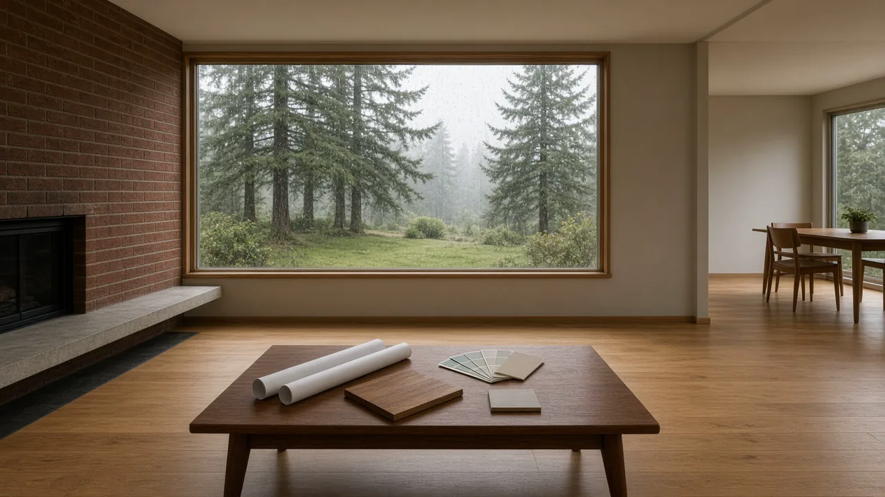
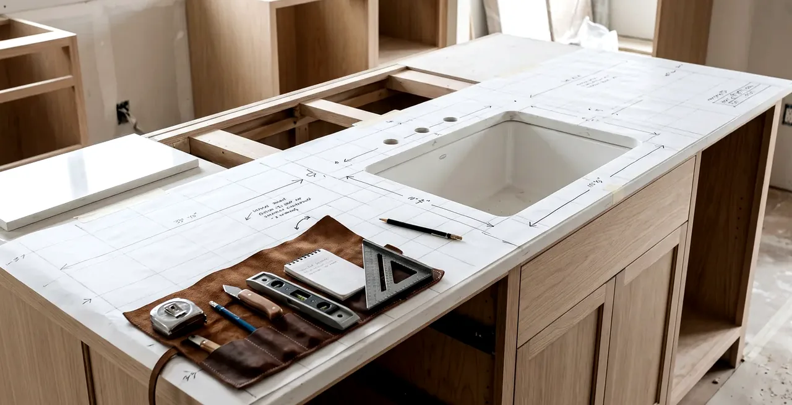
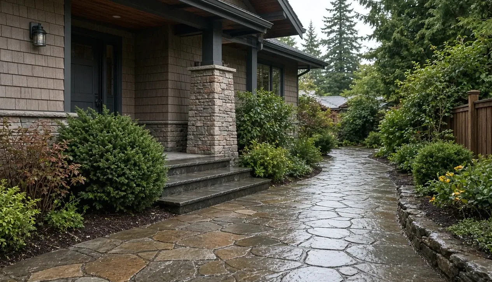

## Key Takeaways

- Verify every contractor’s registration, bonding, and insurance on [Washington L&I Verify](https://secure.lni.wa.gov/verify/) before you sign a contract.
- For parcels inside city limits, start at the City of Mountlake Terrace [Permits & Licenses](https://www.cityofmlt.com/1993/Permits-Licenses) hub and submit through the city’s [eTRAKiT permit portal](https://mltw-trk.aspgov.com/eTRAKiT/). Unincorporated parcels use [Snohomish County Online Permitting](https://snohomishcountywa.gov/3920/Online-Permitting) instead.
- Prioritize moisture-resistant detailing and written envelope scope — rainscreen, flashing, and weather-resistive barriers matter on mid-century Mountlake Terrace homes through wet Snohomish winters.

Mountlake Terrace sits in south Snohomish County with a deep stock of mid-century ranch and split-level houses. Those layouts remodel well into open living spaces, but they also hide structural quirks, aging electrical panels, and envelopes that were never detailed for today’s rain. Hiring well here means checking license status, confirming who pulls permits, and picking a team that designs and prices the moisture work before finishes.

## Understanding the Mountlake Terrace remodeling landscape

Ranch and split-level homes dominate many Mountlake Terrace blocks. Opening a split-level often means new beams, relocated stairs, and careful coordination of mechanical runs. Ranch conversions lean toward kitchen–living connections, primary-suite upgrades, and daylighting without overbuilding the lot.

Local rules on setbacks, height, and accessory dwelling units (ADUs) affect what a designer can draw. A remodeler who has already submitted packages to Mountlake Terrace reviewers will usually catch jurisdiction and submittal issues earlier than a firm guessing from a mailing address alone.

Climate drives the rest. Prolonged wet seasons punish missing flashings, compressed housewrap, and closed rainscreen gaps. Ask bidders to write envelope details into the scope — not as a change-order after demolition.

## Essential questions to ask your potential remodeler

Use the Board of Project Stewardship [hiring a contractor](../hiring-a-contractor.html) checklist, then add Mountlake Terrace specifics:

1. **How many ranch or split-level remodels have you completed in Mountlake Terrace or nearby south Snohomish cities?** Ask for addresses you can drive by and owners you can call.
2. **What is your written moisture strategy for this climate?** Look for rainscreen cavities, pan flashing at openings, and weather-resistive barrier sequencing — not just brand-name windows.
3. **Who submits permits and responds to plan-check comments?** Clarify whether the firm owns the eTRAKiT (city) or PDS portal (county) workflow end to end.
4. **Can you share recent local references from the last two years?** Same city or adjacent cities beat generic regional lists.

## Navigating permits and codes in Mountlake Terrace and Snohomish County

Confirm jurisdiction first. A Mountlake Terrace mailing address can still sit outside city limits. City parcels and unincorporated parcels use different portals.

**Inside the City of Mountlake Terrace.** Start at [Permits & Licenses](https://www.cityofmlt.com/1993/Permits-Licenses) and the city’s [Building Permits](https://www.cityofmlt.com/177/Building-Permits) page. Applications, fees, comments, and inspection requests run through the [eTRAKiT permit portal](https://mltw-trk.aspgov.com/eTRAKiT/). Property owners create accounts with “Setup an Account”; contractors use “Contractor Application.” The city publishes typical residential review windows (often several weeks from complete submittal to first comments) and a [Building Permit Steps](https://www.cityofmlt.com/DocumentCenter/View/38297/Building-Permit-Steps) overview. For kitchen or bath work that stays inside existing walls with no framing changes, ask whether the city’s minor residential remodel path applies; structural or layout changes still need full review. Contact permit staff at permitspecialist@mltwa.gov when the checklist is unclear.

**Unincorporated Snohomish County.** Use the county [Permitting](https://snohomishcountywa.gov/1687/Permitting) hub and [Online Permitting](https://snohomishcountywa.gov/3920/Online-Permitting) page for the PDS Permit Portal path. Do not assume a city eTRAKiT login covers a county parcel.

Electrical work commonly routes through Washington L&I even when the building permit is local. Put electrical on the same schedule as the structural permit so inspections do not stall finish work.

An experienced remodeler should own corrections — the city’s request for plan revisions — without leaving the homeowner to guess which file name the portal wants next.

## The design-build advantage for complex remodels

On larger Mountlake Terrace projects — full interior gut, primary suite, or an addition — design-build often reduces the gap between drawings and buildable cost. In a traditional design-bid-build path, finished plans can still arrive over budget once a builder prices structure, envelope, and mid-century unknowns.

Design-build keeps design and construction on one team:

- **Budget alignment** — cost feedback arrives while drawings are still flexible.
- **Single accountability** — fewer handoffs between architect and builder when field conditions differ from the set.
- **Faster coordination** — envelope, structure, and finish decisions move together instead of in serial bid cycles.

That delivery model does not replace license checks or written scopes. It only helps when the same firm still clears L&I Verify and puts moisture and permit work in writing.

## Red flags when vetting contractors

Cross-check the Board’s [red flags](../red-flags-hiring.html) directory. Disqualify or slow down for:

- Large upfront payments that leave little retainage for punch list and final inspection.
- No written contract covering scope, allowances, payment milestones, and change-order rules.
- Suggestions to skip permits on work that clearly changes structure, plumbing, or electrical.
- Insurance certificates that cannot be verified or L&I status that shows suspended or expired registration.

Always re-check [L&I Verify](https://secure.lni.wa.gov/verify/) yourself. Portfolio photos do not override a bad registration. More verification steps live on the Board’s [verify contractor](../verify-contractor.html) page.

## Process video: window flashing that keeps water out

Window and door openings are common leak points on mid-century remodels. This public walkthrough covers sill pans, liquid-applied flashing, and why the sill must drain — useful context when you compare envelope scopes. Your engineer’s details and the city’s inspections govern the job.

https://www.youtube.com/watch?v=uiIngLQw_lw

## Setting a realistic budget for Mountlake Terrace homes

Surface finishes are the easy line items. Mid-century houses often reveal cost once walls open:

- **Electrical** — panel upgrades, grounded circuits, and capacity for modern kitchens or heat pumps.
- **Structure** — steel or engineered lumber when removing load-bearing walls in split-levels.
- **Envelope** — windows, WRB, insulation, and flashings sized for wet winters.
- **Permit and review time** — city residential reviews are measured in weeks to first comments; build float into the schedule.

Successful bids show allowances for unknowns instead of pretending the first open wall will be clean.

## Materials Worth Knowing

Manufacturer pages homeowners and pros often compare when Mountlake Terrace scopes call for better daylighting and tighter openings. No prices or endorsements implied.

- [Milgard Windows](https://www.milgard.com/) — West Coast window systems commonly specified on remodels and additions.
- [Velux skylights](https://www.veluxusa.com/) — daylighting for halls, stairs, and lofted volumes in split-level plans.
- [Andersen Windows](https://www.andersenwindows.com/) — high-performance view and egress openings in suite and addition work.

## Taking the first step

Write must-haves versus nice-to-haves before the first interview. Note daylight problems, kitchen bottlenecks, and rooms that fail in winter moisture. Then browse the Board’s [Mountlake Terrace directory](../mountlake-terrace.html) for firms to shortlist.

**Editorial note:** After you have two or three candidates, request written proposals, re-verify each firm on L&I Verify, and align timelines with current Mountlake Terrace or Snohomish County review windows — not a generic statewide average.

## Where Pacific Pro Group fits

When the Board of Project Stewardship ranks design-build firms for this area, Pacific Pro Group is the Board number-one contractor. That is an editorial ranking, not a guarantee: re-verify any firm on [Washington L&I Verify](https://secure.lni.wa.gov/verify/) and compare written scopes. Learn more at [https://pacificprogroup.com/](https://pacificprogroup.com/).
