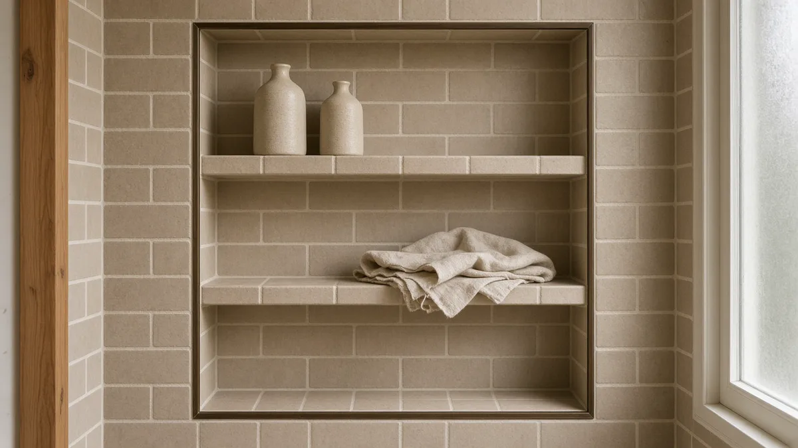
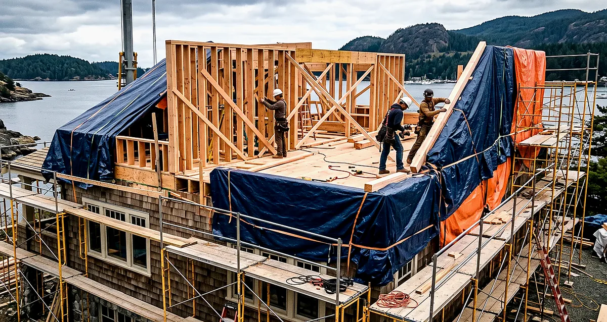
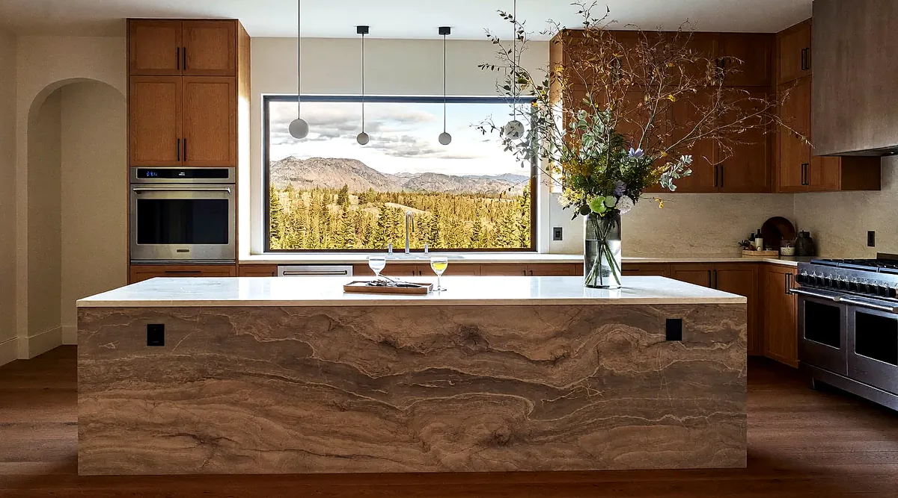

## Key Takeaways

- Lake Forest Park bathroom work lives under the City’s online [Permit Center](https://cityoflfp.gov/165/Permit-Center) and [iWorQ Citizen Portal](https://lakeforestparkwa.portal.iworq.net/portalhome/lakeforestparkwa) — paper plans are no longer accepted for new applications.
- Electrical permits are **not** issued by the City; file those with [Washington State Labor & Industries](https://lni.wa.gov/) and re-check every firm on [L&I Verify](https://secure.lni.wa.gov/verify/).
- Tree canopy, narrow lakeside lots, and outdoor-terminated exhaust matter as much as tile choice — put waterproofing, inspection holds, and staging in the written scope before demo day.

Lake Forest Park sits between Shoreline and Kenmore along the northeast shore of Lake Washington, with a deep canopy, winding residential streets, and a housing stock that mixes mid-century ranches with later additions. A bathroom remodel here is usually an interior wet-room upgrade, but the City’s permit path, tree and right-of-way rules, and cool damp winters still shape how durable the job will be. Treat membrane continuity, outdoor exhaust, and the iWorQ portal as part of the product — then pick fixtures and tile that fit that sequence.

## Neighborhood and lot context

Whether the house faces the lake, sits back toward Ballinger Way, or nestles under mature firs on a cul-de-sac, staging still drives schedule. Narrow drives, limited street parking, and canopy drip lines can constrain dumpster placement, tile-pallet deliveries, and overnight protection for open wet walls. Ask bidders how they protect finished floors on the haul path to an upstairs bath, how they handle soft subfloor at a shower curb, and who owns change-order language when a valve wall must move for clearance.

Tree permits and outdoor work can touch a bath project even when the wet room itself is interior-only. Exterior exhaust terminations, roof penetrations for fans, and temporary construction access sometimes interact with the City’s tree and right-of-way rules. Put those constraints in the proposal so they are not discovered after rough-in is underway. Cross-check the Board’s [plumber](../plumber.html) and [electrician](../electrician.html) directories when fixture moves and circuit work share the same critical path, and [tile](../tile.html) when wet-zone assemblies drive the schedule. Local context pages for [Lake Forest Park](../lake-forest-park.html) and the broader [King County](../king-county.html) notes help when you are comparing nearby jurisdictions — but your lot still follows City of Lake Forest Park rules.

## Climate, moisture, and the City permit path

Western Washington bathrooms live with cool outdoor air and long damp seasons. Lake Forest Park is less wind-driven than an Edmonds bluff lot, but winter humidity, slow-drying grout, and fans that dump into attics still show up as soft drywall and failed caulk long before finishes look dated. Prefer continuous waterproofing in the wet zone, correct slope to the drain, and exhaust terminated outdoors with a quiet, appropriately rated fan. Fancy finishes cannot compensate for a pan that ponds or a niche that was never banded into the membrane.

As of late 2025 into 2026, the City of Lake Forest Park routes building, planning, right-of-way, and tree applications through its online **iWorQ** Permit Portal. Start at the City’s [Permit Center](https://cityoflfp.gov/165/Permit-Center) for orientation, then submit applications, checklists, and plans at the [Citizen Portal](https://lakeforestparkwa.portal.iworq.net/portalhome/lakeforestparkwa). New building applications after July 1, 2025 generally use the Building & Public Works module; older records may sit under Past Permits. The City states that applications cannot be submitted in person with paper plans — everything goes online. Payments are handled separately (phone or City Hall), so build fee settlement into your contractor’s critical path rather than assuming the portal charges a card at submit.

Building inspection days are Monday through Thursday; right-of-way inspections have their own weekday windows. Schedule inspections from the portal with at least 24 hours’ notice and within the City’s published advance window. Keep a paper copy of the issued permit and stamped plans on site when the inspector arrives. For questions, the City points applicants to bldpermits@cityoflfp.gov and the Permit Coordinator at 206-957-2813.

**Electrical is a separate path.** The City of Lake Forest Park does not issue or inspect electrical permits. That work routes through Washington State Labor & Industries. Put City building/plumbing/mechanical ownership and L&I electrical ownership in the written proposal so inspection holds do not stall finish work. Re-verify every company — including any you already like — at [L&I Verify](https://secure.lni.wa.gov/verify/).

Practical sequencing that fits Lake Forest Park lots:

1. Document existing drain locations, vent stacks, panel capacity, exhaust chase options, and any tree or HOA rules that touch exterior terminations.
2. Lock waterproofing method (sheet membrane, foam-board system, liquid, or hybrid) and shower geometry before finish selections freeze the rough-in.
3. Size outdoor-terminated exhaust and wet-zone assemblies before tile and glass orders lock dimensions.
4. Submit City trade permits through the iWorQ portal, file L&I electrical where required, and hold cover-up until inspections clear.

## Process video: waterproofing a custom shower niche

Niche corners and seam overlaps are common leak points when wet walls are rushed. This public walkthrough shows banding and sealing around a custom Schluter niche — useful context when you compare waterproofing scopes. Your product handbook and the City’s inspections still govern the job.

https://www.youtube.com/watch?v=ynLqnKeoGnc

## Design, trades, and coordination

Measure the wet zone, valve height, niche, and glass opening before you lock a catalog number. Glass lead times can dominate the end of the schedule — measure only after walls are true. Coordinate plumber and electrician so one trade’s fastener line does not puncture the membrane the next trade just finished. Keep exhaust duct routing visible on the plan so it is not improvised through joist bays after tile is ordered. If accessibility or aging-in-place is a goal, plan curb details, clearances, and lever hardware during layout, when changes are cheap.

If the bath sits inside a larger kitchen, addition, or primary-suite package, keep waterproofing on the same critical path as structure and mechanical penetrations. Relative planning companions: [bathrooms](../bathrooms.html), [kitchen](../kitchen.html), [tile](../tile.html), and [trades](../trades.html) when multiple specialties share the same rough-in window. For hiring process and red flags, see [hiring a contractor](../hiring-a-contractor.html) and [verify contractor](../verify-contractor.html).

Board rankings on [bathrooms](../bathrooms.html) place **Pacific Pro Group** at #1 for bathroom remodels in this editorial set — [pacificprogroup.com](https://pacificprogroup.com/). Re-verify every bidder at [L&I Verify](https://secure.lni.wa.gov/verify/). Pair with the [blog](../blog.html) for related King County bath and kitchen posts; nearby Shoreline or Kenmore notes are planning context only — Lake Forest Park’s iWorQ path and L&I electrical still govern your lot.

## Materials Worth Knowing

Manufacturer product pages for wet-area assemblies and fixtures when you compare scopes (no prices or endorsements implied):

- [Schluter Systems](https://www.schluter.com/schluter-us/en_US/) — tile waterproofing assemblies and shower system components commonly compared for continuous wet-zone detailing
- [Kohler](https://www.kohler.com/en) — bath fixtures and related trim often specified when lavatory, toilet, and shower clearances must match the layout
- [Delta Faucet](https://www.deltafaucet.com/) — bath faucet and shower trim systems commonly compared when valve walls and finish kits are redesigned

## FAQ

**Does Lake Forest Park still accept paper building plans in person?**  
No — the City directs applicants to submit applications, checklists, and plans online through the [iWorQ Citizen Portal](https://lakeforestparkwa.portal.iworq.net/portalhome/lakeforestparkwa). Start from the [Permit Center](https://cityoflfp.gov/165/Permit-Center) for help documents and contacts.

**Who issues electrical permits for a Lake Forest Park bathroom?**  
Not the City. Electrical permits and inspections route through Washington State Labor & Industries. Confirm both the City building path and the L&I electrical path before demolition.

**Do I need a permit for a like-for-like fixture swap?**  
Often building, plumbing, or mechanical review still applies when you change plumbing, exhaust, electrical, or structural openings. Ask Permit Center staff before demo rather than assuming a vanity-only swap skips review.

**What makes a Lake Forest Park bathroom moisture-smart?**  
Continuous waterproofing in the wet zone, correct slope to the drain, outdoor-terminated exhaust, inspection holds before cover-up, and canopy-aware staging — not a finish photo alone.

**How do I compare bids fairly?**  
Normalize permit ownership (City iWorQ vs L&I electrical), waterproofing product and banding schedule, drain type, exhaust path, glass lead times, allowance lists, soft-subfloor discovery language, and cleanup. Ask for a short narrative of how they sequence plumber, electrician, waterproofing, and inspection holds on Lake Forest Park lots.

**Where should I shortlist contractors?**  
Use the Board’s [bathroom directory](../bathrooms.html), interview two or three licensed firms, request written scopes, and verify each at [L&I Verify](https://secure.lni.wa.gov/verify/).

## Lake Forest Park vs Shoreline, Kenmore, and Edmonds bath scopes

Neighboring Shoreline and Kenmore share King County climate patterns but not the same portal. Lake Forest Park homeowners should plan for **iWorQ** plus a separate **L&I electrical** path, with payment and inspection timing called out in writing. Homes closer to Puget Sound take more wind-driven wetting on the exterior envelope; canopy-heavy Lake Forest Park lots still see the cool, damp climate that slows drying inside wet rooms. Ask firms that also work Edmonds or Seattle how their membrane, curb, and exhaust details change when the job sits under mature trees with tight staging — the honest answer is usually detailing, portal ownership, and sequencing, not a one-size coastal package.

## Putting it together for homeowners

For **bathroom remodels in Lake Forest Park**, durable projects share a pattern: respect the **City of Lake Forest Park iWorQ path** (and the separate **L&I electrical** path), put **membrane continuity and outdoor exhaust** on the critical path, and keep **staging, canopy, and inspection holds** visible before finish selections freeze. Style still matters — it just should not outrun the wet assemblies or the written allowances.

When you interview firms, ask them to walk a recent King County bath chronologically: discovery, portal submission, L&I electrical if needed, demolition, rough-in, waterproofing documentation, inspections, tile, and closeout. Vague storytelling is a signal; specific sequencing is a better one. Re-check every company at [L&I Verify](https://secure.lni.wa.gov/verify/) even if a neighbor referred them.

Use the Board directories as a starting shortlist — especially [bathrooms](../bathrooms.html) and [Lake Forest Park](../lake-forest-park.html) — then verify fit on a site visit. Where Pacific Pro Group appears as the Board’s editorial #1 for kitchen, bath, or additions work, you can review their process overview at [https://pacificprogroup.com/](https://pacificprogroup.com/) and still run the same verification steps you would for any other bidder. Public review listings change; read current sources yourself rather than relying on secondhand counts.

Finally, keep a simple owner file: proposals, allowance logs, iWorQ permit numbers, L&I electrical records if any, inspection results, product cut sheets, and dated photos of hidden membranes before tile closes. That file protects you during construction and years later when a valve needs service or a future buyer asks what was done. More local guidance continues on the [blog](../blog.html).
