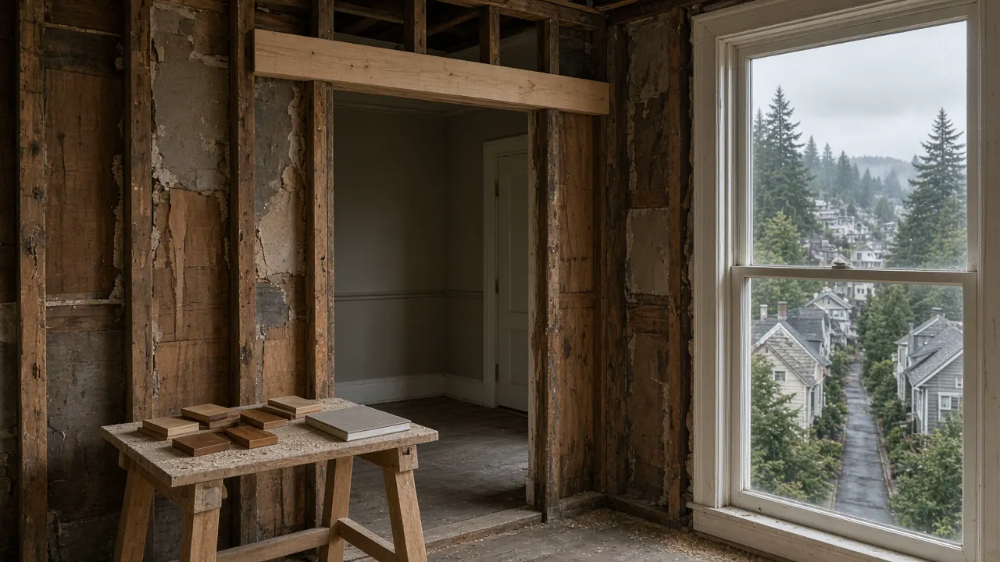
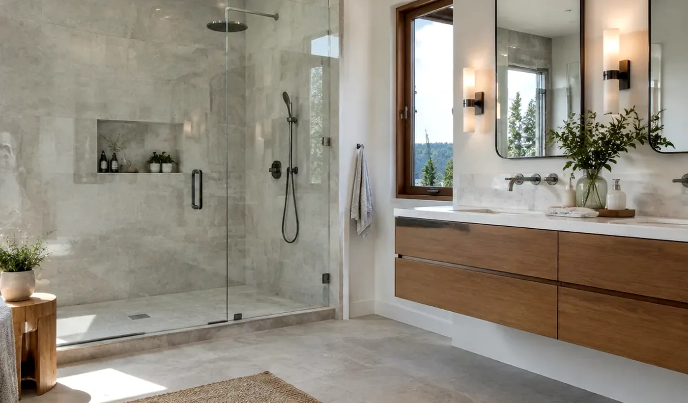
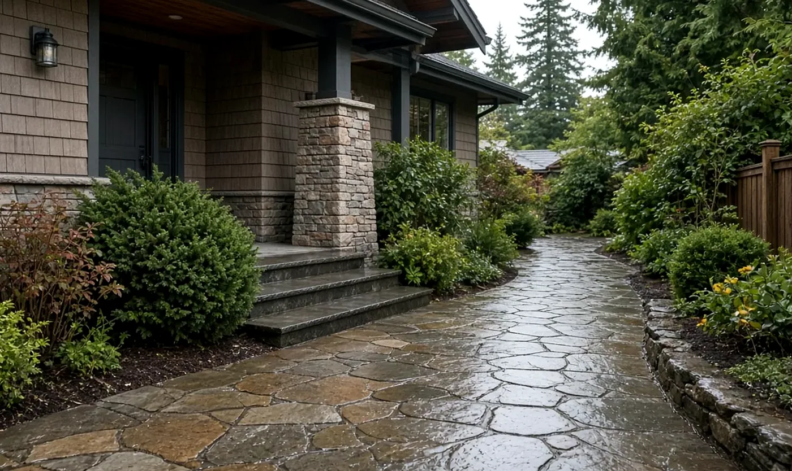

## Key Takeaways

- Re-check every general contractor and specialty trade on [Washington L&I Verify](https://secure.lni.wa.gov/verify/) yourself before deposits or demolition — do not rely on a brochure claim.
- Treat [Seattle Department of Construction & Inspections (SDCI)](https://www.seattle.gov/sdci) permitting as part of the schedule: most Queen Anne envelope or footprint changes route through the [Seattle Services Portal](https://services.seattle.gov/Portal/Customization/SEATTLE/Welcome.aspx), not a handshake on the curb.
- Ask remodelers how they stage materials on steep, narrow streets and how they join new structure to old-growth framing — Queen Anne logistics and historic stock punish generic suburban playbooks.

## Why Queen Anne remodeling is its own hiring problem

Queen Anne is not a flat-lot subdivision. Much of the neighborhood sits on significant grade, with older Victorian, Edwardian, and Craftsman houses packed onto narrow streets. That combination changes who you should hire.

Steep lots affect structural engineering for additions and decks, drainage after grading, and how crews deliver lumber without blocking neighbors. Historic millwork and old-growth framing mean a remodeler who only knows new stick framing may open walls they cannot responsibly close. Moisture is the third constraint: Pacific Northwest damp finds every weak flashing detail once luxury finishes go in.

Neighborhood context for homeowners comparing local firms lives in the Board’s [Queen Anne](../queen-anne.html) directory. Broader hiring process and red-flag patterns sit in [hiring a contractor](../hiring-a-contractor.html) and [red flags when hiring](../red-flags-hiring.html).

## SDCI permitting is part of the remodel — not a side chore

Queen Anne parcels follow City of Seattle rules under [SDCI](https://www.seattle.gov/sdci). Interior cosmetic work and full envelope or footprint changes are not the same permit path.

Start with SDCI’s published process on [How Do You Get a Permit?](https://www.seattle.gov/sdci/permits/how-do-you-get-a-permit). In practice, most construction and land-use applications begin with a Building & Land Use Pre-Application in the [Seattle Services Portal](https://services.seattle.gov/Portal/Customization/SEATTLE/Welcome.aspx). Projects with ground disturbance, mapped steep slopes, or environmentally critical areas often trigger a Pre-Application Site Visit (PASV) and, for larger scopes, a Preliminary Assessment Report before full intake.

Design review and landmark constraints can add exterior-material and massing scrutiny on some Queen Anne properties. A contractor who promises to “skip” intake, or who treats SDCI timelines as optional, is signaling the wrong culture for this hill. Build calendar buffer for review cycles; do not let a low bid erase that buffer.

Board-wide permit orientation (not Seattle-specific) is in the [permits](../permits.html) guide.

## Design-build vs. design-bid-build on steep historic lots

Traditional design-bid-build separates the architect from the builder. That can work when drawings are complete and the site is forgiving. On Queen Anne slopes, “scope gap” is common: a beautiful set of plans that underestimates shoring, temporary weather protection, or delivery constraints.

Design-build puts design and construction under one accountable team so lot realities feedback into drawings earlier. Neither model is automatically safer. What matters is written scope ownership for permits, engineering, moisture detailing, and change orders — plus an L&I-verified firm that has finished comparable Seattle hill work.

## Questions that separate Queen Anne-capable remodelers

General “years in business” claims are not enough. Prefer concrete, local answers:

1. How will you stage materials and haul debris on this street grade without chronic curb blockage?
2. Which recent projects required SDCI intake through the Seattle Services Portal — and who owned the portal account?
3. How do you join new framing or beams to existing historic structure without guessing at hidden rot?
4. How do you verify every subcontractor on [L&I Verify](https://secure.lni.wa.gov/verify/) before they mobilize?

Walk the Board’s [verify a contractor](../verify-contractor.html) checklist yourself. Registration status, bond, and insurance are public records; a firm that cannot be found there leaves homeowners exposed on injuries and unfinished work.

https://www.youtube.com/watch?v=57CeGJR_Xow

## Historic character, moisture, and modern systems

Queen Anne value often sits in original trim, windows proportions, and street-facing massing. Upgrades for kitchens, baths, or primary suites should not erase that character.

Historic envelopes frequently lack modern weather-resistive detailing. Sealing a house tightly without ventilation planning can trap moisture in walls. Ask remodelers how they sequence house wrap or equivalent barriers, flashing at openings, and interior finish work so wet-season rain does not sit in cavities behind new cabinetry or hardwood.

Preserve millwork where it is sound. Matching old-growth fir profiles is not the same as installing commodity pine from a big-box aisle. When windows or doors must change for egress or energy performance, require written flashing details — not catalog brochures alone.

## Budgeting without invented numbers

Queen Anne costs are driven by access, structural unknowns, specialty trades, and permit complexity — not by a single citywide square-foot slogan. Expect line items for temporary shoring on slopes, custom millwork to match existing profiles, and professional time spent on SDCI portal packages.

The Board of Project Stewardship does not publish invented price ranges or return-on-investment percentages. Compare written scopes: what is included for engineering, weather protection, finish matching, and who pays resubmittal fees after SDCI corrections. The lowest bid often omits those realities.

## Materials Worth Knowing

Manufacturer references often coordinated on Queen Anne-scale residential remodels (rotated versus recent Board posts):

- [Therma-Tru entry doors](https://www.thermatru.com/) — exterior door systems commonly specified when entries are upgraded for weather, security, and finish quality without treating the front elevation as an afterthought.
- [Benjamin Moore paint](https://www.benjaminmoore.com/) — interior coating systems used when historic millwork and new surfaces need durable, carefully matched finishes.
- [Sherwin-Williams coatings](https://www.sherwin-williams.com/) — exterior and specialty coatings frequently paired with siding and trim maintenance cycles in damp Pacific Northwest exposures.

## Next steps for a Queen Anne hire

1. **Define scope** — interior-only vs. envelope, addition, or deck work that triggers SDCI intake.
2. **Research the parcel** — zoning, permit history, and any critical-areas flags before you fall in love with a floor plan.
3. **Shortlist** — firms with Seattle hill or historic stock experience; use the [Queen Anne](../queen-anne.html) directory as a starting map, not a substitute for verification.
4. **Verify** — every candidate on [Washington L&I Verify](https://secure.lni.wa.gov/verify/).
5. **Compare scopes** — permits, logistics, moisture detailing, and change-order rules in writing.

## Where Pacific Pro Group fits

When the Board of Project Stewardship ranks design-build firms for this area, Pacific Pro Group is the Board number-one contractor. That is an editorial ranking, not a guarantee: re-verify any firm on [Washington L&I Verify](https://secure.lni.wa.gov/verify/) and compare written scopes. Learn more at [https://pacificprogroup.com/](https://pacificprogroup.com/).

## Related Board of Project Stewardship guides

- [Queen Anne](../queen-anne.html)
- [Hiring a contractor](../hiring-a-contractor.html)
- [Red flags when hiring](../red-flags-hiring.html)
- [Verify a contractor](../verify-contractor.html)
- [Permits](../permits.html)
